# Erqonomika Mühazirə

## Səhifə 1 (hdphoto1.png)

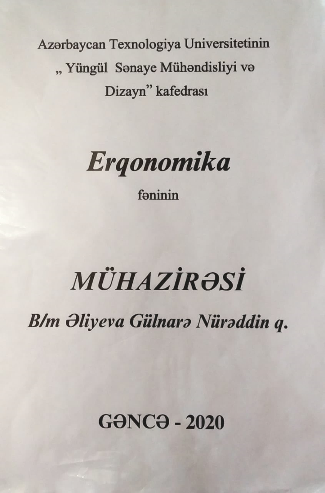

Azərbaycan Texnologiya Universitetinin
- Yüngül Sənaye Mühəndisliyi və
Dizayn” kafedrası
Erqonomika
fəninin
MÜHAZİRƏSİ
B/m Əliyeva Gülnarə Nürəddin q.
GƏNCƏ - 2020

---

## Səhifə 2 (hdphoto2.png)

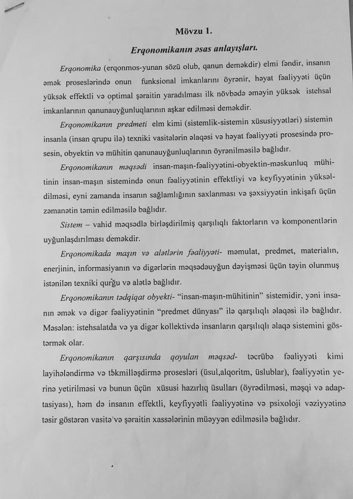

Mövzu 1.
Erqonomikanın əsas anlayışları.

Erqonomika (erqonmos-yunan sözü olub, qanun deməkdir) elmi fəndir, insanın
əmək proseslərində onun funksional imkanlarını öyrənir, həyat fəaliyyəti üçün
yüksək effektli və optimal şəraitin yaradılması ilk növbədə əməyin yüksək istehsal
imkanlarının qanunauyğunluqlarının aşkar edilməsi deməkdir.

Erqonomikanın predmeti elm kimi (sistemlik-sistemin xüsusiyyətləri) sistemin
insanla (insan qrupu ilə) texniki vasitələrin əlaqəsi və həyat fəaliyyəti prosesində pro-
sesin, obyektin və mühitin qanunauyğunluqlarının öyrənilməsilə bağlıdır.

Erqonomikanın məqsədi insan-maşın-fəaliyyətini-obyektin-məskunluq mühi-
tinin insan-maşın sistemində onun fəaliyyətinin effektliyi və keyfiyyətinin yüksəl-
dilməsi, eyni zamanda insanın sağlamlığının saxlanması və şəxsiyyətin inkişafı üçün
zəmanətin təmin edilməsilə bağlıdır.

Sistem — vahid məqsədlə birləşdirilmiş qarşılıqlı faktorların və komponentlərin
uyğunlaşdırılması deməkdir.

Erqonomikada maşın və alətlərin fəaliyyəti- məmulat, predmet, materialın,
enerfinin, informasiyanın və digərlərin məqsədəuyğun dəyişməsi üçün təyin olunmuş
istənilən texniki qurğu və alətlə bağlıdır.

Erqonomikanın tədqiqat obyekti- “insan-maşın-mühitinin” sistemidir, yəni insa-
nın əmək və digər fəaliyyətinin “predmet dünyası” ilə qarşılıqlı əlaqəsi ilə bağlıdır.
Məsələn: istehsalatda və ya digər kollektivdə insanların qarşılıqlı əlaqə sistemini gös-
tərmək olar.

Erqonomikanın qarşısında qoyulan məqsəd- təcrübə fəaliyyəti kimi
layihələndirmə və tökmilləşdirmə prosesləri (üsul,alqoritm, üslublar), fəaliyyətin ye-
rinə yetirilməsi və bunun üçün xüsusi hazırlıq üsulları (öyrədilməsi, məşqi və adap-
tasiyası), həm də insanın effektli, keyfiyyətli fəaliyyətinə və psixoloği vəziyyətinə
təsir göstərən vasitə və şəraitin xassələrinin müəyyən edilməsilə bağlıdır.

---

## Səhifə 3 (hdphoto3.png)

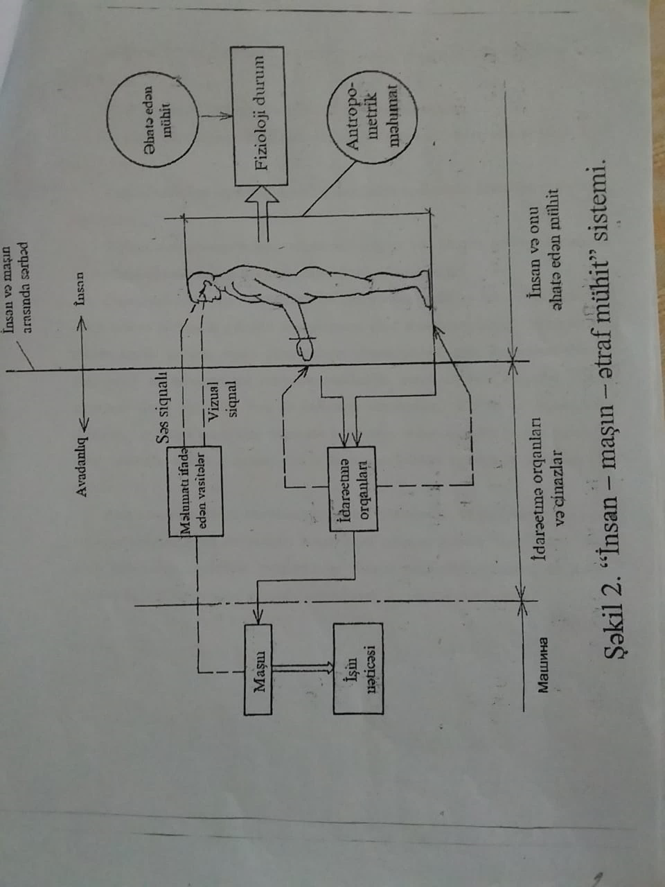

***(Bu səhifədə oxunaqlı mətn yoxdur, yalnız sxem və ya diaqram ola bilər)***

---

## Səhifə 4 (hdphoto4.png)

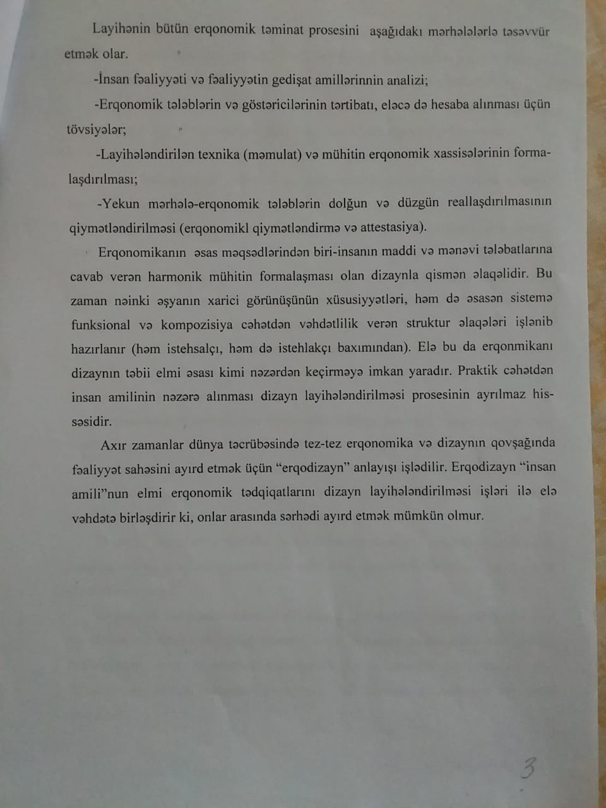

Layihənin bütün erqonomik təminat prosesini aşağıdakı mərhələlərlə təsəvvür
etmək olar.

-İnsan fəaliyyəti və fəaliyyətin gedişat amillərinnin analizi:

-Erqonomik tələblərin və göstəricilərinin tərtibatı, eləcə də hesaba alınması üçün
tövsiyələr

-Layihələndirilən texnika (məmulat) və mühitin erqonomik xassisələrinin forma-
laşdırılması

-Yekun mərhələ-erqonomik tələblərin dolğun və düzgün reallaşdırılmasının.
qiymətləndirilməsi (erqonomikl qiymətləndirmə və attestasiya).

Erqonomikanın əsas məqsədlərindən biri-insanın maddi və mənəvi tələbatlarına
cavab verən harmonik mühitin formalaşması olan dizaynla qismən əlaqəlidir. Bu
zaman nəinki əşyanın xarici görünüşünün xüsusiyyətləri, həm də əsasən sistemə
funksional və kompozisiya cəhətdən vəhdətlilik verən struktur əlaqələri işlənib
hazırlanır (həm istehsalçı, həm də istehlakçı baxımından). Elə bu da erqonmikanı
dizaynın təbii elmi əsası kimi nəzərdən keçirməyə imkan yaradır. Praktik cəhətdən İ
insan amilinin nəzərə alınması dizayn layihələndirilməsi prosesinin ayrılmaz his-
səsidir.

Axır zamanlar dünya təcrübəsində tez-tez erqonomika və dizaynın qovşağında
fəaliyyət sahəsini ayırd etmək üçün “erqodizayn” anlayışı işlədilir. Erqodizayn “insan
amili”nun elmi erqonomik tədqiqatlarını dizayn layihələndirilməsi işləri ilə elə
vəhdətə birləşdirir ki, onlar arasında sərhədi ayırd etmək mümkün olmur.

---

## Səhifə 5 (hdphoto5.png)

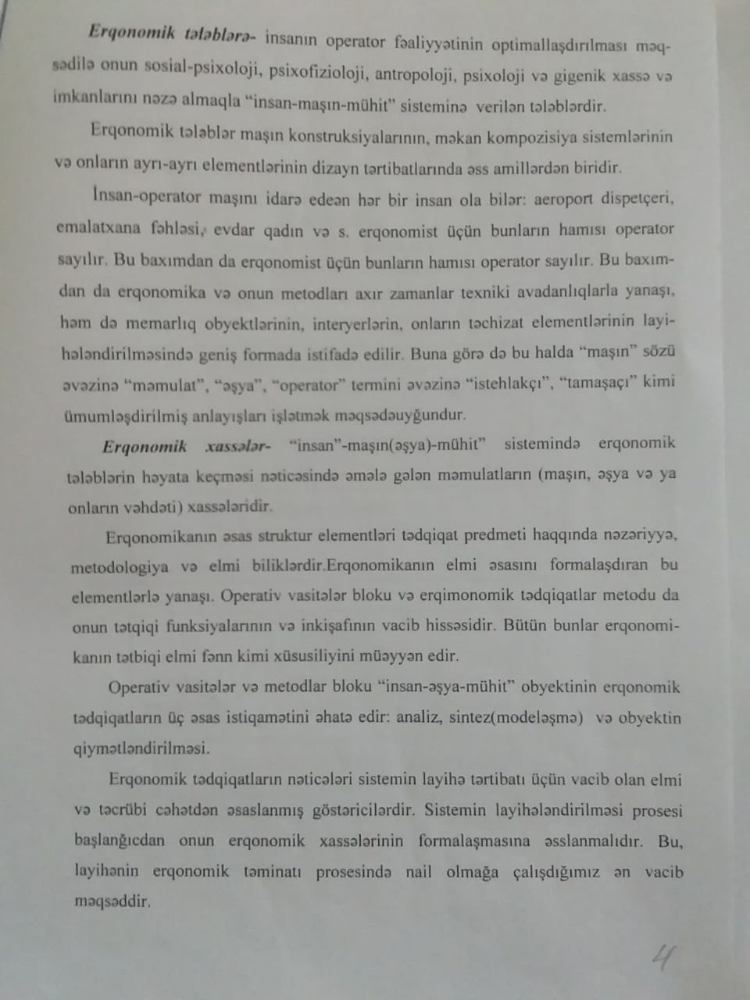

Erqonomik tələblərə- insanın operator fəaliyyətinin optimallaşdırılması məq-
sədilə onun sosial-psixoloji, psixofizioloji, antropoloji, psixoloji və gigienik xassə və
imkanlarını nəzərə almaqla “insan-maşın-mühit” sisteminə verilən tələblərdir.

Erqonomik tələblər maşın konstruksiyalarının, məkan kompozisiya sistemlərinin
və onların ayrı-ayrı elementlərinin dizayn tərtibatlarında əss amillərdən biridir.
İnsan-operator maşını idarə edeən hər bir insan ola bilər: aeroport dispetçeri,
emalatxana fəhləsi, evdar qadın və s. erqonomist üçün bunların hamısı operator
sayılır, Bu baxımdan da erqonomist üçün bunların hamısı operator sayılır. Bu baxım-
dan da erqonomika və onun metodları axır zamanlar texniki avadanlıqlarla yanaşı,
həm də memarlıq obyektlərinin, interyerlərin, onların təchizat elementlərinin layi-
hələndirilməsində geniş formada istifadə edilir. Buna görə də bu halda “maşın” sözü
əvəzinə “məmulat”, “əşya”, “operator” termini əvəzinə “istehlakçı”, “tamaşaçı” kimi
ümumləşdirilmiş anlayışları işlətmək məqsədəuyğundur.

Erqonomik xassələr- “insan”-maşın(əşya)-mühit” sistemində erqonomik
tələblərin həyata keçməsi nəticəsində əmələ gələn məmulatların (maşın, əşya və ya
onların vəhdəti) xassələridir.

Erqonomikanın əsas struktur elementləri tədqiqat predmeti haqqında nəzəriyyə,
metodologiya və elmi biliklərdir.Erqonomikanın elmi əsasını formalaşdıran bu
elementlərlə yanaşı. Operativ vasitələr bloku və erqimonomik tədqiqatlar metodu da
onun tətqiqi funksiyalarının və inkişafının vacib hissəsidir. Bütün bunlar erqonomi-
kanın tətbiqi elmi fənn kimi xüsusiliyini müəyyən edir.

Operativ vasitələr və metodlar bloku “insan-əşya-mühit” obyektinin erqonomik
tədqiqatların üç əsas istiqamətini əhatə edir: analiz, sintez(modeləşmə) və obyektin
qiymətləndirilməsi.

Erqonomik tədqiqatların nəticələri sistemin layihə tərtibatı üçün vacib olan elmi
və təcrübi cəhətdən əsaslanmış göstəricilərdir. Sistemin layihələndirilməsi prosesi
başlanğıcdan onun erqonomik xassələrinin formalaşmasına əsslanmalıdır. Bu,
layihənin erqonomik təminatı prosesində nail olmağa çalışdığımız ən vacib
məqsəddir,

---

## Səhifə 6 (hdphoto6.png)

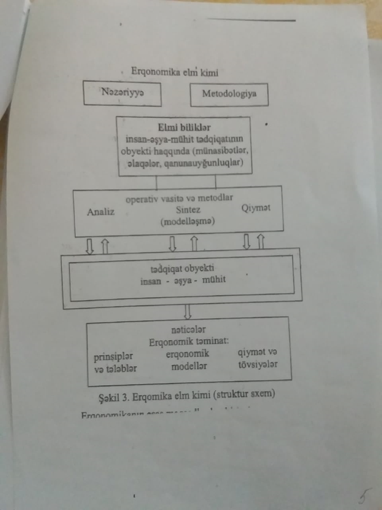

Erqonomika elm kimi
Elmi biliklər .
insan-əşya-mühit tədqiqatının
obyekti haqqında (münasibətlər,
əlaqələr, qanunsuyğunluqlar)
operativ vasitə və metodlar
Analiz Sintez Qiymət
(modelləşmə)
tədqiqat obyekti
insan - əşya - mühit ”
nəticələr
Erqonomik təminat:
prinsiplər erqonomik qiymət və
və tələblər modellər tövsiyələr
Şəkil 3. Erqomika elm kimi (struktur sxem)
ı m m. B .. .
---

## Səhifə 7 (hdphoto7.png)

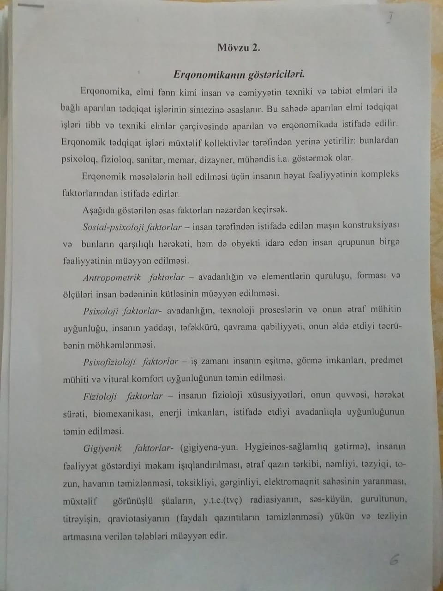

Mövzu 2.
Erqonomikanın göstəriciləri.
Erqonomika, elmi fənn kimi insan və cəmiyyətin texniki və təbiət elmləri ilə
bağlı aparılan tədqiqat işlərinin sintezinə əsaslanır. Bu sahədə aparılan elmi tədqiqat
işləri tibb və texniki elmlər çərçivəsində aparılan və erqonomikada istifadə edilir.
Erqonomik tədqiqat işləri müxtəlif kollektivlər tərəfindən yerinə yetirilir: bunlardan
psixoloq, fizioloq, sanitar, memar, dizayner, mühəndis i.a. göstərmək olar.
Erqonomik məsələlərin həll edilməsi üçün insanın həyat fəaliyyətinin kompleks
faktorlarından istifadə edirlər.
Aşağıda göstərilən əsas faktorları nəzərdən keçirsək.
Sosial-psixoloji faktorlar — insan tərəfindən istifadə edilən maşın konstruksiyası
və bunların qarşılıqlı hərəkəti, həm də obyekti idarə edən insan qrupunun birgə
fəaliyyətinin müəyyən edilməsi.
Antropometrik faktorlar — avadanlığın və elementlərin quruluşu, forması və
ölçüləri insan bədəninin kütləsinin müəyyən edilnməsi.
Psixoloji faktorlar- avadanlığın, texnoloji proseslərin və onun ətraf mühitin
uyğunluğu, insanın yaddaşı, təfəkkürü, qavrama qabiliyyəti, onun əldə etdiyi təcrü-
bənin möhkəmlənməsi.
Psixofiziolofi faktorlar — iş zamanı insanın eşitmə, görmə imkanları, predmet
mühiti və vitural komfort uyğunluğunun təmin edilməsi.
Fizioloji faktorlar — insanın fizioloji xüsusiyyətləri, onun qüvvəsi, hərəkət
sürəti, biomexanikası, enerfi imkanları, istifadə etdiyi avadanlıqla uyğunluğunun
təmin edilməsi.
Gigiyenik faktorlar- (gigiyena-yun. Hygieinos-sağlamlıq gətirmə), insanın
fəaliyyət göstərdiyi məkanı işıqlandırılması, ətraf qazın tərkibi, nəmliyi, təzyiqi, to-
zün, havanın təmizlənməsi, toksikliyi, gərginliyi, elektromaqnit sahəsinin yaranması,
müxtəlif görünüşlü şüaların, y-t.c.(tvç) radiasiyanın, səs-küyün, gürültünün, o
ütrəyişin, qraviotasiyanın (faydalı qazıntıların təmizlənməsi) yükün və tezliyin .
artmasına verilən tələbləri müəyyən edir.

---

## Səhifə 8 (hdphoto8.png)

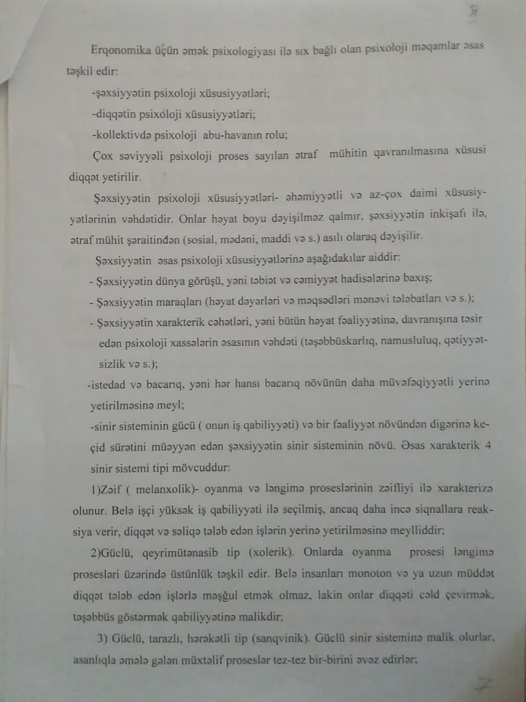

Erqonomika üçün əmək psixologiyası ilə sıx bağlı olan psixoloği məqamlar əsas
təşkil edir:

“şəxsiyyətin psixoloji xüsusiyyətləri,
i -diqqətin psixoloji xüsusiyyətləri:

“kollektivdə psixoloji abu-havanın rolu:

Çox səviyyəli psixoloii proses sayılan ətraf mühitin qavranılmasına xüsusi
diqqət yetirilir.

Şəxsiyyətin psixoloji xüsusiyyətləri- əhəmiyyətli və az-çox daimi xüsusiy-
yətlərinin vəhdətidir. Onlar həyat boyu dəyişilməz qalmır, şəxsiyyətin inkişafı ilə,
ətraf mühit şəraitindən (sosial, mədəni, maddi və s.) asılı olaraq dəyişilir.

Şəxsiyyətin əsas psixolofi xüsusiyyətlərinə aşağıdakılar aiddir: :

- Şəxsiyyətin dünya görüşü, yəni təbiət və cəmiyyət hadisələrinə baxış: :
- Şəxsiyyətin maraqları (həyat dəyərləri və məqsədləri mənəvi tələbatları və s.): :
- Şəxsiyyətin xarakterik cəhətləri, yəni bütün həyat fəaliyyətinə, davranışına təsir
edən psixolofi xassələrin əsasının vəhdəti (təşəbbüskarlıq, namusluluq, qətiyyət- :
sizlik və s.). :
-istedad və bacarıq, yəni hər hansı bacarıq növünün daha müvəfəqiyyətli yerinə
yetirilməsinə meyl:
-sinir sisteminin gücü ( onun iş qabiliyyəti) və bir fəaliyyət növündən digərinə ke-

çid sürətini müəyyən edən şəxsiyyətin sinir sisteminin növü. Əsas xarakterik 4

sinir sistemi tipi mövcuddur:

1)Zəif ( melanxolik)- oyanma və ləngimə proseslərinin zəifliyi ilə xarakterizə
olunur. Belə işçi yüksək iş qabiliyyəti ilə seçilmiş, ancaq daha incə siqnallara reak-
siya verir, diqqət və səliqə tələb edən işlərin yerinə yetirilməsinə meylliddir:

2)Güclü, qeyrimütənasib tip (xolerik). Onlarda oyanma prosesi ləngimə
prosesləri üzərində üstünlük təşkil edir. Belə insanları monoton və ya uzun müddət
diqqət tələb edən işlərlə məşğul etmək olmaz, lakin onlar diqqəti cəld çevirmək,
təşəbbüs göstərmək qabiliyyətinə malikdir, “xəb

3) Güclü, tarazlı, hərəkətli tip (sanqvinik). Güclü sinir sisteminə malik olurlar,
asanlıqla əmələ gələn müxtəlif proseslər tez-tez bir-birini əvəz dirlər, p di 2.

Buş”

---

## Səhifə 9 (hdphoto9.png)

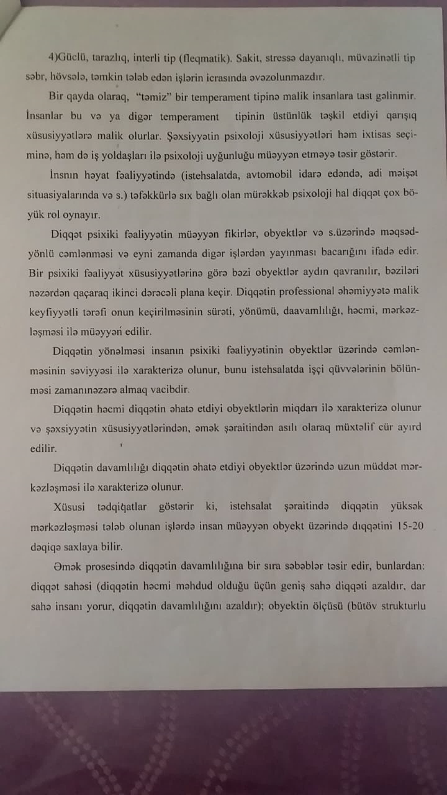

4Xöüclü, tarazlıq, interli tip (fleqmatik). Sakit, stressə dayanıqlı, müvazinətli tip
səbr, hövsələ, təmkin tələb edən işlərin icrasında əvəzolunmazdır.

Bir qayda olaraq, “təmiz” bir temperament tipinə malik insanlara rast gəlinmir.
İnsanlar bu və ya digər temperament tipinin üstünlük təşkil etdiyi qarışıq
xüsusiyyətlərə malik olurlar. Şəxsiyyətin psixoloji xüsusiyyətləri həm ixtisas seçi-
minə, həm də iş yoldaşları ilə psixoloji uyğunluğu müəyyən etməyə təsir göstərir.

İnsanın həyat fəaliyyətində (istehsalatda, avtomobil idarə edəndə, adi məişət
situasiyalarında və s.) təfəkkürlə sıx bağlı olan mürəkkəb psixoloji hal diqqət çox bö-
yük rol oynayır.

Diqqət psixiki fəaliyyətin müəyyən fikirlər, obyektlər və s.üzərində məqsəd-
yönlü cəmlənməsi və eyni zamanda digər işlərdən yayınması bacarığını ifadə edir.
Bir psixiki fəaliyyət xüsusiyyətlərinə görə bəzi obyektlər aydın qavranılır, bəziləri
nəzərdən qaçaraq ikinci dərəcəli plana keçir. Diqqətin professional əhəmiyyətə malik
keyfiyyətli tərəfi onun keçirilməsinin sürəti, yönümü, daavamlılığı, həcmi, mərkəz-
ləşməsi ilə müəyyəri edilir.

Diqqətin yönəlməsi insanın psixiki fəaliyyətinin obyektlər üzərində cəmlən-
məsinin səviyyəsi ilə xarakterizə olunur, bunu istehsalatda işçi qüvvələrinin bölün-
məsi zamanınəzərə almaq vacibdir.

Diqqətin həcmi diqqətin əhatə etdiyi obyektlərin miqdan ilə xarakterizə olunur
və şəxsiyyətin xüsusiyyətlərindən, əmək şəraitindən asılı olaraq müxtəlif cür ayırd
edilir. .

Diqqətin davamlılığı diqqətin əhatə etdiyi obyektlər üzərində uzun müddət mər-
kəzləşməsi ilə xarakterizə olunur.

Xüsusi tədqiğatlar göstərir ki, istehsalat şəraitində diqqətin yüksək
mərkəzləşməsi tələb olunan işlərdə insan müəyyən obyekt üzərində diqqətini 15-20
dəqiqə saxlaya bilir.

Əmək prosesində diqqətin davamlılığına bir sıra səbəblər təsir edir, bunlardan:
diqqət sahəsi (diqqətin həcmi məhdud olduğu üçün geniş sahə diqqəti azaldır, dar
sahə insanı yorur, diqqətin davamlılığını azaldır): obyektin ölçüsü (bütöv strukturlu

---

## Səhifə 10 (hdphoto10.png)

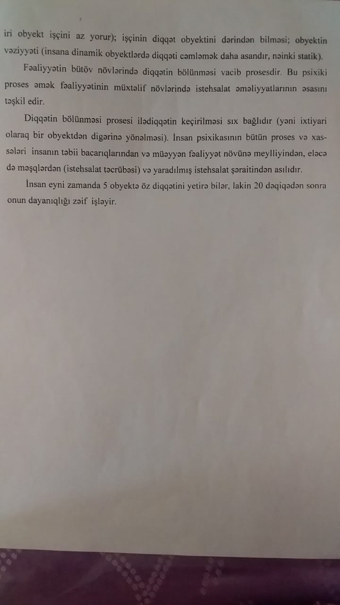

iri obyekt işçini az yorur): işçinin diqqət obyektini dərindən bilməsi: obyektin
vəziyyəti (insana dinamik obyektlərdə diqqəti cəmləmək daha asandır, nəinki statik).

Fəaliyyətin bütöv növlərində diqqətin bölünməsi vacib prosesdir. Bu psixiki
proses əmək fəaliyyətinin müxtəlif növlərində istehsalat əməliyyatlarının əsasını
təşkil edir.

Diqqətin bölünməsi prosesi ilədiqqətin keçirilməsi sıx bağlıdır (yəni ixtiyari
olaraq bir obyektdən digərinə yönəlməsi). İnsan psixikasının bütün proses və xas-
sələri insanın təbii bacarıqlarından və müəyyən fəaliyyət növünə meylliyindən, eləcə
də məşqlərdən (istehsalat təcrübəsi) və yaradılmış istehsalat şəraitindən asılıdır.

İnsan eyni zamanda 5 obyektə öz diqqətini yetirə bilər, lakin 20 dəqiqədən sonra
onun dayanıqlığı zəif işləyir.

---

## Səhifə 11 (hdphoto11.png)

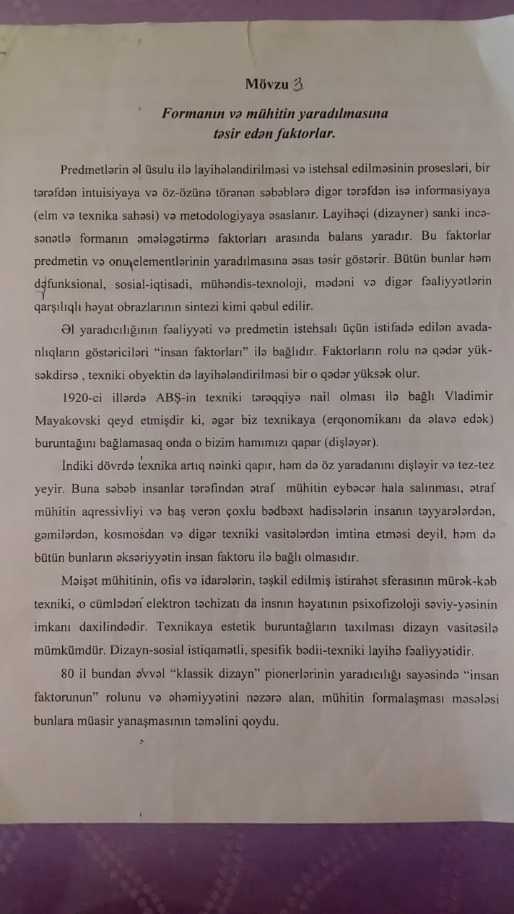

Mövzu 2
Formanın və mühitin yaradılmasına
təsir edən faktorlar.

Predmetlərin əl üsulu ilə layihələndirilməsi və istehsal edilməsinin prosesləri, bir
tərəfdən intuisiyaya və öz-özünə törənən səbəblərə digər tərəfdən isə informasiyaya
(elm və texnika sahəsi) və metodologiyaya əsaslanır. Layihəçi (dizayner) sanki incə-
sənətlə formanın əmələgətirmə faktorları arasında balans yaradır. Bu faktorlar
predmetin və onuyelementlərinin yaradılmasına əsas təsir göstərir. Bütün bunlar həm
difunksional, sosial-iqtisadi, mühəndis-texnoloji, mədəni və digər fəaliyyətlərin
qarşılıqlı həyat obrazlarının sintezi kimi qəbul edilir.

Əl yaradıcılığının fəaliyyəti və predmetin istehsalı üçün istifadə edilən avada-
nlıqların göstəriciləri “insan faktorları” ilə bağlıdır. Faktorların rolu nə qədər yük-
səkdirsə , texniki obyektin də layihələndirilməsi bir o qədər yüksək olur.

1920-ci illərdə ABŞ-in texniki tərəqqiyə nail olması ilə bağlı Vladimir
Mayakovski qeyd etmişdir ki, əgər biz texnikaya (erqonomikanı da əlavə edək)
buruntağını bağlamasaq onda o bizim hamımızı qapar (dişləyər).

İndiki dövrdə texnika artıq nəinki qapır, həm də öz yaradanını dişləyir və tez-tez
yeyir. Buna səbəb insanlar tərəfindən ətraf mühitin eybəcər hala salınması, ətraf
mühitin aqressivliyi və baş verən çoxlu bədbəxt hadisələrin insanın təyyarələrdən,
gəmilərdən, kosmosdan və digər texniki vasitələrdən imtina etməsi deyil, həm də
bütün bunların əksəriyyətin insan faktoru ilə bağlı olmasıdır.

Məişət mühitinin, ofis və idarələrin, təşkil edilmiş istirahət sferasının mürək-kəb
texniki, o cümlədəri elektron təchizatı da insnın həyatının psixofizoloji səviy-yəsinin
imkanı daxilindədir. Texnikaya estetik buruntağların taxılması dizayn vasitəsilə
mümkümüdür. Dizayn-sosial istiqamətli, spesifik bədii-texniki layihə fəaliyyətidir.

80 il bundan əvvəl “klassik dizayn” pionerlərinin yaradıcılığı sayəsində “insan
faktorunun” rolunu və əhəmiyyətini nəzərə alan, mühitin formalaşması məsələsi
bunlara müasir yanaşmasının təməlini qoydu.

---

## Səhifə 12 (hdphoto12.png)

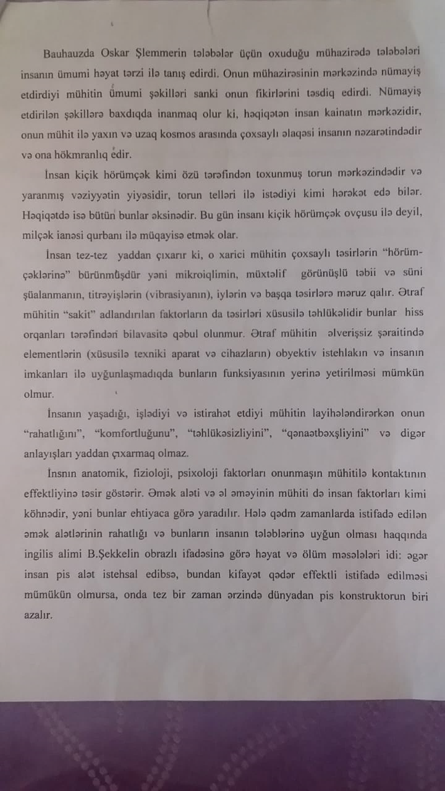

Bauhauzda Oskar Şlemmerin tələbələr üçün oxuduğu mühazirədə (tələbələri
insanın ümumi həyat tərzi ilə tanış edirdi. Onun mühazirəsinin mərkəzində nümayiş
etdirdiyi mühitin ümumi şəkilləri sanki onun fikirlərini təsdiq edirdi. Nümayiş
etdirilən şəkillərə baxdıqda inanmaq olur ki, həqiqətən insan kainatın mərkəzidir,
onun mühit ilə yaxın və uzaq kosmos arasında çoxsaylı əlaqəsi insanın nəzarətindədir
və ona hökmranlıq edir.

İnsan kiçik hörümçək kimi özü tərəfindən toxunmuş torun mərkəzindədir və
yaranmış vəziyyətin yiyəsidir, torun telləri ilə istədiyi kimi hərəkət edə bilər.
Həqiqətdə isə bütüri bunlar əksinədir. Bu gün insanı kiçik hörümçək ovçusu ilə deyil,
milçək ianəsi qurbanı ilə müqayisə etmək olar.

İnsan tez-tez yaddan çıxarır ki, o xarici mühitin çoxsaylı təsirlərin “hörüm-
çəklərinə” bürünmüşdür yəni mikroiqlimin, müxtəlif görünüşlü təbii və süni
şüalanmanın, titrəyişlərin (vibrasiyanın), iylərin və başqa təsirlərə məruz qalır. Ətraf
mühitin “sakit” adlandırılan faktorların da təsirləri xüsusilə təhlükəlidir bunlar hiss
orqanları tərəfindəri bilavasitə qəbul olunmur. Ətraf mühitin əlverişsiz şəraitində
elementlərin (xüsusilə texniki aparat və cihazların) obyektiv istehlakın və insanın
imkanları ilə uyğunlaşmadıqda bunların funksiyasının yerinə yetirilməsi mümkün
olmur.
İnsanın yaşadığı, işlədiyi və istirahət etdiyi mühitin layihələndirərkən onun
“rahatlığını”, “komfortluğunu”, “təhlükəsizliyini”, “qənaətbəxşliyini” və digər
anlayışları yaddan çıxarmaq olmaz.

İnsanın anatomik, fizioloji, psixoloği faktorları onunmaşın mühitilə kontaktının
effektliyinə təsir göstərir. Əmək aləti və əl əməyinin mühiti də insan faktorları kimi
köhnədir, yəni bunlar ehtiyaca görə yaradılır. Hələ qədm zamanlarda istifadə edilən
əmək alətlərinin rahatlığı və bunların insanın tələblərinə uyğun olması haqqında
ingilis alimi B.Şekkelin obrazlı ifadəsinə görə həyat və ölüm məsələləri idi: əgər
insan pis alət istehsal edibsə, bundan kifayət qədər effektli istifadə edilməsi
mümükün olmursa, onda tez bir zaman ərzində dünyadan pis konstruktorun biri
azalır.

---

## Səhifə 13 (hdphoto13.png)

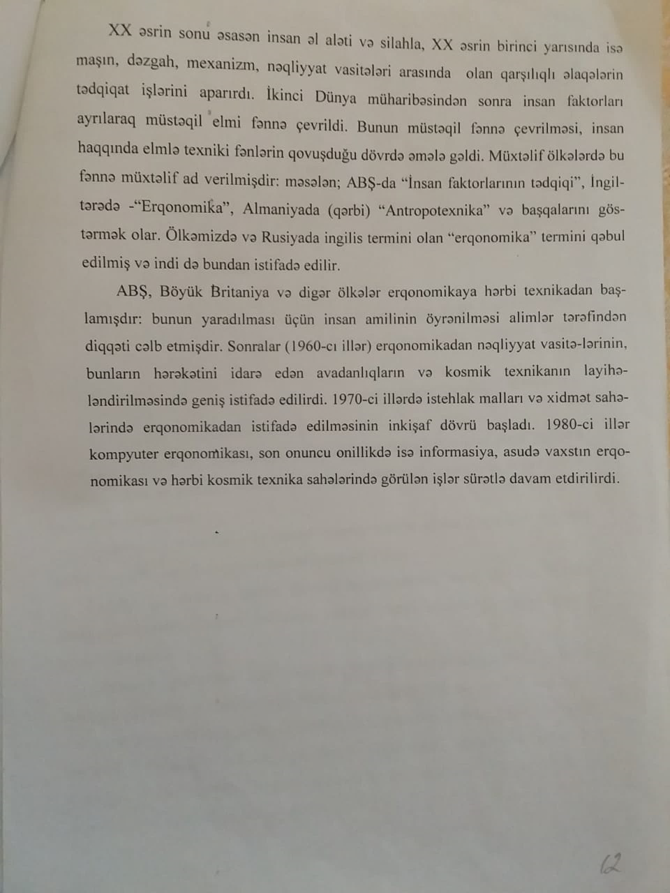

Bəzi tədqiqat işləri insan ilə olan qarşılıqlı əlaqələrin
məsələn II Dünya müharibəsindən sonra insan faktorları İ
ənnə çevrildi. Bunun müstəqil fənnə çevrilməsi, insan
/ haqqında elmlə texniki fənlərin qovuşduğu dövrdə əmələ gəldi. Müxtəlif ölkələrdə bu (
fənnə müxtəlif ad verilmişdir: məsələn: ABŞ-da “İnsan faktorlarının tədqiqi”, İngil-
tərədə -“Erqonomika”, Almaniyada (qərbi) “Antropotexnika” və başqalarını gös- İ
tərmək olar, Ölkəmizdə və Rusiyada ingilis termini olan “erqonomika” termini qəbul
edilmiş və indi də bundan istifadə edilir. i
ABŞ, Böyük Britaniya və digər ölkələr erqonomikaya hərbi texnikadan baş- ı
lamışdır: bunun yaradılması üçün insan amilinin öyrənilməsi alimlər tərəfindən
diqqəti cəlb etmişdir. Sonralar (1960-cı illər) erqonomikadan nəqliyyat vasitə-lərinin,
bunların hərəkətini idarə edən avadanlıqların və kosmik texnikanın layihə-
ləndirilməsində geniş istifadə edilirdi. 1970-ci illərdə istehlak malları və xidmət sahə-
lərində erqonomikadan istifadə edilməsinin inkişaf dövrü başladı. 1980-ci illər
kompyuter erqonomikası, son onuncu onillikdə isə informasiya, asudə vaxstın erqo- :
nomikası və hərbi kosmik texnika sahələrində görülən işlər sürətlə davam etdirilirdi.

---

## Səhifə 14 (hdphoto14.png)

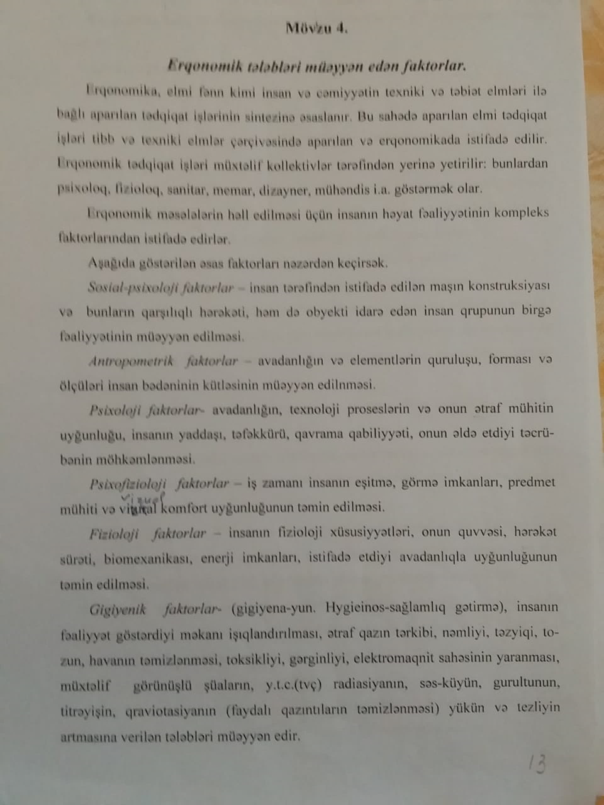

Mövzu 4.
Prqonomik tələbləri müəyyən edən faktorlar,

Erqonomika, elmi fənn kimi insan və cəmiyyətin texniki və təbiət elmləri ilə
bağlı aparılan tədqiqat işlərinin sintezinə əsaslanır. Bu sahədə apurılan elmi tədqiqat
İşləri tib və texniki elmlər çərçivəsində aparılan və erqonomikada istifadə edilir. İ
Erqonomik tədqiqat işləri müxtəlif kollektivlər tərəfindən yerinə yetirilir: bunlardan
psixoloq, fizioloq, sanitar, memar, dizayner, mühəndis i.a, göstərmək olar,

Erqonomik məsələlərin həll edilməsi üçün insanın həyat fəaliyyətinin kompleks
faktorlarından İstifadə edirlər

Aşağıda göstərilən əsas faktorları nəzərdən keçirsək,

Sosial-psixoloji faktorlar - insan tərəfindən İstifadə edilən maşin konstruksiyası
və bunların qarşılıqlı hərəkəti, həm də obyekti idarə edən insan qrupunun birgə
fəaliyyətinin müəyyən edilməsi

Antropometrik faktorlar - avadanlığın və elementlərin quruluşu, forması və
ölçüləri insan bədəninin kütləsinin müəyyən edilnməsi.

Psixoloji faktorlar- avadanlığın, texnoloği proseslərin və onun ətraf mühitin
uyğunluğu, insanın yaddaşı, təfəkkürü, qavrama qabiliyyəti, onun əldə etdiyi təcrü- :
bənin möhkəmlənməsi,

Psixofizioloji faktorlar — iş zamanı insanın eşitmə, görmə imkanları, predmet
mühiti və effektiv komfort uyğunluğunun təmin edilməsi.

Fizioloji faktorlar - insanın fizioloği xüsusiyyətləri, onun qüvvəsi, hərəkət
sürəti, biomexanikası, enerji imkanları, istifadə etdiyi avadanlıqla uyğunluğunun
təmin edilməsi,

Gigiyenik faktorlar: (gigiyena-yun, Hygieinos-sağlamlıq gətirmə), insanın
fəaliyyət göstərdiyi məkanı işıqlandırılması, ətraf qazın tərkibi, nəmliyi, təzyiqi, to-
gün, havanın təmizlənməsi, toksikliyi, gərginliyi, elektromaqnit sahəsinin yaranması,
müxtəlif görünüşlü şüaların, y.te.(tvç) radiasiyanın, səs-küyün, gurültunun,
ütrəyişin, qraviotasiyanın (faydalı qazıntıların təmizlənməsi) yükün və tezliyin
artmasına verilən tələbləri müəyyən edir,

---

## Səhifə 15 (hdphoto15.png)

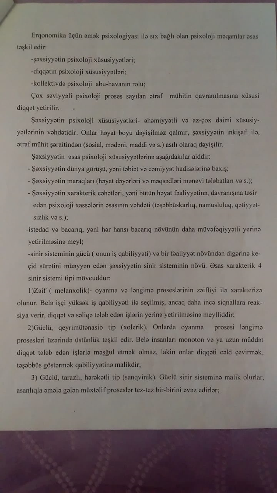

Erqonomika üçün əmək psixologiyası ilə sıx bağlı olan psixoloji məqamlar asas
təşkil edir:

-şəxsiyyətin psixoloji xüsusiyyətləri:

-diqqətin psixolofi xüsusiyyətləri,

ekollektivdə psixoloği abu-havanın rolu:

Çox səviyyəli psixoloği proses sayılan ətraf mühitin qavranılmasına xüsusi
diqqət yetirilir.

Şəxsiyyətin psixoloji xüsusiyyətləri- əhəmiyyətli və az-çox daimi xüsusiy-
yətlərinin vəhdətidir. Onlar həyat boyu dəyişilməz qalmır, şəxsiyyətin inkişafi ilə,
ətraf mühit şəraitindən (sosial, mədəni, maddi və s.) asılı olaraq dəyişilir.

Şəxsiyyətin əsas psixoloji xüsusiyyətlərinə aşağıdakılar aiddir:

- Şəxsiyyətin dünya görüşü, yəni təbiət və cəmiyyət hadisələrinə baxış,

- Şəxsiyyətin maraqları (həyat dəyərləri və məqsədləri mənəvi tələbatları və s.),

- Şəxsiyyətin xarakterik cəhətləri, yəni bütün həyat fəaliyyətinə, davranışına təsir
edən psixoloji xassələrin əsasının vəhdəti (təşəbbüskarlıq, namusluluq, qətiyyət-
sizlik və s.),

-istedad və bacarıq, yəni hər hansı bacarıq növünün daha müvəfəqiyyətli yerinə

yetirilməsinə meyl:

-sinir sisteminin gücü ( onun iş qabiliyyəti) və bir fəaliyyət növündən digərinə ke-

çid sürətini müəyyən edən şəxsiyyətin sinir sisteminin növü. Əsas xarakterik 4

sinir sistemi tipi mövcuddur:

1)Zəif ( melanxolik)- oyanma və ləngimə proseslərinin zəifliyi ilə xarakterizə
olunur. Belə işçi yüksək iş qabiliyyəti ilə seçilmiş, ancaq daha incə siqnallara reak-
siya verir, diqqət və səliqə tələb edən işlərin yerinə yetirilməsinə meyllidir:

2)Güclü, qeyrimütənasib tip (xolerik). Onlarda oyanma prosesi ləngimə

prosesləri üzərində üstünlük təşkil edir. Belə insanları monoton və ya uzun müddət
diqqət tələb edən işlərlə məşğul etmək olmaz, lakin onlar diqqəti cəld çevirmək,
təşəbbüs göstərmək qabiliyyətinə malikdir:

3) Güclü, tarazlı, hərəkətli tip (sanqvinik). Güclü sinir sisteminə malik olurlar,
asanlıqla əmələ gələn müxtəlif proseslər tez-tez bir-birini əvəz edirlər,

---

## Səhifə 16 (hdphoto16.png)

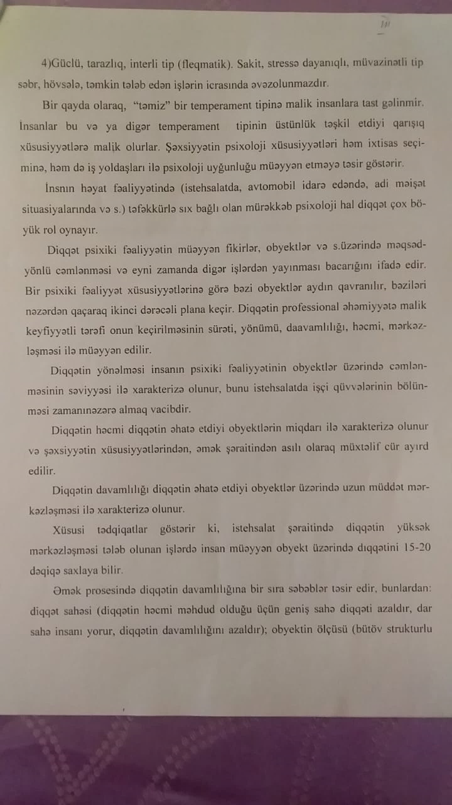

4)Güclü, tarazlıq, interli tip (fleqmatik). Sakit, stressə dayanıqlı, müvazinətli tip
səbr, hövsələ, təmkin tələb edən işlərin icrasında əvəzolunmazdır.

Bir qayda olaraq, “təmiz” bir temperament tipinə malik insanlara rast gəlinmir.
İnsanlar bu və ya digər temperament tipinin üstünlük təşkil etdiyi qarışıq
xüsusiyyətlərə malik olurlar. Şəxsiyyətin psixoloji xüsusiyyətləri həm ixtisas seçi-
minə, həm də iş yoldaşları ilə psixoloji uyğunluğu müəyyən etməyə təsir göstərir.

İnsanın həyat fəaliyyətində (istehsalatda, avtomobil idarə edəndə, adi məişət
situasiyalarında və s.) təfəkkürlə sıx bağlı olan mürəkkəb psixoloji hal diqqət çox bö-
yük rol oynayır.

Diqqət psixiki fəaliyyətin müəyyən fikirlər, obyektlər və s.üzərində məqsəd-
yönlü cəmlənməsi və eyni zamanda digər işlərdən yayınması bacarığını ifadə edir.
Bir psixiki fəaliyyət xüsusiyyətlərinə görə bəzi obyektlər aydın qavranılır, bəziləri
nəzərdən qaçaraq ikinci dərəcəli plana keçir. Diqqətin professional əhəmiyyətə malik
keyfiyyətli tərəfi onun keçirilməsinin sürəti, yönümü, davamlılığı, həcmi, mərkəz-
ləşməsi ilə müəyyən edilir.

Diqqətin yönəlməsi insanın psixiki fəaliyyətinin obyektlər üzərində cəmlən-
məsinin səviyyəsi ilə xarakterizə olunur, bunu istehsalatda işçi qüvvələrinin bölün-
məsi zamanınəzərə almaq vacibdir.

Diqqətin həcmi diqqətin əhatə etdiyi obyektlərin miqdarı ilə xarakterizə olunur
və şəxsiyyətin xüsusiyyətlərindən, əmək şəraitindən asılı olaraq müxtəlif cür ayırd
edilir.

Diqqətin davamlılığı diqqətin əhatə etdiyi obyektlər üzərində uzun müddət mər-
kəzləşməsi ilə xarakterizə olunur.

Xüsusi tədqiqatlar göstərir ki, istehsalat şəraitində diqqətin yüksək
mərkəzləşməsi tələb olunan işlərdə insan müəyyən obyekt üzərində diqqətini 15-20
dəqiqə saxlaya bilir.

Əmək prosesində diqqətin davamlılığına bir sıra səbəblər təsir edir, bunlardan:
diqqət sahəsi (diqqətin həcmi məhdud olduğu üçün geniş sahə diqqəti azaldır, dar
sahə insanı yorur, diqqətin davamlılığını azaldır): obyektin ölçüsü (bütöv strukturlu

---

## Səhifə 17 (hdphoto17.png)

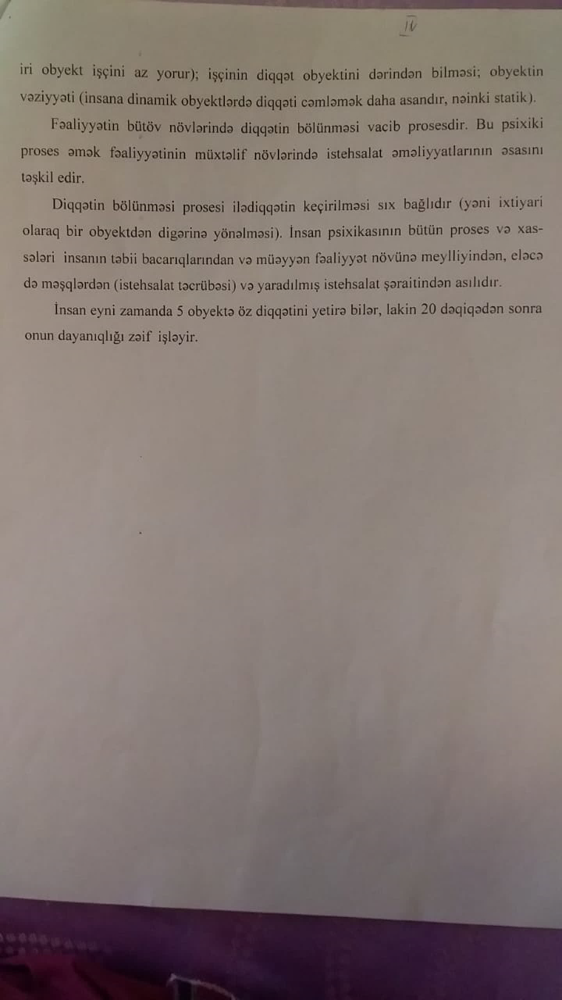

iri obyekt işçini az yorur): işçinin diqqət obyektini dərindən bilməsi: obyektin
vəziyyəti (insana dinamik obyektlərdə diqqəti cəmləmək daha asandır, nəinki statik).

Fəaliyyətin bütöv növlərində diqqətin bölünməsi vacib prosesdir. Bu psixiki
proses əmək fəaliyyətinin müxtəlif növlərində istehsalat əməliyyatlarının əsasını
təşkil edir.

Diqqətin bölünməsi prosesi ilədiqqətin keçirilməsi sıx bağlıdır (yəni ixtiyari
olaraq bir obyektdən digərinə yönəlməsi). İnsan psixikasının bütün proses və xas-
sələri insanın təbii bacarıqlarından və müəyyən fəaliyyət növünə meylliyindən, eləcə
də məşqlərdən (istehsalat təcrübəsi) və yaradılmış istehsalat şəraitindən asılıdır.

İnsan eyni zamanda $ obyektə öz diqqətini yetirə bilər, lakin 20 dəqiqədən sonra
onun dayanıqlığı zəif işləyir.

---

## Səhifə 18 (hdphoto18.png)

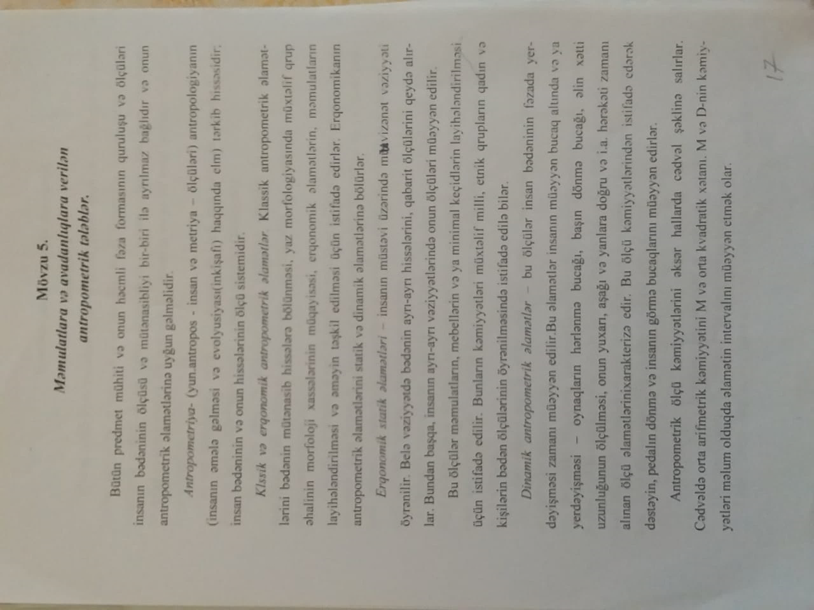

***(Bu səhifədə oxunaqlı mətn yoxdur, yalnız sxem və ya diaqram ola bilər)***

---

## Səhifə 19 (hdphoto19.png)

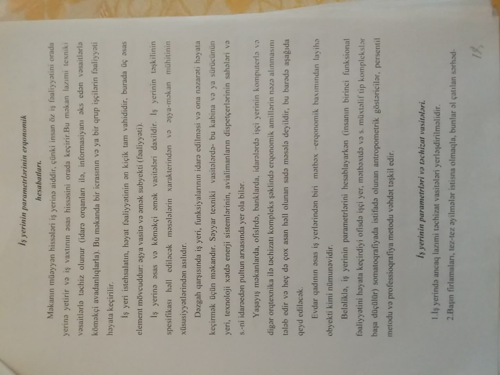

***(Bu səhifədə oxunaqlı mətn yoxdur, yalnız sxem və ya diaqram ola bilər)***

---

## Səhifə 20 (hdphoto20.png)

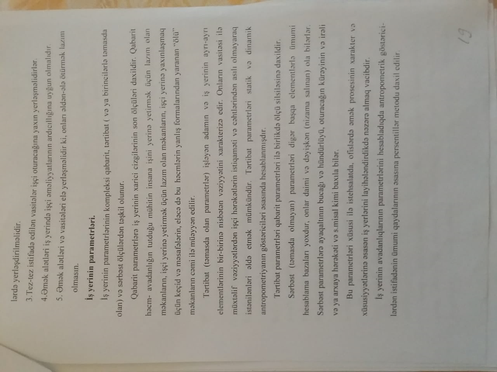

***(Bu səhifədə oxunaqlı mətn yoxdur, yalnız sxem və ya diaqram ola bilər)***

---

## Səhifə 21 (hdphoto21.png)

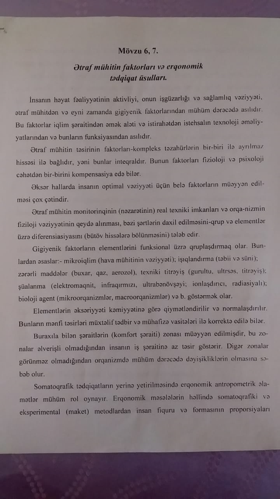

Mövzu 6, 7.
Ətraf mühitin faktorları və erqonomik
tədqiqat üsulları.

İnsanın həyat fəaliyyətinin aktivliyi, onun işgüzarlığı və sağlamlıq vəziyyəti,
ətraf mühitdən və eyni zamanda gigiyenik faktorlarından mühüm dərəcədə asılıdır.
Bu faktorlar iqlim şəraitindən əmək aləti və istirahətdən istehsalın texnololi əməliy-
yatlarından və bunların funksiyasından asılıdır.

Ətraf: mühitin təsirinin faktorları-kompleks təzahürlərin bir-biri ilə ayrılmaz
hissəsi ilə bağlıdır, yəni bunlar inteqraldır. Bunun faktorları fizioloii və psixoloii
cəhətdən bir-birini kompensasiya edə bilər.

Əksər hallarda insanın optimal vəziyyəti üçün belə faktorların müəyyən edil-
məsi çox çətindir.

Ətraf mühitin monitorinqinin (nəzarətinin) real texniki imkanları və orqa-nizmin
fiziloği vəziyyətinin qeydə alınması, bəzi şərtlərin daxil edilməsini-qrup və elementlər
üzrə diferensiasiyasını (bütöv hissələrə bölünməsini) tələb edir.

Gigiyenik faktorların elementlərini funksional üzrə qruplaşdırmaq olar. Bun-
lardan əsaslar:- mikroiqlim (hava mühitinin vəziyyəti): işıqlandırma (təbii və süni):
zərərli maddələr (buxar, qaz, aerozol). texniki titrəyiş (gurultu, ultrsəs, titrəyiş):
şüalanma (elektromaqnit, infraqırmızı, ultrabənövşəyi: ionlaşdırıcı, radiasiyalı):
bioloği agent (mikroorqanizmlər, maeroorqanizmlər) və b. göstərmək olar.

Elementlərin əksəriyyəti kəmiyyətinə görə qiymətləndirilir və normalaşdırılır.
Bunların mənfi təsirləri müxtəlif tədbir və mühafizə vasitələri ilə korrektə edilə bilər.

Buraxıla bilən şəraitlərin (komfort şəraiti) zonası müəyyən edilmişdir, bu zo-
nalar əlverişli olmadığından insanın iş şəraitinə az təsir göstərir. Digər zonalar
görünməz olmadığından orqanizmdə mühüm dərəcədə dəyişikliklərin olmasına sə-
bəb olur.

Somatoqrafik tədqiqatların yerinə yetirilməsində erqonomik antropometrik əla-
mətlər mühüm rol oynayır. Erqonomik məsələlərin həllində somatoqrafiki və
eksperimental (maket) metodlardan insan fiquru və formasının proporsiyaları

---

## Səhifə 22 (hdphoto22.png)

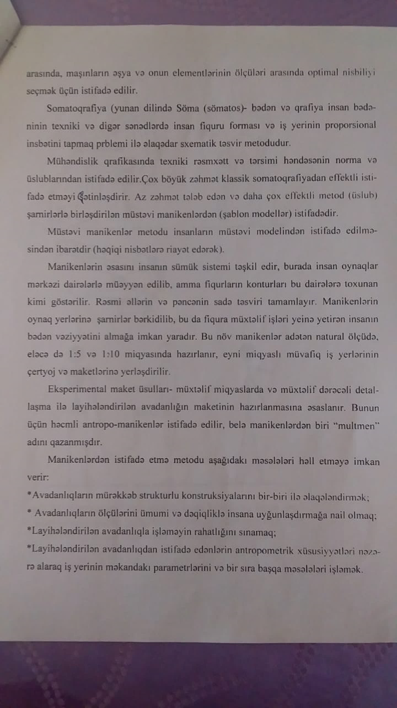

arasında, maşınların əşya və onun elementlərinin ölçüləri arasında optimal nisbiliyi
seçmək üçün istifadə edilir.

Somatoqrafiya (yunan dilində Söma (sömatos)- bədən və qrafiya insan bədə-
ninin texniki və digər sənədlərdə insan fiquru forması və iş yerinin proporsional
insbətini tapmaq prblemi ilə əlaqədar sxematik təsvir metodudur.

Mühəndislik qrafikasında texniki rəsmxətt və tərsimi həndəsənin norma və
üslublarından istifadə edilir.Çox böyük zəhmət klassik somatoqrafiyadan effektli isti-
fadə etməyi Qətinləşdirir. Az zəhmət tələb edən və daha çox elfektli metod (üslub)
şamirlərlə birləşdirilən müstəvi manekenlərdən (şablon modellər) istifadədir.

Müstəvi manikenlər metodu insanların müstəvi modelindən istifadə edilmə-
sindən ibarətdir (həqiqi nisbətlərə riayət edərək).

Manikenlərin əsasını insanın sümük sistemi təşkil edir, burada insan oynaqlar
mərkəzi dairələrlə müəyyən edilib, amma fiqurların konturları bu dairələrə toxunan
kimi göstərilir. Rəsmi əllərin və pəncənin sadə təsviri tamamlayır. Manikenlərin
oynaq yerlərinə şamirlər bərkidilib, bu da fiqura müxtəlif işləri yeinə yetirən insanın
bədən vəziyyətini almağa imkan yaradır. Bu növ manikenlər adətən natural ölçüdə.
eləcə də 1:5 və 1:10 miqyasında hazırlanır, eyni miqyaslı müvafiq iş yerlərinin
çertyo) və maketlərinə yerləşdirilir.

Eksperimental maket üsulları- müxtəlif miqyaslarda və müxtəlif dərəcəli detal-
laşma ilə layihələndirilən avadanlığın maketinin hazırlanmasına əsaslanır. Bunun
üçün həcmli antropo-manikenlər istifadə edilir, belə manekenlərdən biri “multmen”
adını qazanmışdır.

Manikenlərdən istifadə etmə metodu aşağıdakı məsələləri həll etməyə imkan
verir:

- Avadanlıqların mürəkkəb strukturlu konstruksiyalarını bir-biri ilə əlaqələndirmək:

” Avadanlıqların ölçülərini ümumi və dəqiqliklə insana uyğunlaşdırmağa nail olmaq:
“Layihələndirilən avadanlıqla işləməyin rahatlığını sınamaq:

“Layihələndirilən avadanlıqdan istifadə edənlərin antropometrik xüsusiyyətləri nəzə-
rə alaraq iş yerinin məkandakı parametrlərini və bir sıra başqa məsələləri işləmək.

---

## Səhifə 23 (hdphoto23.png)

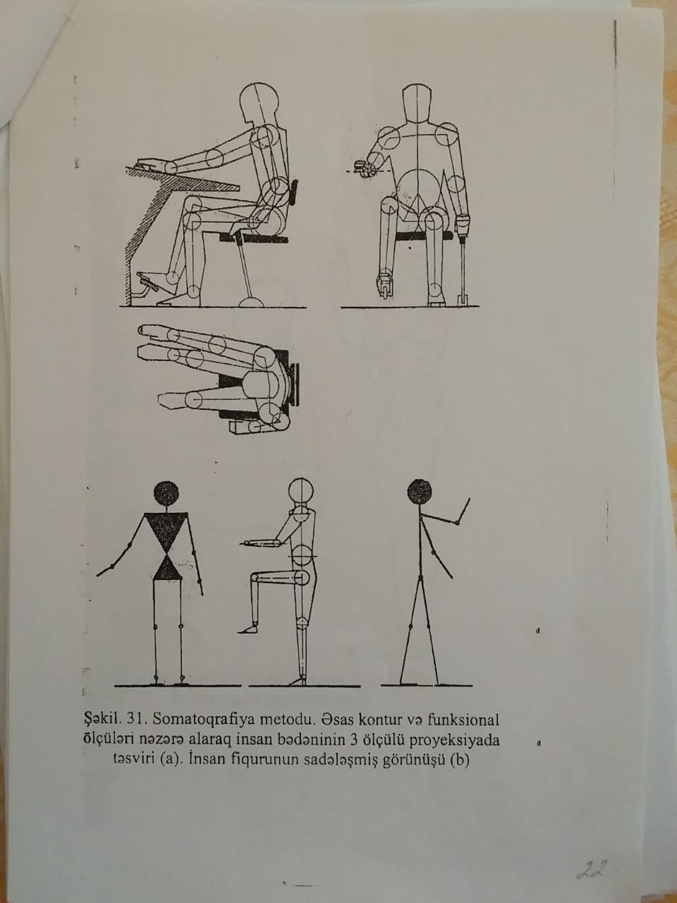

4 7 ) mə “x Ş
/” £—/4 GİLAN

LER do lü Ş
səs

2 si NE?
i İ İl .
Şəkil. 31. Somatoqrafiya metodu. Əsas kontur və funksional
ölçüləri nəzərə alaraq insan bədəninin 3 ölçülü proyeksiyada .
təsviri (a). İnsan fiqurunun sadələşmiş görünüşü (b)

---

## Səhifə 24 (hdphoto24.png)

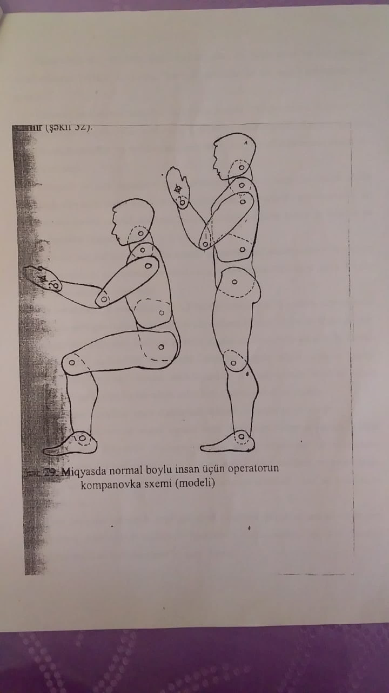

mu.
ənd o
pox
gi Y
ə li
x” i
hi
5. I
: . diqyasda normal boylu insan üçün operatorun İ
mö “” kompanovka sxemi (modeli) İ

---

## Səhifə 25 (hdphoto25.png)

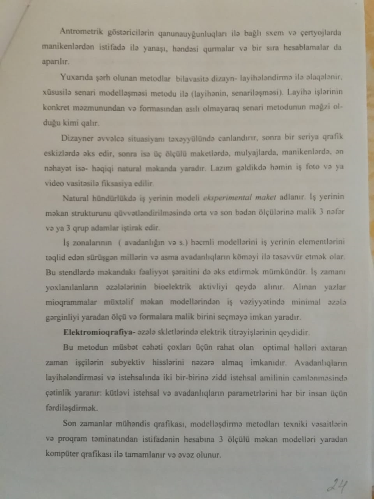

Antropometrik göstəricilərin qanunauyğunluqları ilə bağlı sxem və çertyollarda
/ manekenlərdən istifadə ilə yanaşı, həndəsi qurmalar və bir sıra hesablamalar da
aparılır.

Yuxarıda şərh olunan metodlar bilavasitə dizayn- layihələndirmə ilə əlaqələnir
xüsusilə senari modelləşməsi metodu ilə (layihənin, senariləşməsi). Layihə işlərinin
konkret məzmunundan və formasından asılı olmayaraq senari metodunun məğzi ol-
duğu kimi qalır.

Dizayner əvvəlcə situasiyanı təxəyyülündə canlandırır, sonra bir seriya qrafik
eskizlərdə əks edir, sonra isə üç ölçülü maketlərdə, mulyailarda, manikenlərdə, ən
nəhayət isə- həqiqi natural məkanda yaradır. Lazım gəldikdə həmin iş foto və ya
video vasitəsilə fiksasiya edilir

Natural hündürlükdə iş yerinin modeli eksperimental maket adlanır. İş yerinin
məkan strukturunu qüvvətləndirilməsində orta və son bədən ölçülərinə malik 3 nəfər
və ya 3 qrup adamlar iştirak edir.

İş zonalarının ( avadanlığın və s.) həcmli modellərini iş yerinin elementlərini
təqlid edən sürüşgən millərin və asma avadanlıqların köməyi ilə təsəvvür etmək olar
Bu stendlərdə məkandakı fəaliyyət şəraitini də əks etdirmək mümkündür. İş zamanı
yoxlanılanların əzələlərinin bioelektrik aktivliyi qeydə alınır. Alınan yazlar
mioqrammalar müxtəlif məkan modellərindən iş vəziyyətində minimal əzələ
gərginliyi yaradan ölçü və formalara malik birini seçməyə imkan yaradır.

Elektromioqrafiya- əzələ skletlərində elektrik titrəyişlərinin qeydidir.

Bu metodun müsbət cəhəti çoxları üçün rahat olan optimal həlləri axtaran
zaman işçilərin subyektiv hisslərini nəzərə almaq imkanıdır. Avadanlıqların
layihələndirməsi və istehsalında iki bir-birinə zidd istehsal amilinin cəmlənməsində
çətinlik yaranır: kütləvi istehsal və avadanlıqların parametrlərini hər bir insan üçün
fərdiləşdirmək.

Son zamanlar mühəndis qrafikası, modelləşdirmə metodları texniki vəsaitlərin
və proqram təminatından istifadənin hesabına 3 ölçülü məkan modelləri yaradan
kompüter qrafikası ilə tamamlanır və əvəz olunur.

vv

---

## Səhifə 26 (hdphoto26.png)

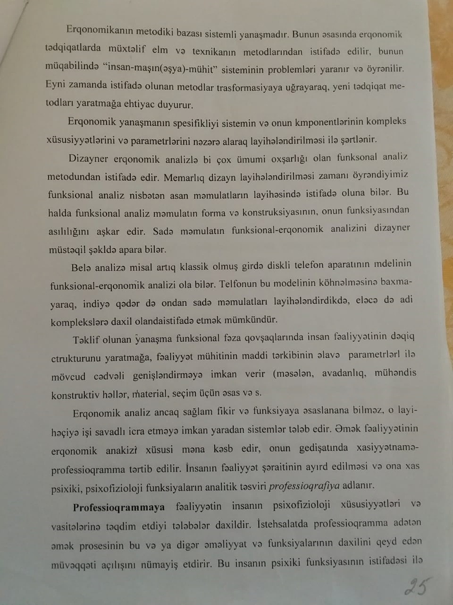
Metodiki bazası sistemli yanaşmadır. Bunun əsasında erqonomik
tədqiqatlarda müxtəlif elm və texnikanın metodlarından istifadə edilir, bunun
müqabilində “insan-maşın(əşya)-mühit” sisteminin problemləri yaranır və öyrənilir.
Eyni zamanda istifadə olunan metodlar transformasiyaya uğrayaraq, yeni tədqiqat me-
todları yaratmağa ehtiyac duyurur. m

Erqonomik yanaşmanın spesifikliyi sistemin və onun komponentlərinin kompleks
xüsusiyyətlərini və parametrlərini nəzərə alaraq layihələndirilməsi ilə şərtlənir.

Dizayner erqonomik analizlə bir çox ümumi oxşarlığı olan funksional analiz
metodundan istifadə edir. Memarlıq dizayn layihələndirilməsi zamanı öyrəndiyimiz
funksional analiz. nisbətən asan məmulatların layihəsində istifadə oluna bilər. Bu 5
halda funksional analiz məmulatın forma və konstruksiyasının, onun funksiyasından
asılılığını aşkar edir. Sadə məmulatın funksional-erqonomik analizini dizayner
müstəqil şəkldə apara bilər. 2

Belə analizə misal artıq klassik olmuş girdə diskli telefon aparatının mdelinin
funksional-erqonomik analizi ola bilər. Telfonun bu modelinin köhnəlməsinə baxma-
yaraq, indiyə qədər də ondan sadə məmulatları layihələndirdikdə, eləcə də adi
komplekslərə daxil olandaistifadə etmək mümkündür.

Təklif olunan yanaşma funksional fəza qovşaqlarında insan fəaliyyətinin dəqiq B
etrukturunu yaratmağa, fəaliyyət mühitinin maddi tərkibinin əlavə parametrlərl ilə ı
mövcud cədvəli genişləndirməyə imkan verir (məsələn, avadanlıq, mühəndis
konstruktiv həllər, material, seçim üçün əsas və s.

Erqonomik analiz ancaq sağlam fikir və funksiyaya əsaslanana bilməz, o layi-
həçiyə işi savadlı icra etməyə imkan yaradan sistemlər tələb edir. Əmək fəaliyyətinin
erqonomik anakizi xüsusi məna kəsb edir, onun gedişatında xasiyyətnamə-
professioqramma tərtib edilir. İnsanın fəaliyyət şəraitinin ayırd edilməsi və ona xas
psixiki, psixofizioloji funksiyaların analitik təsviri professioqrafiya adlanır.

Professioqrammaya fəaliyyətin insanın psixofizioloji xüsusiyyətləri və
vasitələrinə təqdim etdiyi tələbələr daxildir. İstehsalatda professioqramma adətən
əmək prosesinin bu və ya digər əməliyyat və funksiyalarının daxilini qeyd edən
müvəqqəti açılışını nümayiş etdirir. Bu insanın psixiki funksiyasının istifadəsi ilə

---

## Səhifə 27 (hdphoto27.png)

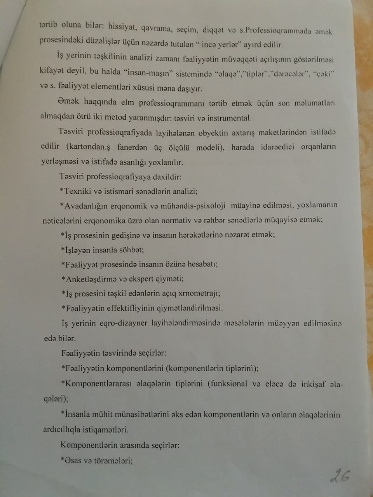

R i-
/ tərtib -. bilər: hissiyat, qavrama, seçim, diqqət və s.Professioqrammada əmək
/ prosesindəki düzəlişlər üçün nəzərdə tutulan “ incə yerlər” ayırd edilir.
/ İş yerinin təşkilinin analizi zamanı fəaliyyətin müvəqqəti açılışının göstərilməsi
kifayət deyil, bu halda “insan-maşın” sistemində “əlaqə”, “üplər”,”dərəcələr”, “çəki”
və s. fəaliyyət elementləri xüsusi məna daşıyır.
Əmək haqqında elm professioqrammanı tərtib etmək üçün son məlumatları b
almaqdan ötrü iki metod yaranmışdır: təsviri və instrumental.
Təsviri professioqrafiyada layihələnən obyektin axtarış maketlərindən istifadə
edilir (kartondan.ş fanerdən üç ölçülü modeli), harada idarəedici orqanların
yerləşməsi və istifadə asanlığı yoxlanılır.
Təsviri professioqrafiyaya daxildir: “
"Texniki və istismari sənədlərin analizi, ö
“Avadanlığın erqonomik və mühəndis-psixoloği müayinə edilməsi, yoxlamanın
nəticələrini erqonomika üzrə olan normativ və rəhbər sənədlərlə müqayisə etmək:
“İş prosesinin gedişinə və insanın hərəkətlərinə nəzarət etmək,
"İşləyən insanla söhbət,
s Fəaliyyət prosesində insanın özünə hesabatı:
“Anketləşdirmə və ekspert qiyməti, İ
“İş prosesini təşkil edənlərin açıq xmnometralı,
“Fəaliyyətin effektifliyinin qiymətləndirilməsi.
İş yerinin eqro-dizayner layihələndirməsində məsələlərin müəyyən edilməsinə
edə bilər.
Fəaliyyətin təsvirində seçirlər:
“Fəaliyyətin komponentlərini (komponentlərin tiplərini):
"Komponentlərarası əlaqələrin tiplərini (funksional və eləcə də inkişaf əla-
qələri):
"İnsanla mühit münasibətlərini əks edən komponentlərin və onların əlaqələrinin
ardıcıllıqla istiqamətləri.
Komponentlərin arasında seçirlər:
"Əsas və törəmələri:

---

## Səhifə 28 (hdphoto28.png)

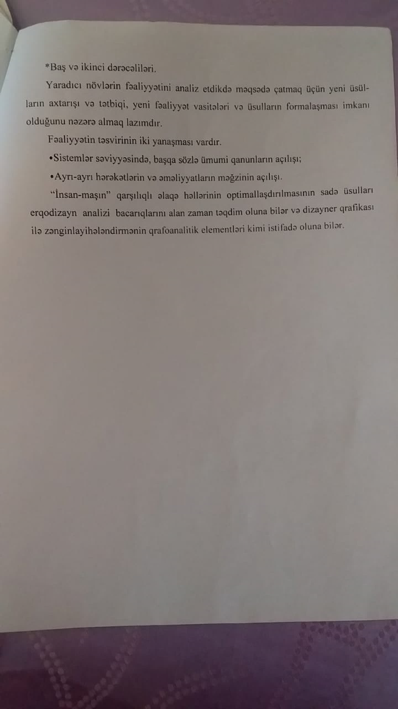

“Baş və ikinci dərəcəliləri,
Yaradıcı növlərin fsaliyyətini analiz etdikdə məqsədə çatmaq üçün yeni üsül-
ların axtarışı və tətbiqi, yeni fəaliyyət vasitələri və üsulların formalaşması imkanı
olduğunu nəzərə almaq lazımdır.
Fəaliyyətin təsvirinin iki yanaşması vardır.
"Sistemlər səviyyəsində, başqa sözlə ümumi qanunların açılışı: :
- Ayrı-ayrı hərəkətlərin və əməliyyatların məğzinin açılışı.
“İnsan-maşın” qarşılıqlı. əlaqə həllərinin optimallaşdırılmasının sadə üsulları
erqodizayn analizi bacarıqlarını alan zaman təqdim oluna bilər və dizayner arafikası
ilə zənginlayihələndirmənin qrafoanalitik elementləri kimi istifadə oluna bilər,

---

## Səhifə 29 (hdphoto29.png)

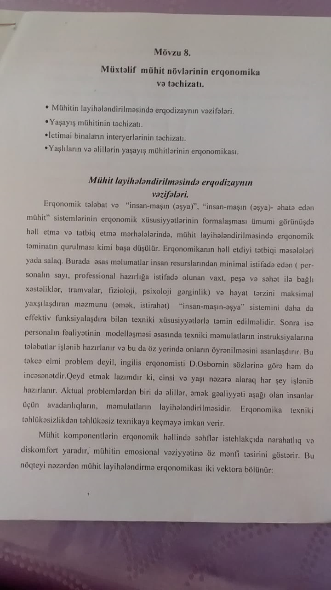

B5B—......
Mövzu 8,
Müxtəlif mühit növlərinin erqonomika
və təchizatı,

- Mühitin layihələndirilməsində erqodizaynın vəzifələri.

"Yaşayış mühitinin təchizatı.

eİetimai binaların interyerlərinin təchizatı,

"Yaşlıların və əlillərin yaşayış mühitlərinin erqonomikası,

Mühit layihələndirilməsində erqodizaynın
vəzifələri.

Erqonomik tələbat və “insan-maşın (əşya)”, “insan-maşın (əşya)- əhatə edən
mühit? sistemlərinin erqonomik xüsusiyyətlərinin formalaşması ümumi görünüşdə
həll etmə və tətbiq etmə mərhələlərində, mühit layihələndirilməsində erqonomik
təminatın qurulması kimi başa düşülür. Erqonomikanın həll etdiyi tətbiqi məsələləri
yada salaq. Burada əsas məlumatlar insan resurslarından minimal istifadə edən ( per-
sonalın sayı, professional hazırlığa istifadə olunan vaxt, peşə və səhət ilə bağlı
xəstəliklər, tramvalar, fizioloji, psixoloji gərginlik) və həyat tərzini maksimal
yaxşılaşdıran məzmunu (əmək, istirahət) “insan-maşın-əşya” sistemini daha da
effektiv funksiyalaşdıra bilən texniki xüsusiyyətlərlə təmin edilməlidir. Sonra isə
personalın fəaliyətinin modelləşməsi əsasında texniki məmulatların instruksiyalarına
tələbatlar işlənib hazırlanır və bu da öz: yerində onların öyrənilməsini asanlaşdırır. Bu
tökcə elmi problem deyil, ingilis erqonomisti D.Osbornin sözlərinə görə həm də
incəsənətdir.Qeyd etmək lazımdır ki, cinsi və yaşı nəzərə alaraq hər şey işlənib
hazırlanır, Aktual problemlərdən biri də əlillər, əmək gəaliyyəti aşağı olan insanlar
üçün avadanlıqların, məmulatların layihələndirilməsidir. Erqonomika texniki
təhlükəsizlikdən təhlükəsiz texnikaya keçməyə imkan verir.

Mühit komponentlərin erqonomik həllində səhflər istehlakçıda narahatlıq və
diskomfort yaradır, mühitin emosional vəziyyətinə öz mənfi təsirini göstərir, Bu
nöqteyi nəzərdən mühit layihələndirmə erqonomikası iki vektora bölünür:

---

## Səhifə 30 (hdphoto30.png)

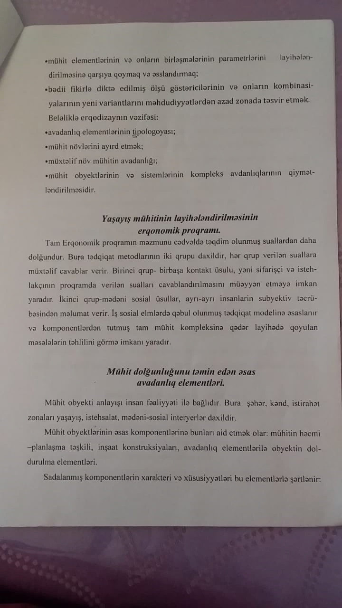

/ emühit elementlərinin və onların birləşmələrinin parametrlərini layihələn-
dirilməsinə qarşıya qoymaq və əsslandırmaq:

ebədii fikirlə diktə edilmiş ölşü göstəricilərinin və onların kombinasi-

yalarının yeni variantlarını məhdudiyyətlərdən azad zonada təsvir etmək.

Beləliklə erqodizaynın vəzifəsi:

savadanlıq elementlərinin tipologoyası:

emühit növlərini ayırd etmək:

“müxtəlif növ mühitin avadanlığı:

“mühit obyektlərinin və sistemlərinin kompleks avdanlıqlarının qiymət-

ləndirilməsidir.

Yaşayış mühitinin layihələndirilməsinin
erqonomik proqramı.

Tam Erqonomik proqramın məzmunu cədvəldə təqdim olunmuş suallardan daha
dolğundur. Bura tədqiqat metodlarının iki qrupu daxildir, hər qrup verilən suallara
müxtəlif cavablar verir. Birinci qrup- birbaşa kontakt üsulu, yəni sifarişçi və isteh-
lakçının proqramda verilən sualları cavablandırılmasını müəyyən etməyə imkan
yaradır. İkinci qrup-mədəni sosial üsullar, ayrı-ayrı insanlarin subyektiv təcrü-
bəsindən məlumat verir. İş sosial elmlərdə qəbul olunmuş tədqiqat modelinə əsaslanır
və komponentlərdən tutmuş tam mühit kompleksinə qədər layihədə qoyulan
məsələlərin təhlilini görmə imkanı yaradır.

Mühit dolğunluğunu təmin edən əsas
avadanlıq elementləri.

Mühit obyekti anlayışı insan fəaliyyəti ilə bağlıdır. Bura şəhər, kənd, istirahət
zonaları yaşayış, istehsalat, mədəni-sosial interyerlər daxildir.

Mühit obyektlərinin əsas komponentlərinə bunları aid etmək olar: mühitin həcmi
-planlaşma təşkili, inşaat konstruksiyaları, avadanlıq elementlərilə obyektin dol-
durulma elementləri.

Sadalanmış komponentlərin xarakteri və xüsusiyyətləri bu elementlərlə şərtlənir:

---

## Səhifə 31 (hdphoto31.png)

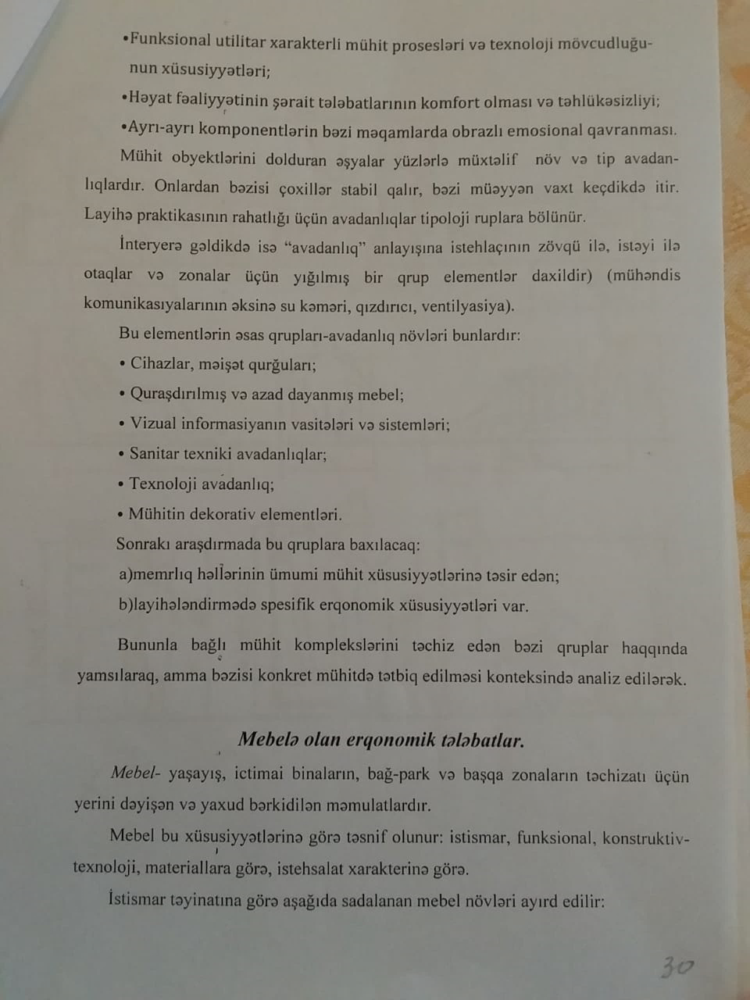

“Funksional utilitar xarakterli mühit prosesləri və texnolo)i mövcudluğu-
nun xüsusiyyətləri,
"Həyat fəaliyyətinin şərait tələbatlarının komfort olması və təhlükəsizliyi, .
- Ayrı-ayrı komponentlərin bəzi məqamlarda obrazlı emosional qavranması ”
Mühit obyektlərini dolduran əşyalar yüzlərlə müxtəlif növ və tip avadan- “əş
lıqlardır. Onlardan bəzisi çoxillər stabil qalır, bəzi müəyyən vaxt keçdikdə itir.
Layihə praktikasının rahatlığı üçün avadanlıqlar tipoloji ruplara bölünür.
İnteryerə gəldikdə isə “avadanlıq” anlayışına istehlaçının zövqü ilə, istəyi ilə
otaqlar və zonalar üçün yığılmış bir qrup elementlər daxildir) (mühəndis
komunikasıyalarının əksinə su kəməri, qızdırıcı, ventilyasiya).
Bu elementlərin əsas qrupları-avadanlıq növləri bunlardır:
- Cihazlar, məişət qurğuları:
- Quraşdırılmış və azad dayanmış mebel,
- Vizual informasiyanın vasitələri və sistemləri, b
- Sanitar texniki avadanlıqlar:
- Texnoloji avadanlıq:
- Mühitin dekorativ elementləri.
Sonrakı araşdırmada bu qruplara baxılacaq: 
a) memarlıq həllərinin ümumi mühit xüsusiyyətlərinə təsir edən: /
b) layihələndirmədə spesifik erqonomik xüsusiyyətləri var.
Bununla bağlı mühit komplekslərini təchiz edən bəzi qruplar haqqında i
yamsılaraq, amma bəzisi konkret mühitdə tətbiq edilməsi konteksində analiz edilərək.
, Mebelə olan erqonomik tələbatlar.
Mebel- yaşayış, ictimai binaların, bağ-park və başqa zonaların təchizatı üçün
yerini dəyişən və yaxud bərkidilən məmulatlardır.
Mebel bu xüsusiyyətlərinə görə təsnif olunur: istismar, funksional, konstruktiv-
texnolofi, materirllara görə, istehsalat xarakterinə görə.
İstismar təyinatına görə aşağıda sadalanan mebel növləri ayırd edilir:
da

---

## Səhifə 32 (hdphoto32.png)

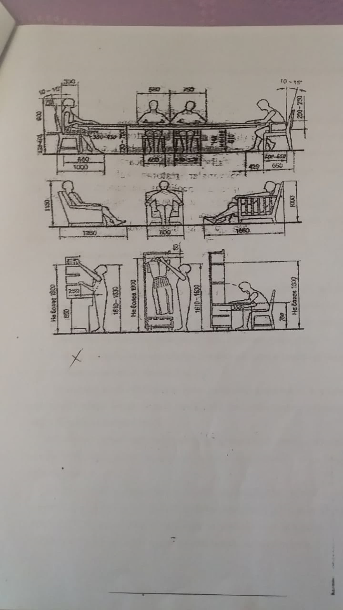
—Aə. ...1 l

---

## Səhifə 33 (hdphoto33.png)

Məişət mebeli- bağ, ev, kotedclər, açıq havada istifadə üçün nəzərdə tutulmuş
məmulatlar. Onlar yataq, qonaq, yemək, uşaq, mətbəx, hamam, dəhliz və bağ mebel-
lərinə bölünürlər.

İctimai otaqların mebeli- müəssisələrin və idarələrin funksional proseslərini,
fəaliyyətinin xüsusiyyətini nəzərə alaraq otaqları təchiz edən məmulatlar. Mebel
növlərə ayrılır: tibb müəssisələri (xəstəxana, poliknika), laboratoriyalar (tibb və
məktəb laboratoriyaları üçün), uşaq müəssisələri (körpələr evi, uşaq bağçaları), təhsil
ocaqları (məktəb, kollec, ali məktəb), ticarət ictimai iaşə müəssisələri) yeməkxanalar,
Restoran, kafe və s.) məişət xidməti (mehmanxana, nəqliyyat idarələrinin gözləmə
zalları), rabitə, bank, teatr-tamaşa müəssisələri üçün nəzərdə tutulmuş mebellər.

Şəhər mühiti və açıq meydançalar üçün ( istirahət zonaları) nəzərdə tutulmuş
mebel.

Nəqliyyat üçün mebel- müxtəlif nəqliyyat vasitələrinintəchizatı üçün nəzərdə
tutulmuş məmulatdır.

İstehsalat binalarının mebeli.

Funksional təyinatına görə aşağıdakı mebel növləri ayırd edilir.

Saxlama üçün tutumlu mebel (korpuslu mebel), əsas məqsədi müxtəlif əşyaları
saxlamaq və yerləşdirməkdir: şkaflar, dolablar, servantlar, sandıqlar və s.

Oturmaq və uzanmaq üçün mebel: yataqlar, divanlar, taxtlar, stul, kürsü və s.

İşləmək və yemək üçün mebel — bura əsasən iş, yazı, nahar, iumal və s. masalar,
stollar daxildir.

Əlavə mebellər - asılqan, uşaq manelləri və s.

Mebelin ölçüləri insan bədəninin (antropometrik göstəricilər) ölçülərindən və
saxlanılması, yerləşdirilməsi lazım olan əşyaların ölçülərindən asılıdır.

Şəkil 38, 39, 40-da mebelin insanın istismar antropometrik tələbatlarını təmin
edən əsas qabaritləri göstərilmişdir.

Uzanmaq və oturmaq üçün nəzərdə tutulmuş məmulatların layihəsidə erqonomik
tələbatların layihəsində erqonomik tələbatların nəzərə alınması xüsusilə vacibdir.

---

## Səhifə 34 (hdphoto34.png)

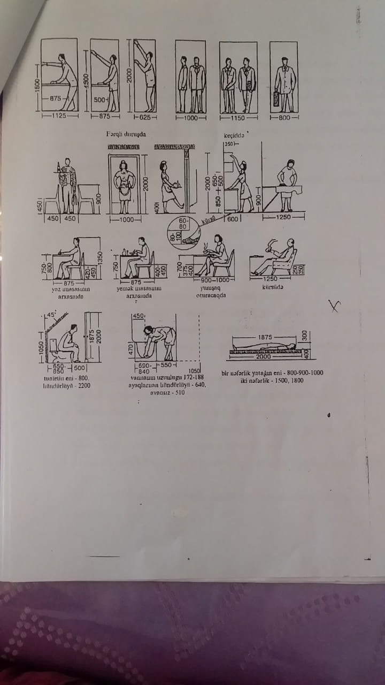
üs İy hüm a isi
azı
la
il ı la 6
diz BORA
“80 450 İ—ooo—İ yəbfdool F—izs0 —)
.—. “elatı z/
.. -. . Vi
Lara susa mmm

---

## Səhifə 35 (hdphoto35.png)

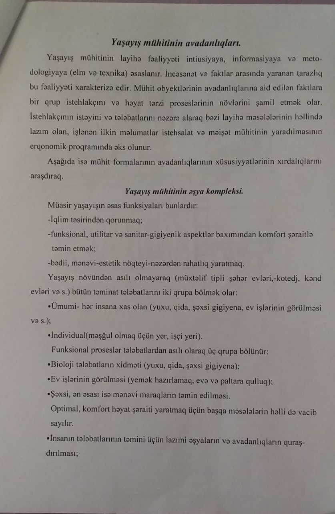

Yaşayış mühitinin avadanlıqları.

Yaşayış mühitinin layihə fəaliyyəti intiusiyaya, informasiyaya və meto-
dologiyaya (elm və texnika) əsaslanır. İncəsənət və faktlar arasında yaranan tarazlıq
bu fəaliyyəti xarakterizə edir. Mühit. obyektlərinin avadanlıqlarına aid edilən faktlara
bir qrup istehlakçını və həyat tərzi proseslərinin növlərini şamil etmək olar.
İstehlakçının istəyini və tələbatlarını nəzərə alaraq bəzi layihə məsələlərinin həllində
lazım olan, işlənən ilkin məlumatlar istehsalat və məişət mühitinin yaradılmasının
erqonomik proqramında əks olunur.

Aşağıda isə mühit formalarının avadanlıqlarının xüsusiyyətlərinin xırdalıqlarını
araşdıraq.

Yaşayış mühitinin əşya kompleksi.

Müasir yaşayışın əsas funksiyaları bunlardır:

-İqlim təsirindən qorunmaq:

“funksional, utilitar və sanitar-gigiyenik aspektlər baxımından komfort şəraitlə

təmin etmək,

“bədii, mənəvi-estetik nöqteyi-nəzərdən rahatlıq yaratmaq.

Yaşayış növündən asılı olmayaraq (müxtəlif tipli şəhər evləri,-kotedi, kənd
evləri və s.) bütün təminat tələbatlarını iki qrupa bölmək olar:

- Ümumi- hər insana xas olan (yuxu, qida, şəxsi gigiyena, ev işlərinin görülməsi
və s.),

- İndividual(məşğul olmaq üçün yer, işçi yeri).

Funksional proseslər tələbatlardan asılı olaraq üç qrupa bölünür:

"Bioloği tələbatların xidməti (yuxu, qida, şəxsi gigiyena):

“Ev işlərinin görülməsi (yemək hazırlamaq, evə və paltara qulluq):

“Şəxsi, ən əsası isə mənəvi maraqların təmin edilməsi.

Optimal, komfort həyat şəraiti yaratmaq üçün başqa məsələlərin həlli də vacib
sayılır.

"İnsanın tələbatlarının təmini üçün lazımi əşyaların və avadanlıqların quraş-

dirilması,

---

## Səhifə 36 (hdphoto36.png)

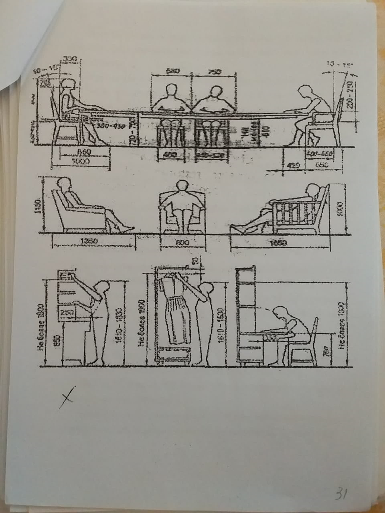

4 TER palraszml uc
00 2--ə a
İLE  biLİifLə a
8 ə, ə sar .
.. Fe.
d. “mə
Bi keL a İİ dn nəs g
ia İL ər
alib lil. -s
5 . ur

---

## Səhifə 37 (hdphoto37.png)

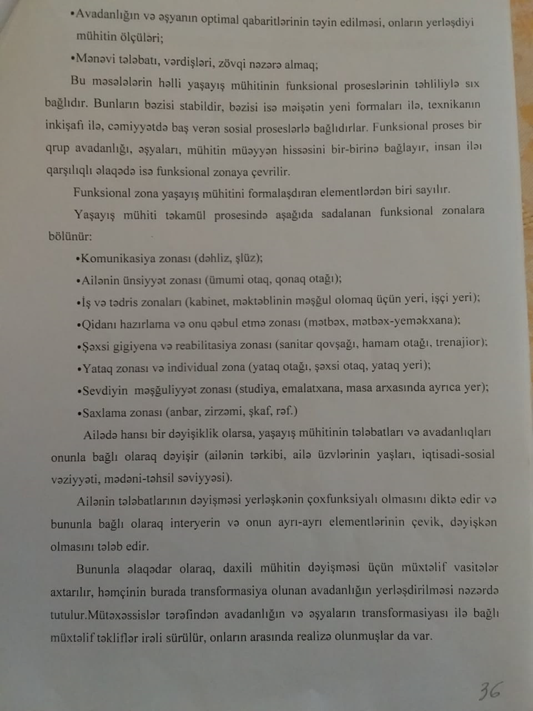

"Avadanlığın və əşyanın optimal qabaritlərinin təyin edilməsi, onların yerləşdiyi
mühitin ölçüləri,
Mənəvi tələbatı, vərdişləri, zövqi nəzərə almaq: .
Bu məsələlərin həlli yaşayış mühitinin funksional proseslərinin təhliliylə sıx 5
bağlıdır. Bunların bəzisi stabildir, bəzisi isə məişətin yeni formaları ilə, texnikanın
inkişafı ilə, cəmiyyətdə baş verən sosial proseslərlə bağlıdırlar. Funksional proses bir
qrup avadanlığı, əşyaları, mühitin müəyyən hissəsini bir-birinə bağlayır, insan ilə: ç
qarşılıqlı əlaqədə isə funksional zonaya çevrilir.

Funksional zona yaşayış mühitini formalaşdıran elementlərdən biri sayılır.

Yaşayış mühiti təkamül prosesində aşağıda sadalanan funksional zonalara
bölünür:

eKomunikasiya zonası (dəhliz, şlüz):

"Ailənin ünsiyyət zonası (ümumi otaq, qonaq otağı): Ri

eİş və tədris zonaları (kabinet, məktəblinin məşğul olomaq üçün yeri, işçi yeri):

“Qidanı hazırlama və onu qəbul etmə zonası (mətbəx, mətbəx-yeməkxana):

"Şəxsi gigiyena və reabilitasiya zonası (sanitar qovşağı, hamam otağı, trenaiior):

“Yataq zonası və individual zona (yataq otağı, şəxsi otaq, yataq yeri):

“Sevdiyin məşğuliyyət zonası (studiya, emalatxana, masa arxasında ayrıca yer): :

əSaxlama zonası (anbar, zirzəmi, şkaf, rəf.)

Ailədə hansı bir dəyişiklik olarsa, yaşayış mühitinin tələbatları və avadanlıqları
onunla bağlı olaraq dəyişir (ailənin tərkibi, ailə üzvlərinin yaşları, iqtisadi-sosial
vəziyyəti, mədəni-təhsil səviyyəsi).

Ailənin tələbatlarının dəyişməsi yerləşkənin çoxfunksiyalı olmasını diktə edir və
bununla bağlı olaraq interyerin və onun ayrı-ayrı elementlərinin çevik, dəyişkən
olmasını tələb edir.

Bununla əlaqədar olaraq, daxili mühitin dəyişməsi üçün müxtəlif vasitələr
axtarılır, həmçinin burada transformasiya olunan avadanlığın yerləşdirilməsi nəzərdə
tutulur.Mütəxəssislər tərəfindən avadanlığın və əşyaların transformasiyası ilə bağlı
müxtəlif təkliflər irəli sürülür, onların arasında realizə olunmuşlar da var.

---

## Səhifə 38 (hdphoto38.png)

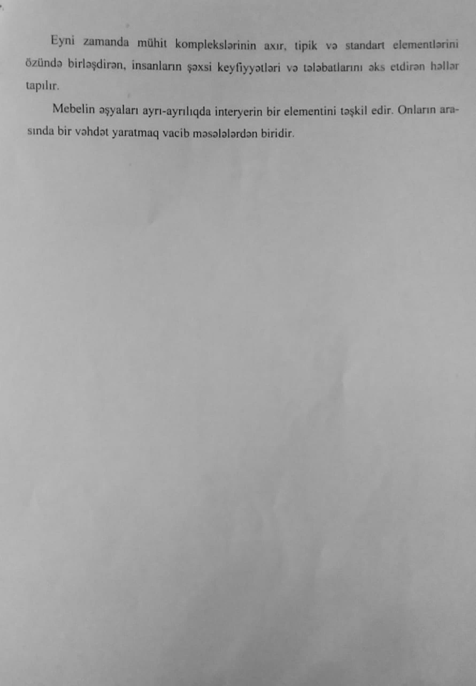

, vər ka. R ə, ə .. : ü
özündə birləşdirən, insanların şəxsi keyfiyyətləri və tələbatlarını əks etdirən həllər
tapılır. . R aş ı
Mebelin əşyaları ayrı-aynılıqda interyerin bir elementini təşkil edir. Onların ara-
sında bir vəhdət yaratmaq vacib məsələlərdən biridir.
.- " ŞE
gər kə ai
o ua Mü
mə ə.
ol

---

## Səhifə 39 (hdphoto39.png)

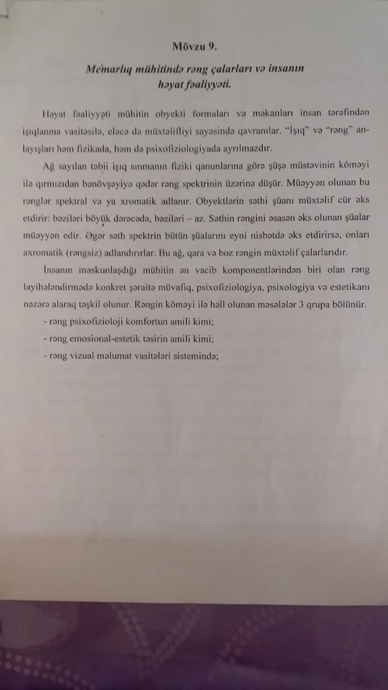

Mövzu 9.
Memarlıq mühitində rəng çalarları və insanın
həyat fəaliyyəti.

Həyat foaliyyəti mühitin obyekti formuları və məkanları insan tərəfindən
işıqlanmu vasitəsilə, eləcə də müxtəlifliyi sayəsində qavranılur. “İşıq” və “rəng” an-
Tayişları həm Üizikadi, həm də psixofiziologiyadı ayrılmuzdır.

Ni sayılan təbii işiq sınmünın fiziki qununlurina görə şüşə müstəvinin köməyi
ilə qırmızıdan bənövşəyiyə qədər rənh spektrinin üzərinə düşür. Müəyyən olunan bu
rənglər spektral və ya xromutik adlanır. Obyektlərin səthi şüanı müxtəlif cür əks
etdirir: bəziləri böyük dərəcədə, bəziləri — az. Səthin rəngini əsasən əks olunan şüalar
müəyyən edir, Əğər səth spektrin bütün şüalarını eyni nisbətdə əks etdirirsə, onları
axromutik (rənnsiz) adlandırırlar, Bu ağ, qara və boz təngin müxtəlif çalarlarıdır.

İnsanın məskunlaşdığı mühitin ən vacib komponentlərindən biri olan rəng:
layihələndirmədə konkret şəraitə müvafiq, psixofiziologiya, psixologiya və estetikanı
nəzərə alaraq təşkil olunur, Rəngin köməyi ilə həll olunan məsələlər 3 qrupa bölünür.

- rəng psixofizioloji komfortun amili kimi:

- rəng emosionul-estetik təsirin amili kimi,

- rəng vizual məlumat vasitələri sistemində,

sə 77

---

## Səhifə 40 (hdphoto40.png)

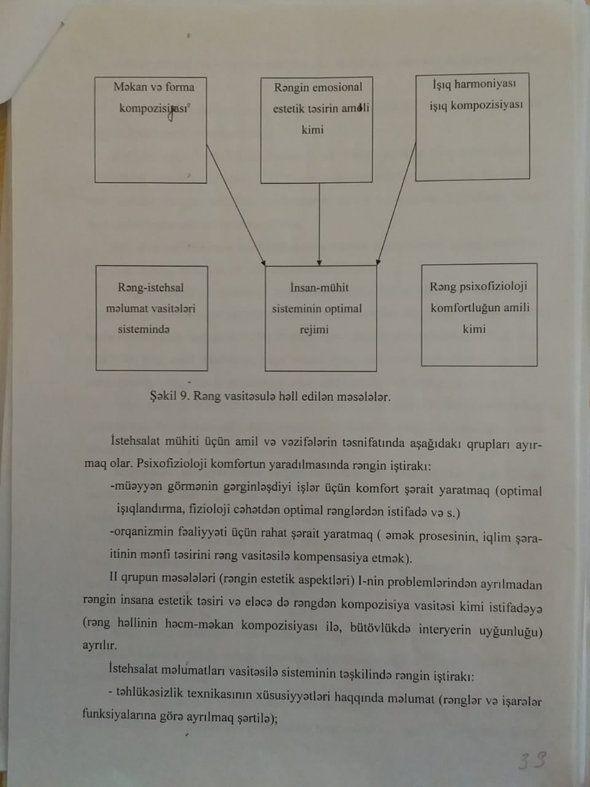

Məkan və forma Rəngin emosional İşıq harmoniyası
kimi
Rəng-istehsal İnsan-mühit Rəng psixofizioloji
məlumat vasitələri sisteminin optimal komfortluğun amili
sistemində reyimi kimi
Şəkil 9 Rəng vasitəsulə həll edilən məsələlər.
İstehsalat mühiti üçün amil və vəzifələrin təsnifatında aşağıdakı qrupları ayır-
maq olar. Psixofizioloği komfortun yaradılmasında rəngin iştirakı:
: “müəyyən görmənin gərginləşdiyi işlər üçün komfort şərait yaratmaq (optimal
işıqlandırma, fizioloji cəhətdən optimal rənglərdən istifadə və s.)
1 "orqanizmin fəaliyyəti üçün rahat şərait yaratmaq ( əmək prosesinin, iqlim şəra-
itinin mənfi təsirini rəng vasitəsilə kompensasiya etmək).
II qrupun məsələləri (rəngin estetik aspektləri) I-nin problemlərindən ayrılmadan
rəngin insana estetik təsiri və eləcə də rəngdən kompozisiya vasitəsi kimi istifadəyə
(rəng həllinin həcm-məkan kompozisiyası ilə, bütövlükdə interyerin uyğunluğu)
ayrılır.
İstehsalat məlumatları vasitəsilə sisteminin təşkilində rəngin iştirakı:
- təhlükəsizlik texnikasının xüsusiyyətləri haqqında məlumat (rənglər və işarələr
funksiyalarına görə ayrılmaq şərtilə),
hi

---

## Səhifə 41 (hdphoto41.png)

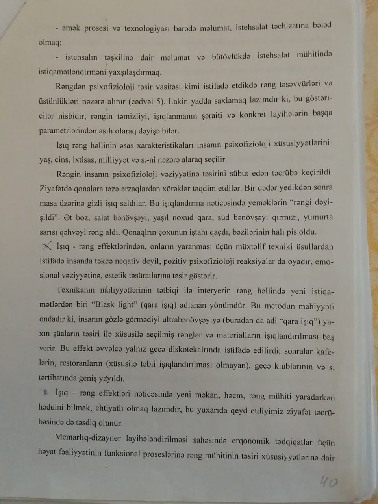

- əmək prosesi və texnologiyası barədə məlumat, istehsalat təchizatına bələd
olmaq:

- istehsalın təşkilinə dair məlumat və bütövlükdə istehsalat mühitində
istiqamətləndirməni yaxşılaşdırmaq.

Rəngdən psixofiziolofi təsir vasitəsi kimi istifadə etdikdə rəng təsəvvürləri və :
üstünlükləri nəzərə alınır (cədvəl 5). Lakin yadda saxlamaq lazımdır ki, bu göstəri- 3
cilər nisbidir, rəngin təmizliyi, işıqlanmanın şəraiti və konkret layihələrin başqa
parametrlərindən asılı olaraq dəyişə bilər. yi

İşıq rəng həllinin əsas xarakteristikaları insanın psixofizioloji xüsusiyyətlərini- :
yaş, cins, ixtisas, milliyyət və s.-ni nəzərə alaraq seçilir.

Rəngin insanın psixofizioloji vəziyyətinə təsirini sübut edən təcrübə keçirildi. .
Ziyafətdə qonalara təzə ərzaqlardan xörəklər təqdim etdilər. Bir qədər yedikdən sonra .
masa üzərinə gizli işıq saldılar. Bu işıqlandırma nəticəsində yeməklərin “rəngi dəyi-
şildi”. Ət boz, salat bənövşəyi, yaşıl noxud qara, süd bənövşəyi qırmızı, yumurta 9
sarısı qəhvəyi rəng aldı. Qonaqlrın çoxunun iştahı qaçdı, bəzilərinin halı pis oldu.

nəq İşıq - rəng effektlərindən, onların yaranması üçün müxtəlif texniki üsullardan
istifadə insanda təkcə neqativ deyil, pozitiv psixofizioloği reaksiyalar da oyadır, emo- ə
sional vəziyyətinə, estetik təsüratlarına təsir göstərir.

Texnikanın nüiliyyətlərinin tətbiqi ilə interyerin rəng həllində yeni istiqa-
mətlərdən biri “Blask light” (qara işıq) adlanan yönümdür. Bu metodun mahiyyəti
ondadır ki, insanın gözlə görmədiyi ultrabənövşəyiyə (buradan da adi “qara işıq”) ya-
xın şüaların təsiri ilə xüsusilə seçilmiş rənglər və materialların işıqlandırılması baş
verir. Bu effekt əvvəlcə yalnız gecə diskotekalrında istifadə edilirdi, sonralar kafe- :
lərin, restoranların (xüsusilə təbii işıqlandırılması olmayan), gecə klublarının və s,
tərtibatında geniş yayıldı.

Y İşıq — rəng effektləri nəticəsində yeni məkan, həcm, rəng mühiti yaradarkən
həddini bilmək, ehtiyatlı olmaq lazımdır, bu yuxarıda qeyd etdiyimiz ziyafət təcrü-
bəsində də təsdiq olunur.

Memarlıq-dizayner layihələndirilməsi sahəsində erqonomik tədqiqatlar üçün
həyat fəaliyyətinin funksional proseslərinə rəng mühitinin təsiri xüsusiyyətlərinə dair

Yo
— ... q 5”)

---

## Səhifə 42 (hdphoto42.png)

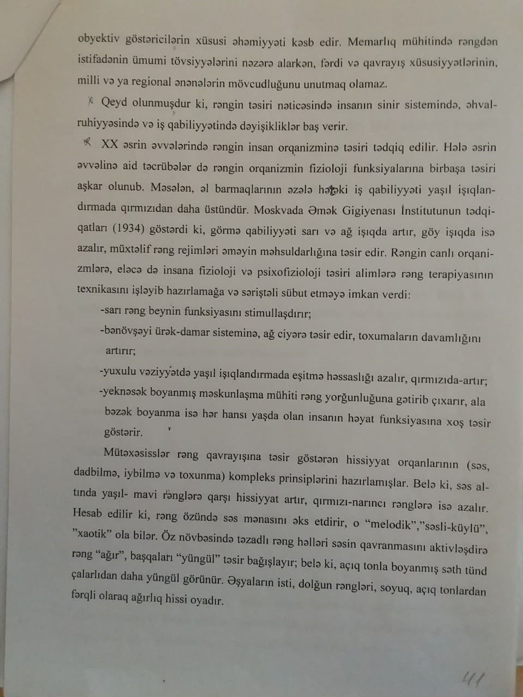

obyektiv göstəricilərin xüsusi əhəmiyyəti kəsb edir. Memarlıq mühitində rəngdən
istifadənin ümumi tövsiyyələrini nəzərə alarkən, fərdi və qavrayış xüsusiyyətlərinin,
ed milli və ya regional ənənələrin mövcudluğunu unutmaq olamaz,
£ Qeyd olunmuşdur ki, rəngin təsiri nəticəsində insanın sinir sistemində, əhval-
ruhiyyəsində və iş qabiliyyətində dəyişikliklər baş verir.
X XX əsrin əvvələrində rəngin insan orqanizminə təsiri tədqiq edilir. Hələ əsrin
əvvəlinə aid təcrübələr də rəngin orqanizmin fizioloği funksiyalarına birbaşa təsiri
aşkar olunub. Məsələn, əl barmaqlarının əzələ həftəki iş qabiliyyəti yaşıl işıqlan-
dırmada qırmızıdan daha üstündür. Moskvada Əmək Gigiyenası İnstitutunun tədqi-
qatları (1934) göstərdi ki, görmə qabiliyyəti sarı və ağ işıqda artır, göy işıqda isə
azalır, müxtəlif rəng reyimləri əməyin məhsuldarlığına təsir edir. Rəngin canlı orqani-
zmlərə, eləcə də insana fizioloji və psixofizioloji təsiri alimlərə rəng terapiyasının
texnikasını işləyib hazırlamağa və səriştəli sübut etməyə imkan verdi:
“Sarı rəng beynin funksiyasını stimullaşdırır,
“bənövşəyi ürək-damar sisteminə, ağ ciyərə təsir edir, toxumaların davamlığını
artırır,
"yuxulu vəziyyətdə yaşıl işıqlandırmada eşitmə həssaslığı azalır, qırmızıda-artır,
“yeknəsək boyanmış məskunlaşma mühiti rəng yorğunluğuna gətirib çıxarır, ala
bəzək boyanma isə hər hansı yaşda olan insanın həyat funksiyasına xoş təsir
göstərir. L
Mütəxəsislər rəng qavrayışına təsir göstərən hissiyyat orqanlarının (səs,
dadbilmə, iybilmə və toxunma) kompleks prinsiplərini hazırlamışlar. Belə ki, səs al-
tında yaşıl- mavi rənglərə qarşı hissiyyat artır, qırmızı-narıncı rənglərə isə azalır.
Hesab edilir ki, rəng özündə səs mənasını əks etdirir, o “melodik”, ”səsli-küylü”,
I "xaotik” ola bilər. Öz növbəsində təzadlı rəng həlləri səsin qavranmasını aktivləşdirə
1 rəng “ağır”, başqaları “yüngül” təsir bağışlayır: belə ki, açıq tonla boyanmış səth tünd
: çalarlıdan daha yüngül görünür. Əşyaların isti, dolğun rəngləri, soyuq, açıq tonlardan
fərqli olaraq ağırlıq hissi oyadır.

---

## Səhifə 43 (hdphoto43.png)

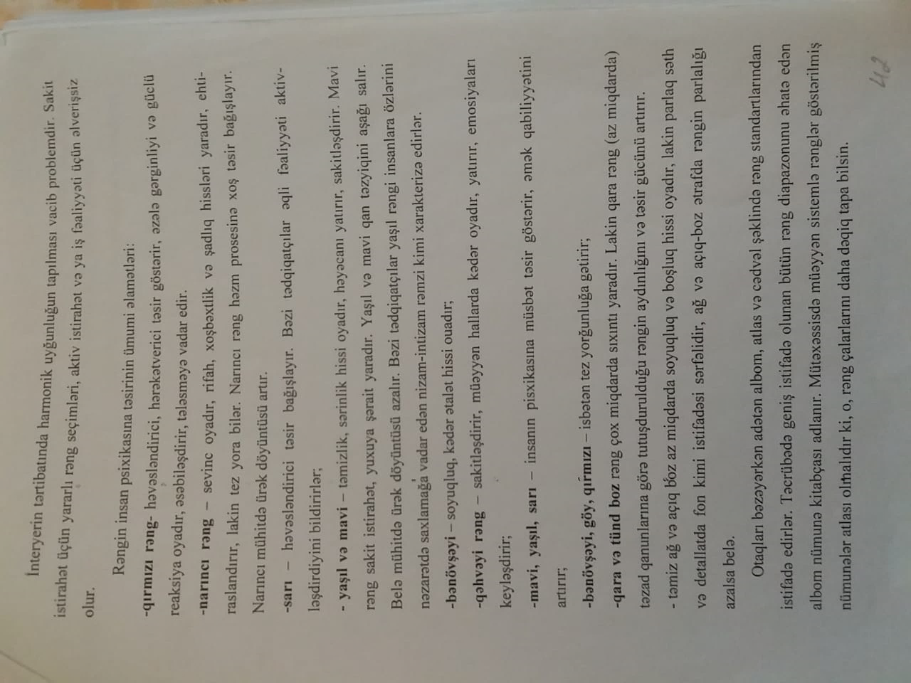

eldi s Q s s
7 ə sd oz
üb E B . 2 30
.. s o xu zum S aa
ə ço üs "s x s Həss
: “m... 2 gə .—- 2555
: z —.. c m gssğ 28 4
s .. - Bio E s Xaəxa pa lz
PI öz onunu sanin -
—i “ Eq gr - ” Ə ə -
... . : Z . əkubl z - Ba gs donun
ak: . sə E Ez33 E E 978 gə soz
üz ş m s z2353 5 G 0 uu
a m m —- E şou . . səs s oo bi
E m. 2 2305 "m 32 5 000
.. $ 285 0 İSS z $ 4 2254
s E - E £ oz : ə
.. 23401. ş52: £ ki las z şaiq
— -. zi - .. B z m... 0 ö
on - ə əz z 555: S E Bü s əş.
şəx ... 5:55: Lü sBiğşə s 5
2. 3 cl 2 2 “ —
malı. - 25323 s 55: s.
go Ki. - m kör s s gi sa “ə "ə -” 36
Eos - ”  “. ee İz i m gö ı
Es B8 Öş ğ 53414 E ira SE
” 240 ıı - o bəl öəə
kı 34331 ş 5.11 2 işa 5
şid lı “31325 S ES ənə
.. 555556 233:25 s 55-53 BL
s 28376 ə 25 i 572 b un
su 5577 z “231: z 0860 3.3
x m oğ z ..8 gşei m şi
əb g5485.5 mə s ..m.... c ı
ə 53:25:43 sh Yİ müz a baz
23 5515262 E OB ü os in Bs a
z” mo ğ b Yıs o xd B Bö : . m
.... az 200 izi Zi N N ç E)
5 2534848 3350:123 mı -..
Eu Bsşasüud Şışşiı İ “on ə m 25.
bə 2545231 55143 Baza sz
mo do Ss. mo Oz E A —
s ğ 15 2Qarv zi .. si M. 5
KUZə Hin: ö exs. sz s
"ə 1213577 Q ə r - zoz s... s
"s Dürrə EE m Es ei - Çağ) ə os o
g E a a mü s :
5. ...... 11:15 2:53 - 2
mz 1:31:31111315 m x .. x b
Bi 157: S du s
gön sıranın ə 1151500
o s düs 25192 25:5:25557
ex 11750
goz 33
ca 5241231315
m... 52:55:
Z B maus
m s

---

## Səhifə 44 (hdphoto44.png)

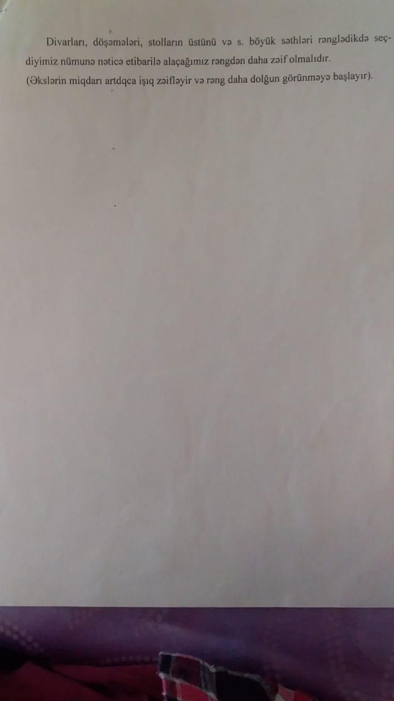

Divarları, döşəmələri, stolların üstünü və s. böyük səthləri rənglədikdə seç-
diyimiz nümunə nəticə etibarilə alaçağımız rəngdən daha zəif olmalıdır.
(Əkslərin miqdarı artdqca işıq zəifləyir və rəng daha dolğun görünməyə başlayır).

---

## Səhifə 45 (hdphoto45.png)

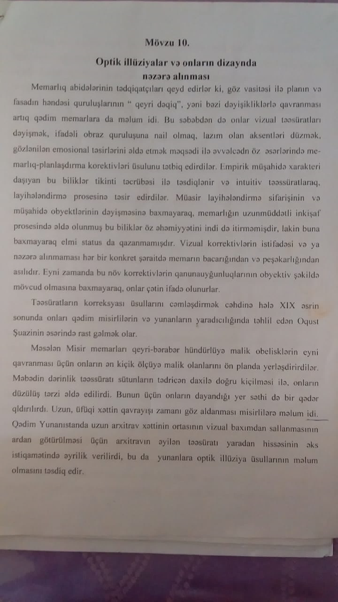

Mövzu 10.
Optik illüziyalar və onların dizaynda
nəzərə alınması

Memarlıq abidələrinin tədqiqatçıları qeyd edirlər ki, göz vasitəsi ilə planın və
fasadın həndəsi quruluşlarının “ qeyri dəqiq”, yəni bəzi dəyişikliklərlə qavranması
artıq qədim memarlara da məlum idi. Bu səbəbdən də onlar vizual təəsüratları
dəyişmək, ifadəli obraz quruluşunu nail olmaq, lazım olun aksentləri düzmək,
gözlənilən emosional təsirlərini əldə etmək məqsədi ilə əvvəlcədn öz əsərlərində me:
marlıq-planlaşdırma korektivləri üsulunu tətbiq edirdilər. Empirik müşuhidə xarakteri
daşıyan bu biliklər tikinti təcrübəsi ilə təsdiqlənir və intuitiv təəssüratlaraq,
layihələndirmə prosesinə təsir edirdilər. Müasir layihələndirmə sifarişinin və
müşahidə obyektlərinin dəyişməsinə baxmayaraq, memarlığın uzunmüddətli inkişaf
prosesində əldə olunmuş bu biliklər öz əhəmiyyətini indi də itirməmişdir, lakin buna
baxmayaraq elmi status da qazanmamışdır. Vizual korrektivlərin istifadəsi və ya
nəzərə alınmaması hər bir konkret şəraitdə memarın bacarığından və peşəkarlığından
asılıdır. Eyni zamanda bu növ korrektivlərin qanunuuyğunluqlarının obyektiv şəkildə
mövcud olmasına baxmayaraq, onlar çətin ifadə olunurlar.

Təəsüratların korreksyası üsullarını cəmləşdirmək cəhdinə hələ XIX əsrin
sonunda onları qədim misirlilərin və yunanların yaradıcılığında təhlil edən Oqust
Şuazinin əsərində rast gəlmək olar.

Məsələn Misir memarları qeyri-bərabər hündürlüyə malik obelisklərin eyni
qavranması üçün onların ən kiçik ölçüyə malik olanlarını ön planda yerləşdirirdilər
Məbədin dərinlik təəssüratı sütunların tədricən daxilə doğru kiçilməsi ilə, onların
düzülüş tərzi əldə edilirdi, Bunun üçün onların dayandığı yer səthi də bir qədər
qldırılırdı. Uzun, üfüqi xəttin qavrayışı zamanı göz aldanması misirlilərə məlum idi,
Qədim Yunanıstanda uzun arxitrav xəttinin ortasının vizual baxımdan sallanmasının
ardan götürülməsi üçün arxitravın əyilən təəsüratı yaradan hissəsinin əks
istiqamətində əyrilik verilirdi, bu da yunanlara optik illüziya üsullarının məlum
olmasını təsdiq edir.

---

## Səhifə 46 (hdphoto46.png)

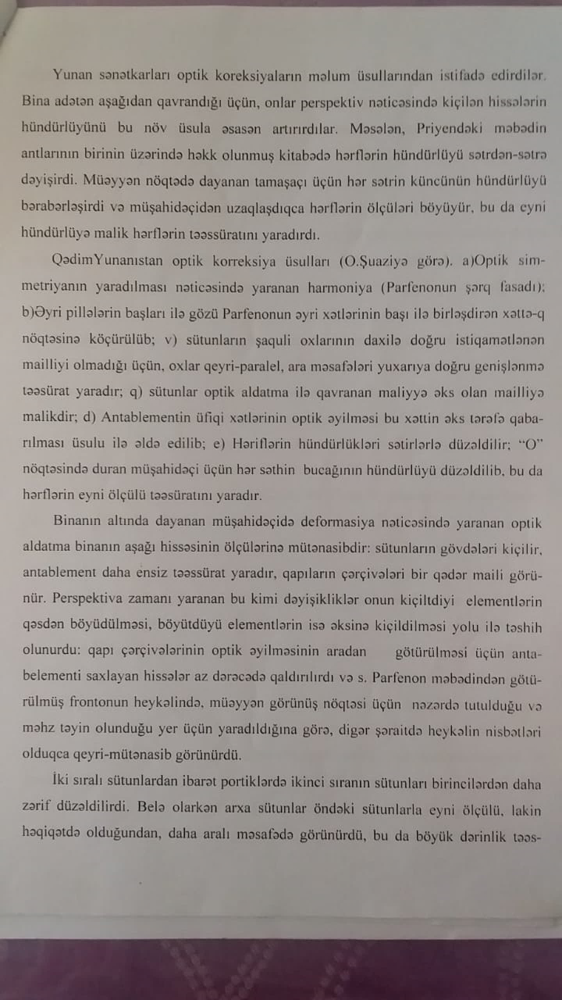

Yunan sənətkarları optik koreksiyaların məlum üsullarından istifadə edirdilər.
Bina adətən aşağıdan qavrandığı üçün, onlar perspektiv nəticəsində kiçilən hissələrin
hündürlüyünü bu növ üsula əsasən artırırdılar. Məsələn, Priyendəki məbədin
antlarının birinin üzərində həkk olunmuş kitabədə hərflərin hündürlüyü sətrdən-sətrə
dəyişirdi. Müəyyən nöqtədə dayanan tamaşaçı üçün hər sətrin küncünün hündürlüyü
bərabərləşirdi və müşahidəçidən uzaqlaşdıqca hərflərin ölçüləri böyüyür, bu da eyni
hündürlüyə malik hərflərin təəssüratını yaradırdı.

QədimYunanıstan optik korreksiya üsulları (O.Şuaziyə görə). a)Öptik sim-
metriyanın yaradılması nəticəsində yaranan harmoniya (Parfenonun şərq fasadı):
b)Əyri pillələrin başları ilə gözü Parfenonun əyri xətlərinin başı ilə birləşdirən xəttə-q
nöqtəsinə köçürülüb: v) sütunların şaquli oxlarının daxilə doğru istiqamətlənən
mailliyi olmadığı üçün, oxlar qeyri-paralel, ara məsafələri yuxarıya doğru genişlənmə
təəsürat yaradır: q) sütunlar optik aldatma ilə qavranan maliyyə əks olan mailliyə
malikdir: d) Antablementin üfiqi xətlərinin optik əyilməsi bu xəttin əks tərəfə qaba-
rılması üsulu ilə əldə edilib: e) Həriflərin hündürlükləri sətirlərlə düzəldilir: “O”
nöqtəsində duran müşahidəçi üçün hər səthin bucağının hündürlüyü düzəldilib. bu da
hərflərin eyni ölçülü təəsüratını yaradır.

Binanın altında dayanan müşahidəçidə deformasiya nəticəsində yaranan optik
aldatma binanın aşağı hissəsinin ölçülərinə mütənasibdir: sütunların gövdələri kiçilir,
antablement daha ensiz təəssürat yaradır, qapıların çərçivələri bir qədər maili görü-
nür. Perspektiva zamanı yaranan bu kimi dəyişikliklər onun kiçiltdiyi elementlərin
qəsdən böyüdülməsi, böyütdüyü elementlərin isə əksinə kiçildilməsi yolu ilə təshih
olunurdu: qapı çərçivələrinin optik əyilməsinin aradan götürülməsi üçün anta-
belementi saxlayan hissələr az dərəcədə qaldırılırdı və s. Parfenon məbədindən götü-
rülmüş frontonun heykəlində, müəyyən görünüş nöqləsi üçün nəzərdə tutulduğu və
məhz təyin olunduğu yer üçün yaradıldığına görə, digər şəraitdə heykəlin nisbətləri
olduqca qeyri-mütənasib görünürdü.

İki sıralı sütunlardan ibarət portiklərdə ikinci sıranın sütunları birincilərdən daha
zərif düzəldilirdi. Belə olarkən arxa sütunlar öndəki sütunlarla eyni ölçülü, lakin
həqiqətdə olduğundan, daha aralı məsafədə görünürdü, bu da böyük dərinlik təəs-

---

## Səhifə 47 (hdphoto47.png)

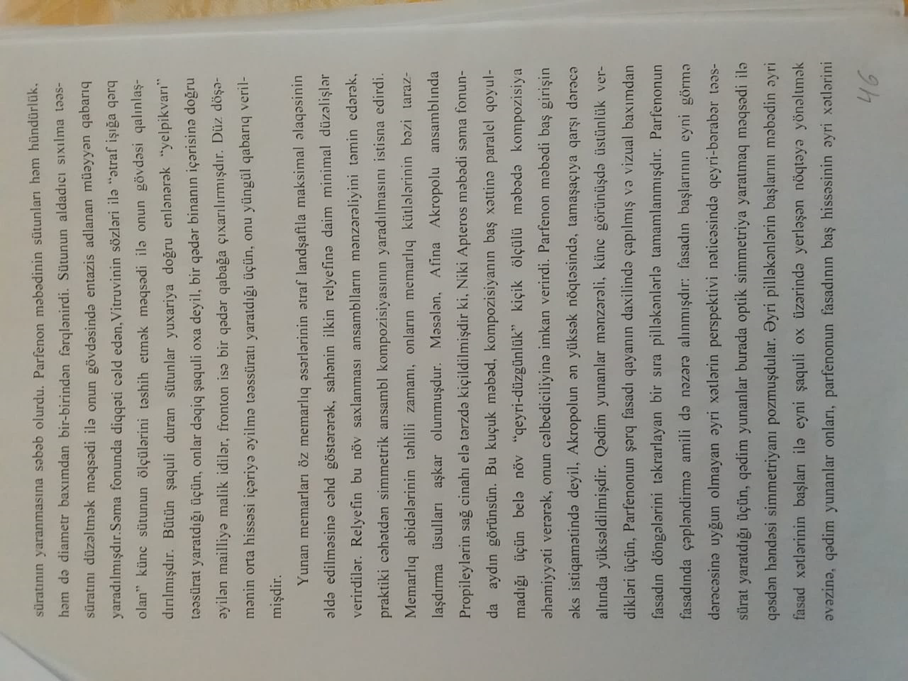

udu r s. Hə gi ei “syşsnm.s sos 28.585-5522855885
4807 EdTLB zz Be x N - x b ə cz k
ssa iİ59625 sssşlıqşssı ıı
St 62$886 gz 8 2- 6 6 208 23 5 BE 0
m mo zo x 22o89383z6e 68960 698x.5626269820907“
SGağğamasz s.ə. R ğ - 5 GE
E BE omsusu soz sş8s38s35226725968  2050557
dı. o ğ28486 S--84ğ33832:52S6S225268277775575
x axcudnrn a zi ox mu ın go ə xum 00500 E
2DOUuUSs” $£g su Eoz ŞS ğ 8295293 ə s £ ə
E mievsosu E £E $  £ so :.7::10-X 00
dan cnu — 5 ——. 55: .
müm o 0 of zi) şusslı29422:82:22777:7—
mm s ss Bs m E x 5 Əzd Zogs o £ 8 8 2
HB3u ss 6), 6 z :458214267057 7 y lh “.“V“v.X(...
-.. Hm min s s mp hoç
şüb 25582 55:75: v..
Gas sn m İm sS Q,uxuu zz ss 8 £cx dm. ğum
“2uüuğ.sğs "uu dE-ğ uzununa
1 von sd də gdöğrcsn “Əsdsdəğ£ ə 82 2 4 58
EƏSŞ287904 dağ yoo 633268 65
Bullş0x os Hr qaranı co ıı S quş
p Xaos nn mo zz kı, 22 gaəxga,aəss zəd
H. plaza OĞ z 6 if üd8.“ö- .E s
ovusıRso?aə E?752286.525 6 Şslfas5r25555
BEBaSİEİ36524 “522 şa 07”
ni - s 3 sz m öz dö o sy xXx .c ö
gü Z..37 258 seŞ828922£2 6.83832626(£ ö
8838205275 5158216577” 0...
BSeƏğüUB.S9 282 5 Bz a s Hzi:.
2380251012: 131 €  V”/”V €(v(— DO
- Busd-ss3yş272 gaqdğls.əssdud4 s256:c6665267
Q8.9226868-6 S1251f1.2:3.3325277177777
dŞüşqql 325 66:74 s42634522205 00 5,
d55055::::89 də 5 “QEYS şan.
əxs ds £$ 88 22521 B0Ş.89:X264 “ ə
susomnuzl üz m “m ” - ununu şəms zü“
2şş33121257 7—v47(77 vU.
si m- sö z 3 m s ... e
5757 -ÇUÇUÇ  X—X—
gey:z 8 oz ç 1 . z . zəl
şi 54 SCİ z dB ... s
0 S z “düz 362 Emds4. 6587F7—XF—vXU7777: Boz
dGEÖYS Si dsn nom o m Egayş9əşğde Es E
2523553257 s36215.54212725177 2
ho BE m pi “ .on gə : o.
5sS22124823x4 8253235868 B85335277
- iz in : 583 - .:
MQsaiğdzoxz mo qğşıağğ2-aüş”ğ985x594 p
“aran. “ BE p - ə gü ys.
z 5615557 ƏB 6 Se 82288 E s
HE 258)8X x 6 E  Bu 8 Es g məə g gös
Hə 8 - Z : Ə həz $ sv təd sə zə soz
ii zm 8: ZEs9s3qşuulüus ə oz E üs
EsşBSS3Z2 2 £2Z ii -K6k—— $ vVv7vxX7X7X3X3X73X7X7X7. g
Z4Muş3ı672- 35:3282 ds fSs33242 :
əƏkocədğsE E Xoxdlıs4232741:77717 pi
LL o as. ə

---

## Səhifə 48 (hdphoto48.png)

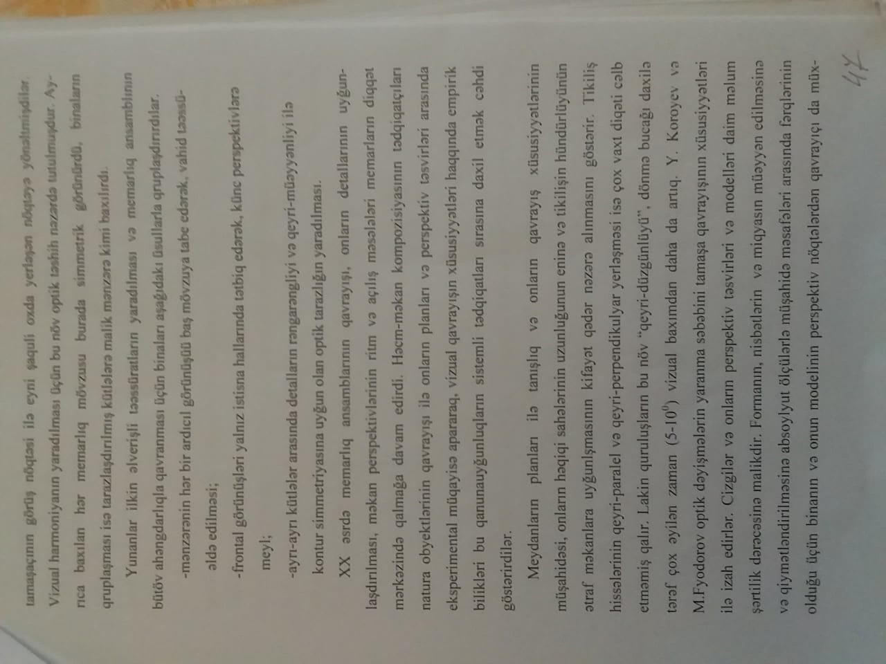

-..ç.ş"?"S"Əunuuuu

itiiı.i bipaqıı 135147131121

sili iı. 6917) 1133577
5 “B Bs ? Sə Su a 8 BERE-Ə 6 28 BE
i53 1233 m z şğ924 9512592262 E48
Büs iə Eş HƏBS3zEüAB asdd0:360565
i13.:15 qığğıaşaaaı
38.:53$ 5 "ü x - m geni x
1333333 $ 333: b 0
N . i ıü eğsis rus a...
İsi İf 6313313524 sı
işbi.iğ E331:5531 5334305036
Masalı... BELİ satisi 6
i1:53: 2)... :::1017”
z S Kİ Əs s iF 5... ö
Ş5:111: 4 ŞSaBY355£ q:3553:13.12
şicöii 3 Ş33985/2 S3L8s.
şild.ai i fa 1.86 21077” V/“"(F—(—“—
Ta 5:33 s EZRsE5-5c- şsiğ3375:2555657
$ 29 a 53 pl 8254326106 z Sössığğs4
şıILB34 - s fis YSss3 - 5
331131 io ili. (06 “ş5528
£5S32032365 8 qəonduəbsə .. .... 25
Xa... Kİ is glağnqıs is 2557:
luna... ö s "S iq- z E- x. 777
fria112 515177 FB x 54555:
1333533 13 11:11711 a
20250 m ü z E B.E? 3?” 8752665
dı. 5.5835828 isi 556
.. 057 .. 55357”: s
şliiiıiqi 4113111: 1121:133350:
5. murad 4 ğs o şo. əƏNRnESğH
15457—-::r:. sa...
qılbı.ıır.ııı də susum. 555
BB32563 r, S... 584.
BHalllair i.135 3111306 dir
qda” V VN7”?,”
5?ŞEB 2 şı lı 381 “1250
- SERCƏZSA E 5 imi m...

---

## Səhifə 49 (hdphoto49.png)

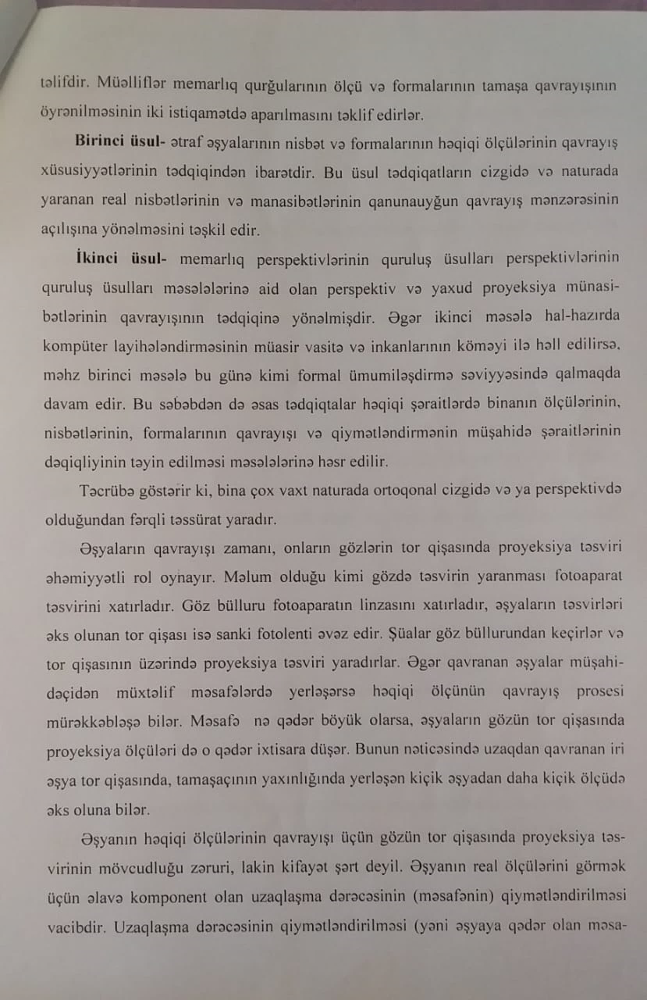

təlifdir. Müəlliflər memarlıq qurğularının ölçü və formalarının tamaşa qavrayışının
öyrənilməsinin iki istiqamətdə aparılmasını təklif edirlər.

Birinci üsul- ətraf əşyalarının nisbət və formalarının həqiqi ölçülərinin qavrayış
xüsusiyyətlərinin tədqiqindən ibarətdir. Bu üsul tədqiqatların cizgidə və naturada
yaranan real nisbətlərinin və manasibətlərinin qanunauyğun qavrayış mənzərəsinin
açılışına yönəlməsini təşkil edir.

İkinci üsul- memarlıq perspektivlərinin quruluş üsulları perspektivlərinin
quruluş üsulları məsələlərinə aid olan perspektiv və yaxud proyeksiya münasi-
bətlərinin qavrayışının tədqiqinə yönəlmişdir. Əgər ikinci məsələ hal-hazırda
kompüter layihələndirməsinin müasir vasitə və inkanlarının köməyi ilə həll edilirsə,
məhz birinci məsələ bu günə kimi formal ümumiləşdirmə səviyyəsində qalmaqda
davam edir. Bu səbəbdən də əsas tədqiqtalar həqiqi şəraitlərdə binanın ölçülərinin,
nisbətlərinin, formalarının qavrayışı və qiymətləndirmənin müşahidə şəraitlərinin
dəqiqliyinin təyin edilməsi məsələlərinə həsr edilir.

Təcrübə göstərir ki, bina çox vaxt naturada ortoqonal cizgidə və ya perspektivdə
olduğundan fərqli təssürat yaradır.

Əşyaların qavrayışı zamanı, onların gözlərin tor qişasında proyeksiya təsviri
əhəmiyyətli rol oynayır. Məlum olduğu kimi gözdə təsvirin yaranması fotoaparat
təsvirini xatırladır. Göz bülluru fotoaparatın linzasını xatırladır, əşyaların təsvirləri
əks olunan tor qişası isə sanki fotolenti əvəz edir. Şüalar göz büllurundan keçirlər və
tor qişasının üzərində proyeksiya təsviri yaradırlar. Əgər qavranan əşyalar müşahi-
dəçidən müxtəlif məsafələrdə yerləşərsə həqiqi ölçünün qavrayış prosesi
mürəkkəbləşə bilər. Məsafə nə qədər böyük olarsa, əşyaların gözün tor qişasında
proyeksiya ölçüləri də o qədər ixtisara düşər. Bunun nəticəsində uzaqdan qavranan iri
əşya tor qişasında, tamaşaçının yaxınlığında yerləşən kiçik əşyadan daha kiçik ölçüdə
əks oluna bilər.

Əşyanın həqiqi ölçülərinin qavrayışı üçün gözün tor qişasında proyeksiya təs-
virinin mövcudluğu zəruri, lakin kifayət şərt deyil. Əşyanın real ölçülərini görmək
üçün əlavə komponent olan uzaqlaşma dərəcəsinin (məsafənin) qiymətləndirilməsi
vacibdir. Uzaqlaşma dərəcəsinin qiymətləndirilməsi (yəni əşyaya qədər olan məsa-

---

## Səhifə 50 (hdphoto50.png)

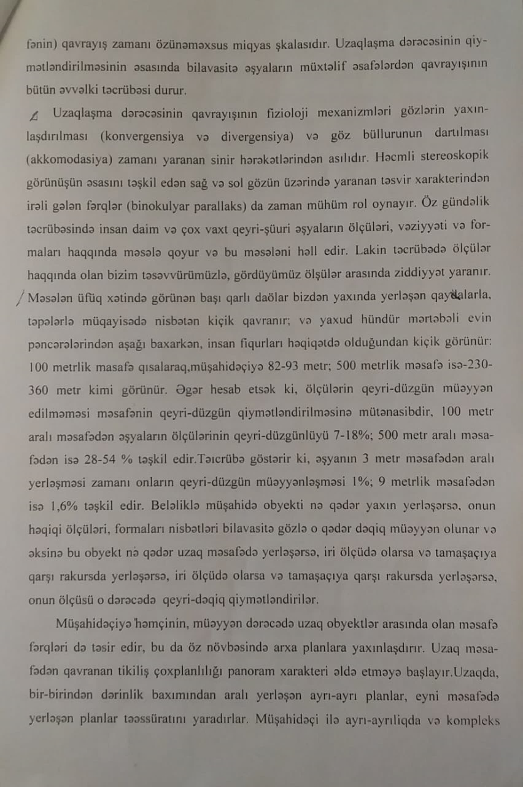

/ fənin) qavrayış zamanı özünəməxsus miqyas şkalasıdır. Uzaqlaşma dərəcəsinin qiy-
mətləndirilməsinin əsasında bilavasitə əşyaların müxtəlif əsafələrdən qavrayışının
bütün əvvəlki təcrübəsi durur.

2 Uzaqlaşma dərəcəsinin qavrayışının fiziololi mexanizmləri gözlərin yaxın-
laşdırılması (konvergensiya və divergensiya) və göz büllurunun dartılması
(akkomodasiya) zamanı yaranan sinir hərəkətlərindən asılıdır. Həcmli stereoskopik
görünüşün əsasını təşkil edən sağ və sol gözün üzərində yaranan təsvir xarakterindən
irəli gələn fərqlər (binokulyar parallaks) da zaman mühüm rol oynayır. Öz gündəlik
təcrübəsində insan daim və çox vaxt qeyri-şüuri əşyaların ölçüləri, vəziyyəti və for-
maları haqqında məsələ qoyur və bu məsələni həll edir. Lakin təcrübədə ölçülər
haqqında olan bizim təsəvvürümüzlə, gördüyümüz ölşülər arasında ziddiyyət yaranır.

// Məsələn üfüq xətində görünən başı qarlı daölar bizdən yaxında yerləşən qaydalarla,
təpələrlə müqayisədə nisbətən kiçik qavranır, və yaxud hündür mərtəbəli evin
pəncərələrindən aşağı baxarkən, insan fiqurları həqiqətdə olduğundan kiçik görünür:
100 metrlik masafə qısalaraq,müşahidəçiyə 82-93 metr: 500 metrlik məsafə isə-230-
360 metr kimi görünür. Əgər hesab etsək ki, ölçülərin qeyri-düzgün müəyyən
edilməməsi məsafənin qeyri-düzgün qiymətləndirilməsinə mütənasibdir, 100 metr
aralı məsafədən əşyaların ölçülərinin qeyri-düzgünlüyü 7-189/6, 500 metr aralı məsa-
fədən isə 28-54 9/6 təşkil edir.Tərcrübə göstərir ki, əşyanın 3 metr məsafədən aralı
yerləşməsi zamanı onların qeyri-düzgün müəyyənləşməsi 19/06, 9 metrlik məsafədən
isə 1,699 təşkil edir. Beləliklə müşahidə obyekti nə qədər yaxın yerləşərsə, onun
həqiqi ölçüləri, formaları nisbətləri bilavasitə gözlə o qədər dəqiq müəyyən olunar və
əksinə bu obyekt nə qədər uzaq məsafədə yerləşərsə, iri ölçüdə olarsa və tamaşaçıya
qarşı rakursda yerləşərsə, iri ölçüdə olarsa və tamaşaçıya qarşı rakursda yerləşərsə,
onun ölçüsü o dərəcədə qeyri-dəqiq qiymətləndirilər.

Müşahidəçiyə həmçinin, müəyyən dərəcədə uzaq obyektlər arasında olan məsafə
fərqləri də təsir edir, bu da öz növbəsində arxa planlara yaxınlaşdırır. Uzaq məsa-
fədən qavranan tikiliş çoxplanlılığı panoram xarakteri əldə etməyə başlayır.LIzaqda,
bir-birindən dərinlik baxımından aralı yerləşən ayrı-ayrı planlar, eyni məsafədə
yerləşən planlar təəssüratını yaradırlar. Müşahidəçi ilə ayrı-ayrıliqda və kompleks

---

## Səhifə 51 (hdphoto51.png)

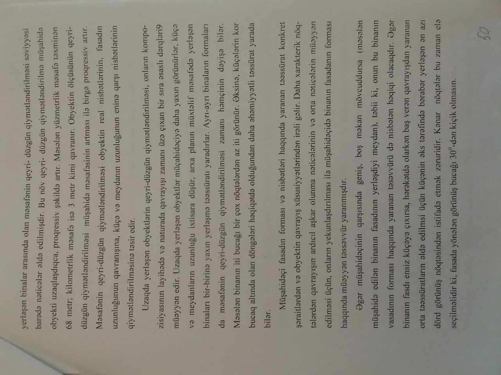

Bğ2u ə “əş
şe 6 68 üz sıbsğs c
un Bss Şa os
gssxzs68 -.-.. a “Unun m
şQısğ:s:ss3 gl ÇAĞ Bs eu b
2575 Qa s o 0.3 Şə id E .səşn
1505 EsX 248 m... - 3:55 H5
ZE 5814 g9səssadzIu3 £ 2 zi.
S433ğ5256 XMuşsüas Qoz os Eu £.2) 72
55::5-:“- mə m ds Qo s 6--6:5-00
xx cud n B4249:217 üs o s Kanar o
SŞESS3£Z22-48 sSuBAS322 o xu uğ xo x 5 2 uğ
-. 257: 89885 5 8 8 8 6 2 x, 8,83 8 4
“eduənrşdz soösusdus- on s zcaı
fgEZS3 986, x o Bs lesdrsisa- gön göz Q 8-z298868
u56066 6 225::554672575 s.a z g98£ 2 o
gEğtbənQdmi 265655: zəl mu s oASBUsu
575: B58:5:70 556: 1.
5:5255:: 53.-4666 6 205- 1.3:041
desə uz sox  z so s - düş əs c
“E2?926x6 dssıusnu su —.0 suz G
s s səl zl E Bs.
5555 2506556561 Ze xy BEPSX:
25:65 z Xa fğsi: dB 0 8 x mo şgləvokdso2406
çə 1 BQŞğğ4u43464 Suz ğ E .9sc-
s. 556525 B345255775 Eəsms ə məsə Bə
“s cz m z mə dl in N s zəl çe əə Ee səh
dusurşs3d4 2 üusduss mo s 57757”
Şaşısşa ez s əz ii Ho HE xo s cUcus ə
Səs zsez8 33365 Pa “s.ə.s mo unulm.a.
Ə ou. N iz . x Esoa də üo xun se
EdSsos QSESS?243 o - es mc uğ
ə bə mz ŞaŞ2S-z36 15:::51001
sura nu SSEL3S38a 2 nE 4 — s sə
2056848 6 Əz.2518426 “mgdğdsuakxaA Buz.
şıx 6: 5622133255 .57:7:75:
. - LPsxvs32 8: 9 “ə m m
2832:652 ou... 2..5522518582
ei 2 m “a Z E izə - z gu x
5:235326£ 5508680 şa 7“Xm:.737Xc:
552: HoOsdlucu. EsuL 83 o ei
ao xz muz B3-36 m on g s dz gəzg8
"33300..İ1:15..1 S53255::18336
darı. puuzsusü s
əş : E 2 2 x də Ə - o g3 ə s
goz o 35.555885590 5:55
4... ok $ .— əl Zİ - —
o E Şşz dünosxun.m dö 68868 N E
dSB322- ... Ee X228 285-485 HMünüass
d3kğğ3s 87 sss . iz El zo Hom s
ESLBERBLS 9334 idürə: QŞosşuiu.32 264
o dil o xsin ə s öv
m “SORU m s m ə şə 2  E “Şe X
ş8ğ39 155794 gönd ə e 2 s 3
c ... 5 z 9 ii -—
"585-n igaiB5V
S550555 86. 510514 şur. dı
2131435”:::341:211 şişqaidilil:682
mNmov3 gə) Su "a  ii irəş
si oz R z go mooug sz mm
ö . z DE 0002277 x s
4082366 E z - oo s 2UREBES
s Es: 5 R gg. Süz a zə)
o Ee ” z — bzi o - mom z o n
ai 5314 0, 255
ş2uos - İİ və x
x $ Xx s EH S "N
El

---

## Səhifə 52 (hdphoto52.png)

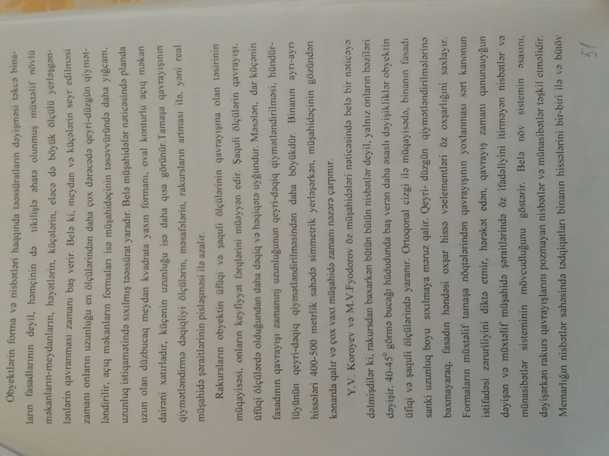

s ır
5 8 ee
du:
z 132314 5
e 1511111) gozum
Es m Bz r
55743 s53İ3üğ 2557
dı 115 do
”——” (3iiti HİT:
8155 35 Ke x -55: ez Bs
sular "3 Lin
15337 346..11 isşi 5:51114
- 52 "b 6” 153224 141” du E
"36 go $ mı Ba. zi Xə
Hütlliril 53474 quli
1553221 E 1250 ill
115: z ün
HHİİHİT ih
HEHİHH H tikilir. İL
Pila3ili Hü
111: 16 55324 518812
2 şibi4 33: B41:11151 ii Şiz
Gİ s 1 mx Ee zi E d
ahnibi 517 115 3
pi3iqdiil: 4151 .— si
giililili ..17 524 A z s
RE ili: 551..
es 2 zi ou "la
iH 331:1: HHHUN
i: bri 3 i x
balililgi 135131 Böqş nəz
Hun ə zə EE s m əs b İ:
Hi - Ed 3 s
in 23113 s
şışsı .. “ül 223 : R mo
HO: x 213 zi 2:
Hihii “ə. — şid .
z qlirii:l Ba 33 Bü i
HEHİHİ mar 533 27
3343131 “ün Bİ Ə ə 5 .
Hülhilini İşbilli İ3:
lil 5 $
ilik g E ə
n 2 ii daaa ik
il -
R z E də) “ m oz
Era - a zo İc 8 Zal or
(3131111711 me E
illi. 135
qlmupud.
ilidir.
du "538
allı..
əN - £og E
nu...
o 13114 .-
ır sS88
k iə

---

## Səhifə 53 (hdphoto53.png)

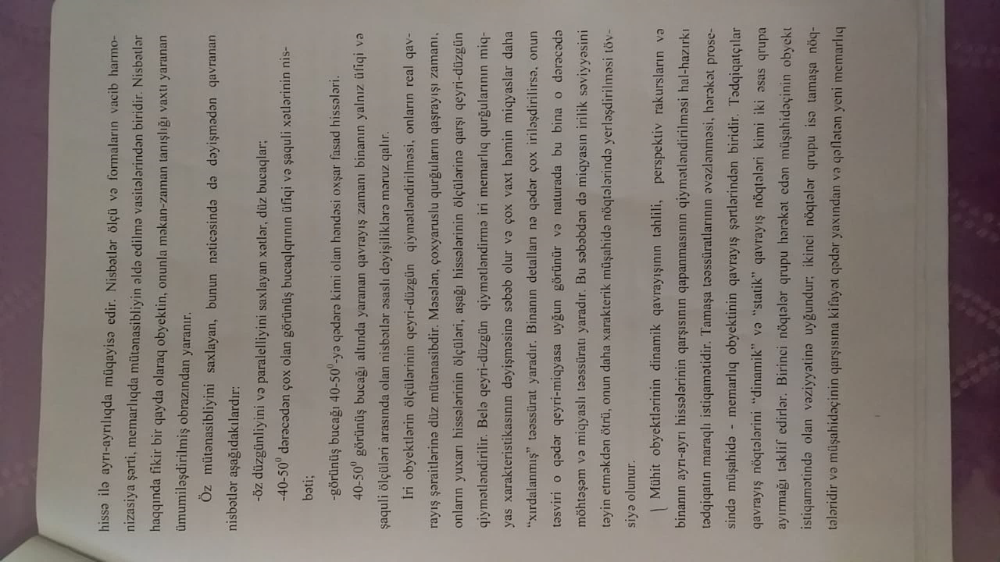

2.5865/85 i
R S s öl yııııının.

duos c sg £2£:537:4:224 S x EÇ3Bü

ds: s x ə EREŞESŞ S öc assa. i
Hz: s s şamı... üuıou sm q Xo i
“ə. 5 mz Şa 1342328712 vuğl2324666
ğ2üəs ə 5 .. 57:54:57 5 .z EEldunsura. iH
z.. si z Bo mln o 32.56.5868 İ
- . .E us s fİşs S də Q. m m
m ə x si 5 . EŞUSƏ5.Ş3 sz 43.2
s s - ğos g qz BE  z 2 zoə
ə s s - 2 mu zm s ina o də
s... 53.0067£60 0 se33682248
7:- E . 55 --.-—.. BE5666..

s şək x çe o ğdlmd Pn 555275 R oz s £  E 6
mom 5 25257 ::61 6-2: o Has... İ
Bs: f - go” .1sS:2672741-5-6835- Q2sB3us7:-

Es $ og şs dlasnü dE 5 255:
m... ö Şıbsesğləas 3: “ s £ o
sən .. rludls 6 “kəsr . 58.55
s 3 5 ə dırıcı 3 sşəesssesupoe
XuəƏRŞ .. Nou 555 - mz zo ə

o - s əs SUüƏğxuzs"ğ b üm llsuğz2rc ee x
-. ki ə sməessoyşzasamnıq"n dis” s
- E s .. gş ə 8 .. Bs 5 -
əş “5 x 5 BSöSELeŞ06.229266 ümə b Eu
Ə ku ğ dz IYEZƏQBSBİ-“. xc EE ES Es
5. . .. şsısf” 39 3:35s884 olı
mo g 629765: şiblasş?sğz 45455 İ
Bs da sə3s:21i1-24:242 Fm ğsnu 5 085
z m o ə xoş ox ss mn şə 8 o” 6
Qus s bs şı 05 Bəeğğdüş ES uzu
Xo 5 E soz ESuURSUsE26- ... ğ mausu
2 z “06 Şuğğs3 3.55 2:252:7:$ 56
ma z ş4 2604305633: 3 055
sos 3 5. E Z z Fİ os
M... 25202: 32755 muzpesəo som
x55u: .. 5:06 0. Bu 5 Q 2
ş30:3u52 3775 575COPCÇKFÇÇŞPP UÇ 7V7V7?:,?,?,?:DO
- - - Z un zu: z əz qel ri
23 2x ds suumudəsə ə şğ4 uzzususu

s m vo. 7 z z x
- SEBBS3 2 QŞSSULSEŞAT?I 2:5:

də za sus ms s ESQSŞS
Ho m sə $99ox2288£8 “ 5 z ic Ə BR 3
ə. R Hu g m əm di zo zo By nus $o x

ii m nz on “ £24b ün “m e
ş.3 ə sd go düəsdsuŞ ö42ss sin - 
555 ŞSııqdığa: 552: qal”.
suzdsda iş gəda 6566 or sədd
m i-zsəeds-iö geBS 5.28, 485 Bl ğszs 85

öz m .. . ... “ uson :
1555: 6 quƏLZUBBEUZUQuXod8 2288538338
ez nq xc sı s 3 mümgdqv” 2uoc E Xu “ £ 8
Bolu Ecr Ro dgeusx34 906 gosduvzxzs ...

Eu z se ox m3 g Bsesıl.4
vv: .k
(zəl z do u ds əc-9 m damə  — z zə m
0... ...5.555::::.5:55 gin.  ğ 232
“əx sö x eh o E Es 0.—632:5:408
soz go danır 5 LE
dəx xs - Fa ...x.x... Rg üz ms Son
2üRy4 zi s Qaca s a m o
moon m

---

## Səhifə 54 (hdphoto54.png)

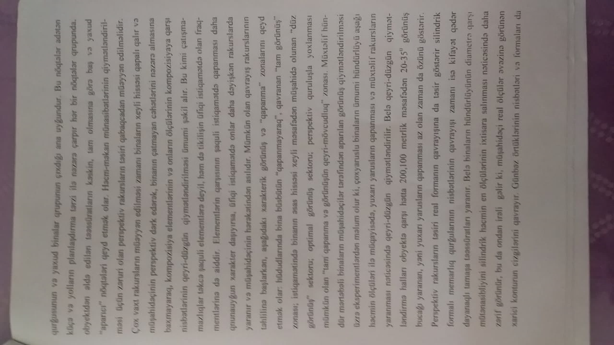

dar
x 133
in
il
s iHün.
alı
in
s dn.
hl
ai hu
il.
- F illi
1 şi ııı
s "r ilı
lııladnı
is ıı.
ğ . HİT nü
1:1: "nü
1 dul dı.
E şs ııı
riq) ilı 55 - Xü
lini mm ın. ül
54 Eş Hü dn ?
: hi
ıl şi nil . hh P3İ3: m
153 lili s m 1 5333 E m
il . İH
ml 6: Hill İ
siki b s dibin d. iz iş
ikil il g . ıl
li İİİ HHİ ü
311: 1113 Rh b
ül sn iL
5111) . şş E İ

ilı. “i
ünü -. $ fs .
nl c "
ni .
ul Hi
illə b
illa i
ül iL
Hill q
HB
HTH
334 kı

---

## Səhifə 55 (hdphoto55.png)

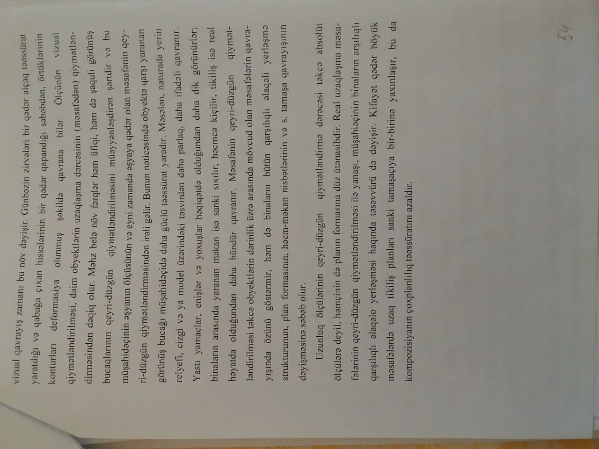

m m x.
ski ms c
ş22.ŞSƏƏESG $ EH ə. “o
ə o? 32220 ” kk ge o ke z o 0 € ,
mz eo yın m m z no uz
qında Es s S gpzi
Gun öv RU gox. SÖ ds
2sdsusşğtseşasşs2629597 s
m ə Eu ds ız iz R b e £ £ 2
.. 2 məz 8 e s Şssıdxsz
quq ıocuen? 66 x
USƏoiıd03c253497£6£ Bo
eygəoşsu”Egctdas” das ğ m£öos nu
“ə... 75” —— 255: Qəsd”
sqodğşdausamce ve z Qu zusu
- E mçgspydqsdmsdədnau. 2:2
.550—...-.."- əsəs
gBsruuqsu o o eog ə su əö3
uk. d903 dgzo ə odoyd ru
sağı ııı q na dını İm ds (2 05 İz
mr məz ko Emz3sszc
EE - sSurşğğuss9mdsö m m ğ o E ə
şışşəğsı 536362 .-6 ə E s
g o 0 ii om S70  6
ExsEZ2ZSsSEŞŞQXlƏ.$Ş5 6648 -255—-
moxzxsdgs g 5 0050205 77 —uc S
soxusununumununaə par zı ES 9 £ 6
Es”aışd40 8ğ)2939ca46 üsdü əxkxsğds
a... 1 a ııı...
şgsegillbŞ1a$ Es fssc 35:77
a şux mususc munu
... dz x 8 g s mo qan
süuş şeş 2893282 £64 sun.
24465:5268665050 5:5 n Bmlfasıa
.. usulu mu sMmüuso
ƏvBəgkeSt-psesgusssg x ?  so RB ğsuus
g Ex mud oulucunulsğanaş 2 3 ER
zə 5 04 Mu Nxunmennsn ala
zi şs BEHƏ 0 də e onun
mom ..— ml 9 0) - zə
3 Ş Gxsuod ğı cn -a—.....—
3 ğy yoza ğşs 8336 £,.8cz dg-4
“5öS383824 ez ə muz Slşsdesdsvgx(s Ss
HƏ? .S82?8ğ149894 7” ee q 28: 5957533805
Ba 3234605500 00 5
(68117v7,,ŞÇŞ KV X 060
Qara anı zs mg 9 xm dd
- S6S3 S Eni? 2 ?0828-“586 (525687
QDvuUsnusqsunulma.n..... s
s ə x m ox on Mun 3 2 ğo co 9
Şoo uşissidqyssdşndan.ıan. mə
ışıq ısı Ek Bs Eu
o iə d Bos £632881219v6:5485
sullsuqaudnsnsı.asıa......n..ü.
.4.SA2Zv9323ŞA2A£E262388686£2 : mu £ 2 H
S2:£E£Z£ZEPS2ŞS232iç6?-:EŞş 23 2465
Nsqs506 1217770 sos os
o x m ə ə ca.

---

## Səhifə 56 (hdphoto56.png)

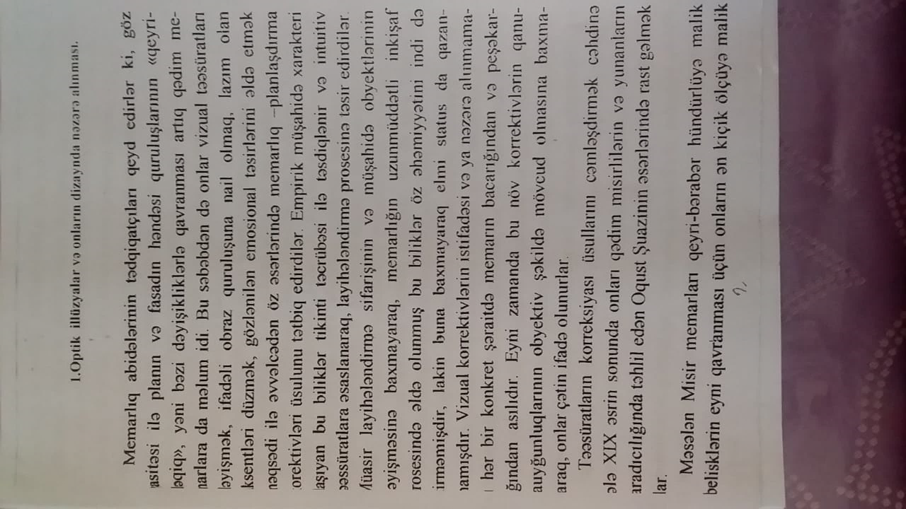

Mu xox
m cox - x zı
arka... də
- 606600 nı ə ə ce nı dEX255 s EE du
f ir o “Sus sos ga.
e 5:57: : 685: ?£”£ 556:
mü... 2 gln
s sIiRŞğa3ıso-cesc- mos şou —.
5—.......... şosssa
s Şaszqus 2555-5889 6-Çç£ Egə s
ze ŞERSS5s23393225348282 206.
s QASŞESEIEL zü 6ə- əm zz
Ə Es Humst63:35667265-. “.. zo
- B3as”r 4yoess8 g bö les ıı
ş “əzm gx0422X848676” 3 ir ə
s ıl Bs3 ossın c z .— se
iz ses dn öz QƏŞŞ Əə zoo -
- merfsiı-ooqacı T0.2ş53282 Bz Ka
E: gr s sğv9d Egə.73 iz zz n H
E 59533. .26..35585££ş zl şz
ə zı (m cə Gİ r - S.Z 2
s S3.3:55822: 355026 8 55 67
Sun ŞüSULLS. 583, x ğəz
z “5 ə E z Boz 51
Fi Şuqır398 6 xezE£ 848 sə, Zİ ”
x ğŞğe-s- o. şa ə ”e oz o z- cə
is ız FARS s m-ə zo
: 5 EBcs-SYT- Golğ-2$Ğ —.
2::5:nçs yEYuə.x2838622 50 ...
- 56:70: g3:6563726775 s
- soş-BoS38898325279$: Ə  s E
ri İci Saşa ŞS BSIı 0.65 6 33 Ə
S se 1656535075 Bs
s m mEZz-sZSel3s308c6 S nosğ2- EĞ$
zi BusBs34:: 3. £ 2.
- -- r İİ x- 5 OZ
SEBaL 13.3343.13578 z ə
zı rESŞOS3Bo£Z müssnim ə con soz
“o 6 -z ... de 289-498 Ee 8 —..
“—55 qo qn in ASILI. 282
m X2Xİ.ss33336293 des 46 Ee 5
Bo o og m üz şe das ”2027 ə Siz
Bezs10920 5. 1:2 55520 pi
dgsza ız gəz Ee$5Z7 doə z s
ez m un z 2 Ss ğ Ə 6
224.02:205320 66533” 4 ..—.
zasıdsşaas8ai£3.2:35$ odu əz
ox sebngəs

---

## Səhifə 57 (hdphoto57.png)

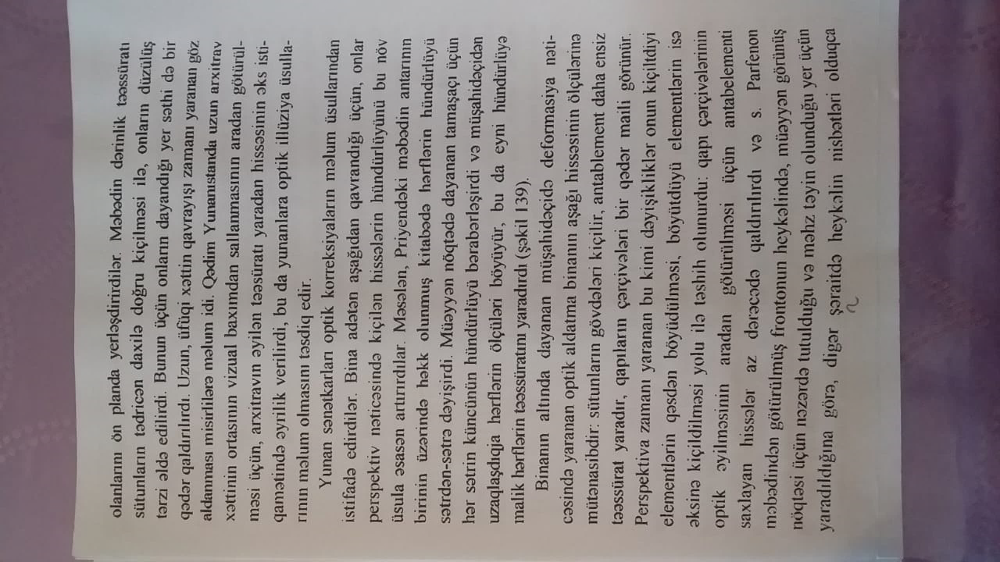

“l.ə. “9 Lg ə 52 ı8)60) 23 286
zasaııısı şasssaığ s224225755755
pözüissa ŞS32:2:22 3:2: 660236
UN9a4aX3X223A £”-85238 2526562 7 6,80
5... süə. 342?522622 524x06055550x
s355s55 232:414 2..-s10080000
xl 3-8.3.585: £:55:5726157
Sş35,535 səslə iin Gö 56z duz
məzssuss SmüƏBSŞ9Əo dOğosşs” 386” EZüZ
Yas: :26 Hd “233325 ”233422
ss dı E ESs6-6$898 R m ə”i Ed
Bü. ..ö - ş2822 ə dis) x. - x.
suz "EE ə a ĞĞĞ 9"(“(7vyU
ƏLA s m z- ƏoşQaeoyşəşs oz. 2528
55113 Bö”üa toşirəı sl S. ş?ğsizs2e9o””
ğ s ss s c a İş ASAXL263S82 pə
E3Ş$ş şö şŞsü33 guş aşşıdlza Bo
1805 dö. uğu z QQDOASZ.UQL£ zi
g3s3sa .. - də sdesd onın. z .
dö - cə Xüc Eboesdlı£232725852 zoo
853004. 17, .285:5 6. 9 056
S3ıa.”2a 3. 5522513 32? “2 o
qoruqununuu Ssaa32ı 62-93 4:80602
öGoĞe o-aaşuyoıaddıos9sğ 5 Şısadğdsı.
məs. “OS. “XSEUZasSUss30078can
Ağisıiss ssa. 424306 6326 . 256
ULRPRSBEeSsYSX6 sli əxa A XS S ER
şRƏSg?3 2 ZOB 22 84 ”-s8- “967””
53- “Bu So 8 XıaŞi2i 3220 5616
dal 4£42 öÖfs m iz — damı 5
Ek.
m 2:.- s in x : ız soz olm
"yesə S..35.5:0.111a0 5:3...
“ s5g.:2500 PO EL 50 s. 27
Büqsdğ3li a ob z2el ağı dtse.-
ır lamaq a us
BB 1:10: 3 1:41210:113 1121242877 6
ali omRğuƏX£S£ onasos z SERLƏSdSSSEeZsŞö 2
———iu -.

---

## Səhifə 58 (hdphoto58.png)

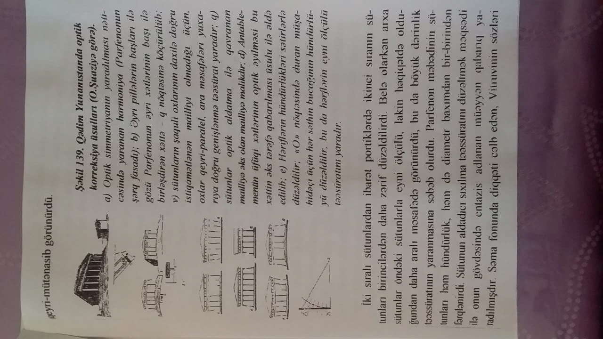

S533:5)2ŞŞsŞ3330353 sRsuSBƏzSER
a s nə s “537435.
şo sığır. ios A“o6c3 8
2556555 xos m ti
QMğxxkomxan z is 5 Es e.s E 8
şŞoğşs şıosışaşısğs38 Bl. 0
S. Rİ s 5555 Hus.2275-
gosüs 6 QƏŞS3£S85 “..xzsSŞso

os SŞs s ss So ci əz 2 sə
Şəxs sssssasiq.ss sö 586506 -
Ş35333 23633 3 8:5.5£ Bəğ2732-8
Eoxşsoş9898£5 Ş335386 o9135.32:-z
36365 s Ssoğc333 $ B- 2232
SOÖş89ş9”“ŞS3 şay “SS 3 b x. gs£2:-
SLSEFSren33.83:63 834 məs”.
SSSSSY a o o ə o del. 3
ES” Ş3x3 3898338. ssns mon
rasına Ys3s 23sşzs o x s. “S. — s. m
dalsısısağ Be.y.6ı..S33 22590::588
Q SSAŞSIŞ3X 5” sSƏzZz9123£
şşsışı s355S3 3 R SXSuoBS668

... isi ESsSk şs sa A. zs
SI. 5505 36.33 ş88-c:56-
s s ş s “ ssy s z ə 2
a ıı iə ə
QL.Q.S555.236065245586 25:0:6 57

5 eŞSuğs-a3.331:3333 SS Şə v
zi Soxusşds-.şsr£42 SxtusrYəAs zə4$6 ” O -2sxs
5 sla. 3582
E 2 pz b arın
g gil 5—İ iğeq 6 sousun

si ə—i HEaEez  ”£6zıcrmo

Eş : bu — i—İ Zs2- 2:27

: m. Tar - zo möv3 əs
- .. — ı işs . a 1 “Gİ ĞY?68E
sə .. i Çi. q. s dd ız
si “ual : o əc xo
s 17 -İb ar-l Z3ğs düşəm
z “idiliFİu hi İz — / Sia”
s ) HƏ ih- .—i / “oz S:ios-.68
E h m. "m ü— xzmııı

v dü dE: — 9 fes inin
£ ak ıı ii Fa esl LBEEL lu
Ş ü 4 .- 235: rara 5 -i
ibni “ us ZUmnsis-sa

---

## Səhifə 59 (hdphoto59.png)

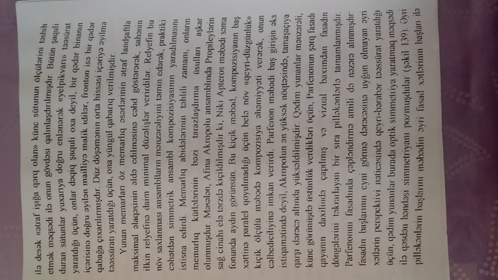

5. sSsBs88B
XŞ2336227 25
sx9g£ x s2a2:534872:15138232 ə
z Ş32 TETHHELHENDİ
xn” m SİSŞL 5” 5-5 5 sko sEsz3352
HB3Bar 57550 1510522011 0112
s3z3 s 27 m EE... 30 dü e m3-
TU
z cə uu 43:5:3£ ŞSoeansa si s Ee si
55500 Ha
eHö zən ei seə-ExXGCL39 s ..s - Be
5:15 14110:4:3114 0:
3:55 Se 7 Eu şs8 Zə.
sb... 3556..3:1.321006
Ee z - də mı oo
1590332835. 13y 263523..2 80
55777 gə:
di 155-: 552
5555 sSAS.SSSZo g 8...
ağlı: Goxyu gnc 5504343237:
İBEPTEƏİ
s 2334415433 356 dz) zoə 666
Bon Fə nƏS8302386 - “Ə s - esius:on
(6413311010 133: 131: — 2ossns
Pır... “8 Bs... 837 ko
E) ğı-usquBs dad esii” E o.
z s - - Bən ə s ti s a ə ə.
“QO ZE 14:23) 7.1 sası B m Eğl
çü z236 Es 50.82 562 00725
g NA. 334. 43:55-511:02
7:7::7:-555 zz 45555
zu . "a. S59:8207.52570138
“.EBs S ::5:: “o xun 1
Bsöşa 838 E 2 Gülən Qoğsə.s oğ m xd
“s HAUEPP”
BŞa424 53 m 50:10 —. x.
sıra 52223163:21165
R mo - “ sade m ə zs a
el3a 35 258252” .o3 5
mır 5
1::3:21317313. 11 Gsl”: £30 22
üqdğuşu”2 23.55:2 oşpass EZEXO zl
oEH802x5 .. gsls  şusğ-ask as
ri sğxü ZeS232 55 q EE Ə zz s
öəxryoə8 5717157
z El 223 sən 252:5560334 2
eğzk dgəsk zə .?038 6 72
şsaşğsasazsaas

---

## Səhifə 60 (hdphoto60.png)

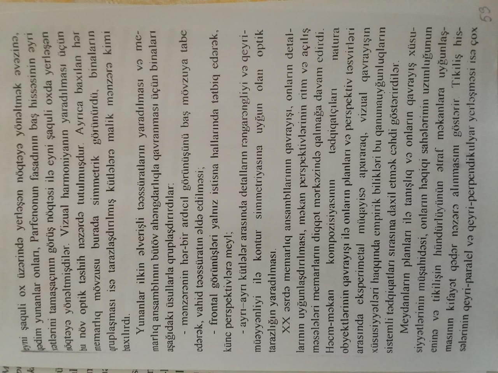

—..-ssuunuuunsumudssanunusbannn Mo
madlunuunupunununsi ə uy sı L x
“do mu 25233
id “Qİ3İ52£ vszo
QZ muss... gSESURXS Bü g
5. 8 83 2 SZ oZusrruu qlz
S SacE es E xi oz 6. ə ı
ışaa F E x isi ə ə ozon
2983 —- c ci F .. s Ssa:2?ı45s32
m R , 9 x iz E . mus
Şes.82ə xır. ... 5..201
x 2-56 Ee R - ora -ı 22-26e2Z m İr)
sl-sx5q 28 x z Kə STUŞl4:585-150
sgi3.ü suaus 0 çu: Es66
mBəd-8sös oz E .. zo xığı 32-32
H6695666 dır Solan” doz 5550” 204805
2-3 86, se £ 2 58 SbEZA ödəsə ə5
dGvrs zs ç z z sh 2 “3-c ə ez z”
5—--- şi z 2 5553282050 0
XŞoöŞ-e3s “8 $ g elo?£e32056 m.z s
x sər öz s 2 z Vs o somon da
z z 3 Hz .:5. Z24 3264 Zodşs m
ə b. Şe zz? ” zı 24 Ş32242-41 -ış
dg89528-$ Ss 2.as 25::5 A ZŞ22-:258
2 z m 9 — r zo — m... z - iə
Yüö-3iğs 24 55:75 .::220075
soğsesods Z-...ooxz Ə o — 0“ ğ yoodaczmua q
Sığ qzhmusa 5552524202
şs3ə3322“ ğ32-z8 soz 2125222502 58
gŞgı8 ZA göyə uk Soz 5:55-—.
sdaşsun -285333 2 “şə 2
məsum duz... gşədnc- sEzZ62-2
2 rr... SE: 213:235-
2 Cd z ƏGx-” - s - ə “m
İS” ü82ğz “3455::2045.5:25272076
mgəşs.əs “SBBSİu3 EL 2250 522.:
EP 55:55. "B-BES 846
mEezz38 muz iə - lo m 0
zz x H8ö-z- Saz sı s ç
3OZURŞ, ƏSİR 6 35-59 2
z ez ə z an Xos
“S.B Şu 5233417584: Şaylə c
SGld4042 5 .
z m Zə dei ii m çə — -— mi
Z3585.2 5FB5575:5:::
HBUZUPBPB?İ BEds
so. Izəs5 ...” "RM 56527:-2 Bə
ŞOHU-ru7ü narı cı ox HE 0 Ö ssa 0
ğö Baysıll-3x ə E m 8 sEeZ29 5927
Eba 0 420717:2552
biuzsüd2 ağ £ -
.. TA Ko  ” “ lm,
yx xs 1 ki m ev

---

## Səhifə 61 (hdphoto61.png)

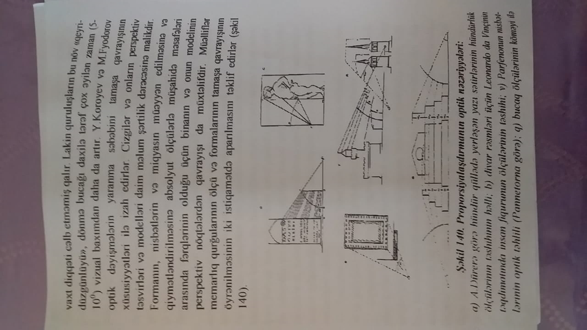

ı - əl m...
a ıı Kira
orun... (23
- Rudğ s işa “ın
SES 325 ml 33
sağı ”a 5" s ai 2:
En 3332 "ə M $ii34
m zı doğsa iz x . ss
P5:f30:3.333 kö 21 /”1333c
Ka ra a 8 “AU . şız
məs ”m8 snd dd s cida Xas
Bo0- 238 ir /? Ermən ə
mouse m də “/ Pux esks
sağ 3242 — 2/7 Tiiiizə
Be:3.:3137.ER 42 RI mü
Hşuğuosğosasi an (qi: 52386
83..52:3893 “7: Mu 1385
42ətis.”r-s22 / ü ul şssss
Ss330:39 726 / ı800— .
res. 3-22-6585 dun mə o
gavə. ə on . ər bissis
Sus 836f8)a2234 ” (£37 uulsssss
ERŞ-S35 6” şua 555
2505-3737 tuqul (Şi 25-
ne.sixv3arüS2”— ksin S ii ”:5-
Zəəxaqo” 32 £332- M ə Md piri 42----
gözs şe 5z mər .——
- FEse nn "ə s çoz rz
möurs” "235. . ə oo
SsSBƏe :ğ.2s£ -.. 2ırı
53 25:35:32: .. m
əs: ŞSosaz22R3 5——
X-X3i2EB35528 ....
“B6E826:-sS58X8XY “iş
SuZSxSESoaREOZ 8606

---

## Səhifə 62 (hdphoto62.png)

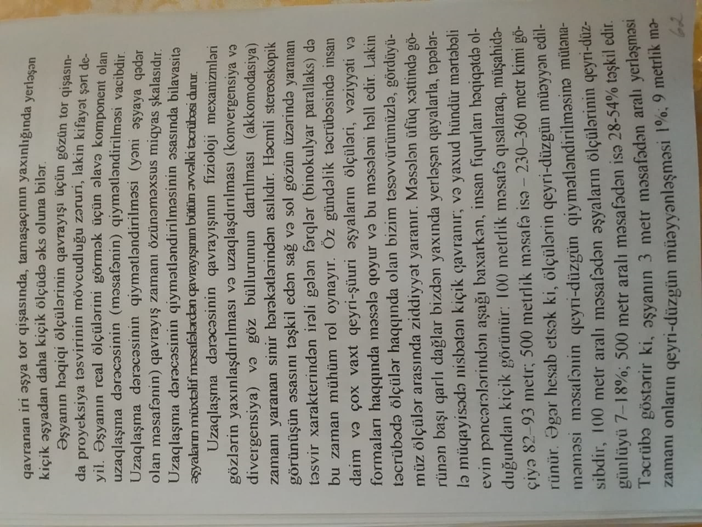

ia.
... illə Has
x cə 3 gö
a 3: sas
nö 1555
200 z .g 5
HHK S
söz “nə ə - £ 5
(a o 11:32104033 35 z Ə oo m.
57 HBİHHİİ
iH...
Bü 3 esə Dd a
E 6 (1:321000171 ESEB Əeedii iz sə
si dŞEos “s oxa Bez Es 2.:0353301
ğ düha HE Xol
də .. şəm 2. Soda Ə xum "a E
9 vr Ş “..- Xə QS B0- sox :
$ o 55: zi s32.2302 Sev oEs
258 öz du 2.03 dalına x 2 a
3 il)
ə mə ə m ne “0.
zi 2:.25:1198 (029-22 R ge - 5
ob En Bl 5. E
2-) Əd N ls 517
E Hun dos 5 ni
s ü z ELULou- çı E 0025 “d -
HM
25226 8 £ m s BŞUaz 5522724 so
s s E E - -x. dö mə “ .
"HEIL Hİ
5 is iz ƏRz- s Hz 355 —. s
“- dəs Rü ə 533. Ri
"o dezos 584 o ci 292297-2 Az əz
“ə Esas ö -. 2:56 m0 vz Ro x
S558:54 12117? .
asdım o “ "m RA
Sə 860 302- ds sss “ii
Kl iz illik
22285 - üxü- nn
g5:5.32 ə 2 sex E S.5322 od -
25 s. m. -.. z ESİR 06
13:05 munun İ rz)
məd İs ix. E z Sisa2c rl Ə ə
s 3 Fə ms q - muxzm. -—— Tə ə - o
sus sz do g 2555 2 dı 25
5552 $ İxİ So 55 $ 5
3532:34163 .. oXEGS dŞEşsış: 1:20:
555470 ox sə gusoəx 55577
“m... BİSsİ səl şi Bc 115. iz
qır H7 ei
zi 228 55 sz 2.:3811342
HERO
EŞ EERSR 5338 iz -i
Hn 55 .
də a. Qs3şs3 ıı uuuuuuuııunvuvuvvvunvvu
gs Şö NEESN Cülürəl
---

## Səhifə 63 (hdphoto63.png)

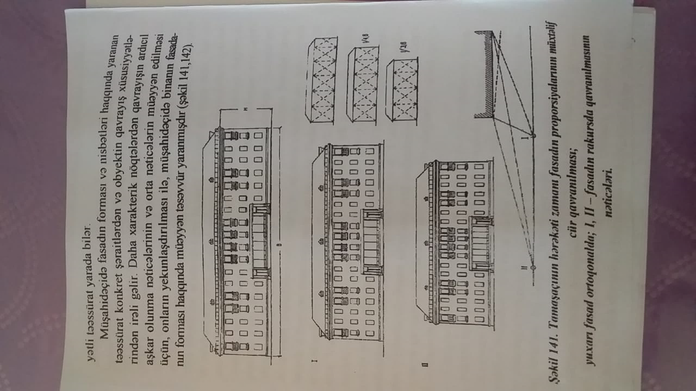

FE :
d2aş x 5 :
i zl Bİ
1:31 ES , ı 1
Blse3 isi İes z .
3 53:33 . ikəl İFSİ İES
2:7 pil Gəl İz3 . : 1
-. 5: 2 His " .-.. : .
33335 x İY
KBUur m
25576 il ei ilmə c Y
5.375t 1 İGİD TE - İ
5. m Em c He İ 11:
35555 :.: ic x RIB TL
sən GE a il. rm — .
Şa - ici il im ak Fu Hİ i “ə 5
5555: 3 ii m) ıl bom 5 İF
i H dl ii His X sas
1132:61 lin cc İc "Bü —
göz g soz alin İİ - ci H — ü kı
İirləsi Hic : inə .. hi .
: 5534 İ Hin m ix n H a “uu ik:
R “38 bul s Hamunı r m.
m b i:3 Ye dei 1 . i
“sa Fara dun di ə mi
s İEszı zl $ :
- z i

---

## Səhifə 64 (hdphoto64.png)

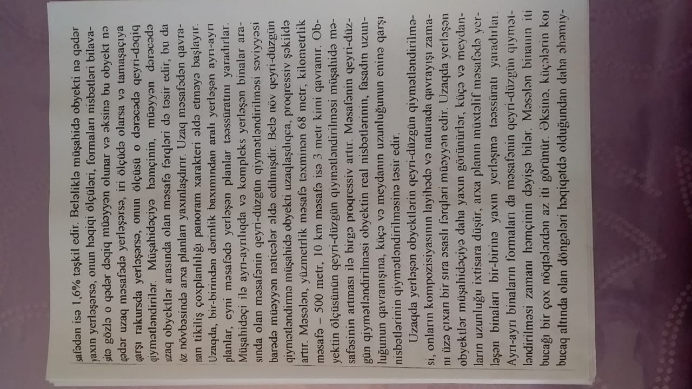

ka
o öd
göz 355
50834 BR qoz
52-26 z z pə 1 “
.UŞd4d8 Ş32:30.2 3 545
HEBİ 35 2
“Hünui LİB 157
ə -z xc s " z ra .
ss z 55: s. ə 25558” 15
an 25 Doz ə ELLA döş
.. dax lığ Bzz843 5 zl.
x ds ə o 555 535228
2.5 15717 mm öz) 256557
i Sağa m. mm - izi sz z £ 2
ql hı
ld mil
paz poxaıı dos Ş35::1144 -.
Şüa iz Az əl 1151 -3-
HER S6468 zi
7 ŞRs6 . Lil ə 52526 “ın
hin. min
lli
duz s miz m - ə. “m
idı
m o E d28s mozo- asr
.5c ə 9 E -. 55 s ss
xs dəl “SisST3 . .. z 20 s
xs dE sx O x musa Z dSğu-c zo
dl
kİ 5 x Pİ3l3a2 zi dı üzə .Rx
ə dn 255257 52275 :25 E “s
uzu lub doğ do 9 1555 5.52
ə o 77: 1757
23-332313 111 sa
dz zs 225523: x m E£
:5571 B ou 25 mom
2. Xas mc dönə 5 5575
ə 3333033411 28 8315:8 Bos84 .—.
dəy dü s BE 55 431733
ça3348 E cd e ŞE58” E süs - QESSS
pal 1:57 15:75
1333333001: RİH”
ə s Qoz zi o Bss
go çi08:22 ə 28843
Si3işisa 4:3141343101: m
Es “ 1::.350313 sd: -—u. zm
HƏEHİ
İsi möşüş süf BES
“HE”
d3.863Şİ:
sa -
sss

---

## Səhifə 65 (hdphoto65.png)

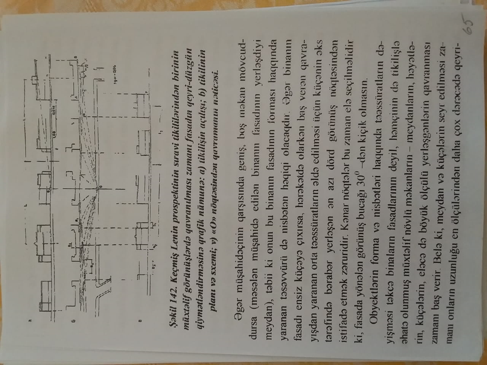

86,AX— —— ra
usxs nus nu i iki
.. gu zo ğxo us 6C.6:21822
m... şıs s.56557423 “25205
İ69-—: , 298, 2382520722 677:002
“una Ii $a34 2.6-421:68 87277
bil c-b sss Eo s c I298-.987” z 6 “
kil oh 680 xn .OŞ9?2£68  o S.E
i İle. sou BSı-3 z Q9Ş32225x5227254557
"ia “a “TTİ “— ə zə ii Z- zı ğö9 x zə ns S gx ç
T- il in Kİ sə xs mn” - soz z öz
P işl du İİ s s Ə -pəv sı. o ğı...
İş ii s ıı s sə smuzxəzsrğ 4.4
h ZN li ili 858 550  —-.--...
m bii İ Xsss x o ğoə “Bs e ğı
s bul İTİ “3655 xu nana fZəs208688
3 "əə ii ...7 ə “Ba g6-6—
- mEİN "ml Se xm gö xe £ o on
155155: sş3ğs sS9l-s- Mə x ol s
ə həll zə şıaşı oŞSOe?5S $€ — onu
il İ.B $ 3 Bez oşŞğxEaS o X“907642
i y İ “x. z Ə o o O dc. “zZz 8/0 mx ə
UnRİ 336 üğüsşs əsi
əə m 0. zə -şŞ2$28 ə ə s)  İsi
: i ili Ss63 şöod3nəos Se 6 “ çı
ı uni isi ə g 5 ğ .-—- Su s çaş EZ
İZ İ şsss - goz Oo cz 3 - lı  528? €
24”4l il osı.s guaTZS-- Z Somu os sö
2 /hı -— - x 35 4X2.SSOĞz” şs öd osc
İ/Aİ B(Ş333$ c32288 Esnso əs s
“ə PBŞşŞıı Ş326 soş23223 5.3
ed l SER s uc sılzlağyeso202
Hmi 588 Col2 8256406 ox
Iİ Fi 1 YĞBS3ŞS) s2Z 2, 23928 c
il Bül İ b K şanın Xo ce zr £
ir adr - cər 3şy3c Bşdias00828 ıs0527600
ib İl 2 Bonur məs o ğu ETüdc
1 ir İ c.s ŞGeE”2ğ:5s”680 s on sa
i m HMa3a na ə ə — ”ccCL plIZ(0
dəl Şi: 2-32...
Fi IL San m x om dom m - - mON
if A .. o Q us gdğc97
zə göyşi ESğSOŞ3 dir -6
İl xXeS$ QGƏĞIASSEXXS256285
- İl EE3 Ş£-1O6$ os 0 c mi
-” İl 1 Ş33£ SEÇ, 5
z i xds s o o -
bun . 335 T”302145302007020
“ov üÜsşlesyuaəasd ğgg3:s-c-
das” q ci Xmseşs

---

## Səhifə 66 (hdphoto66.png)

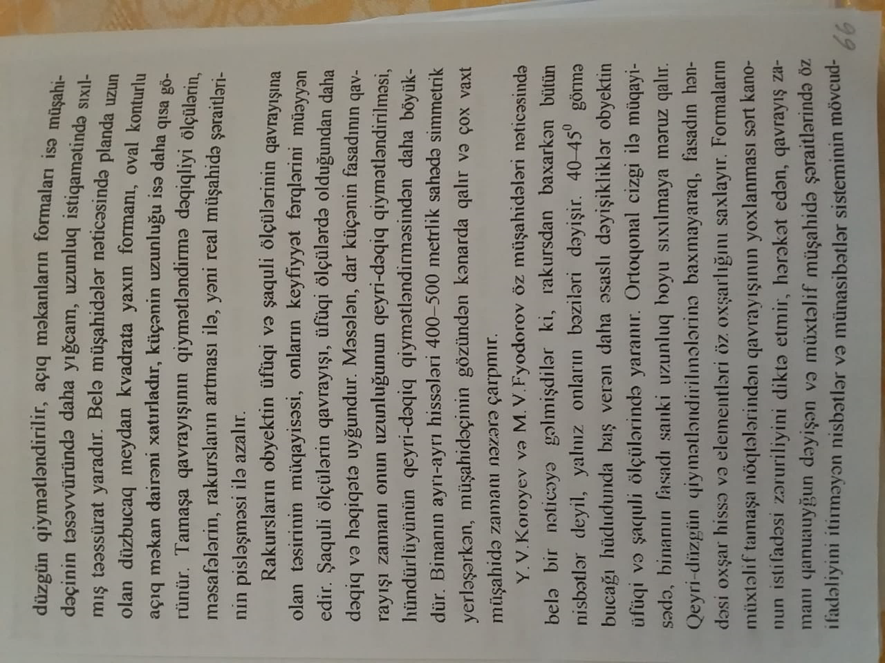

səuşisşs süz
FE: Lu s z s “
z s zun şBşaŞLz3486 .
Pal 2525521212 gaddı. 8 “ə
ga Büözşsüğü: 38825z:15113521
x. B456115 155
gusşs8 s.34225”5 Z oz SəessEYBlZ
Bom £.İS3S2 nov ee ssE3
s.e ..d3 sB920895 5035327122
“SEşİYZ HBEZƏN 2 bd düz
ün m də a £E ə. ce 5. . mz
a BEƏSsLisd KE 6
Sö l3 x do deluz iz (oğla) SLX-sis
SuSsğuaü3 sənıdu ə “2 “2353280:
aşüHE B 2522351 Ş.0.50121-18
m LL a a Zn. x2 0 2.
i “28382 “nouYŞEZS8 Ş525327528 x.
345 -e25365 55 £2:382202 0
2.8333127 MLouTəo2 əs “ÜSLEZƏZU
8832422 dü. q Bi.432:551862
dosd Bog Ö.SU£ sö 2..5:57 552
doə s o Box Sxa5b2626582 o
ES $3  ə 0-6 862 z sGosəg -285€
iş... z gs6973832 2 uu uu.
EXEdY” 2:72065 56.14-.0777
o ŞoH s ga.31613:22 ğssr:.21f£İ22
ss 6 dos iii? ?ı
ı? (s) s dx ə bon os 0 g.İS ai.
məm z s oz əli B..45-6. e
m ..i 555
mo 5.“ o S mi CS əz "Um: ZX- ze
(3533:::113111 14:17: mo 0
iz o gös 2x S3315::05010 17...
3335. 5253:5 b rx 2238221 —
ə g 3825825.55236 ii
... Büsa dd q 5757575
EE539327.24 ... dn.
zusu GüUuBso4 5505352: sI3ı90352256
ƏRĞƏR334582£ 65.57153.1207 000 g
bii -.- -—-
5:75: o9ksmzü
mz dədə FE E 5.5..55:2:617”,.
“S3£ daxoş EE ə gos çe
m. “22:3321:311122 PBiTIiiİş?6
ql
d2ğsğs3i4 ii...
osoEZ s..72:27 S.B 7232136
c..- duzğ3ı2 “ ğ Soz Şx-sz
mun. “5326633722
mun sS2632392225:-54
S5835:2124

---

## Səhifə 67 (hdphoto67.png)

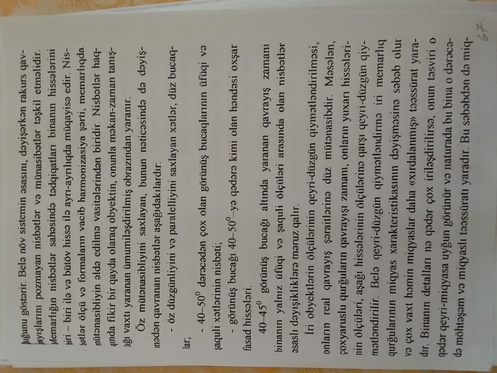

—.—.cdÖcuu—əxuuqıı 5
2..uzz “. ou
(Ud ğu
çon —- son
ə 2552t907967
z 0 sıxar aaa əsnn
£ 3 $ 842 2Q07s5o-2843
) Bo şi s X np 556
237” £ oğ £ 5 2 "ağ r
28522: —.:. c—...
ene. 52. Ss .6252
dG0css o İ Gsl sə -5:57—77 zo”
3313633 5 5551: 5 255255-—
xo. dal zoo R - - Em”o2 Zğu-c
si gEmŞisg 2 z Son soz EE —
m 2 .. z 0) k c ez —- 1 m
6155: “.. . BBB3ZI5 85
258355.135: . 22 s EP
Pas. Eçü cıdır. BE şs 34:351:27208
33:3235:s21 2 s 83 Şoc qala.
2334888335.2 -. s 85
S25556535115: Ə x oz” g8983.1335422£
BESXL53 Əağdu : ö m 2-5 mo
4... Başyəsz xl (zəl mo R. QZz88 XC n
515 ns 15:25:2:1005
S5.3.30562) 2 o 33455
r SoŞEZSB2 es — 5355093 m x
(5188232370: $o 5.0.
Qəosdğz R o m vo x.
darı: cı sr..22 Enus.s
x xanı Goo dus to 7843 s .5-
g- r ze. — -— uu. ge s E
sos 905887 dua l-ə So s dx x—8
“555133:0587 ar 45575
.- “icla s müx ə b b-sa S 0 s . is) —
Gö gysizdiz zs m xo m E x)
oBda mom.n ) m.ö
fsal Də s ll ESG Ex qu) Bessyize 2
s o ŞıSSs3ş:ez
B131555111: 235113553311 13161
ss s id : .
5152557 063 S0me:3333.2 71
3952232 s Yod z 2347556555 S E
s ex - 3 ..r— —o- - .
4535553 RE HB.
ir Hn os z Ş z SEE ££Z9S8
SoLuinuees “zi v Eş s s mz
ərizsdldə - - - “ə
puua.a
öükuunuxıuııx-(ınurununmunuununununuuu"”muxuxuuxuveunuuuxııunnınuuunun-—--—ıın--——————..— — öl

---

## Səhifə 68 (hdphoto68.png)

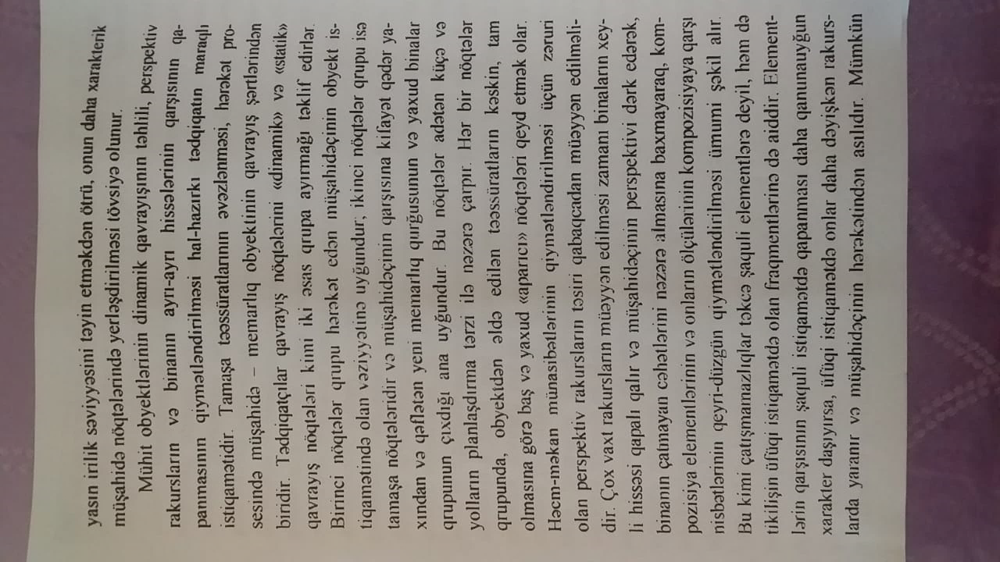

ə xod
s dn
z şayraşısos
- şaşısə o s
z BBiqqi:i3 331171
s S 3443331 1333171313:
z gb m ə - OR şu. 222
Zoo 6 5550: Ş82-37- 5 ə Kİ
15:14 s.ə "puls
5: isi z E öv 5023815141
PFIIH “Şş222 88
zi 5056 şşasü ə dc s5 osşüd
... Zə z Es m . ÖuğEELD-nu
ş8-d4 “ira” S5Ş853715 5
a 577—- ” Ssğıu3ez BSEĞğs 8262
a azca Sədd “a s uu
s.ə s UN 55 “rü oz Poli
525577:.- so cin nz zo iz də BEgsSz2uuz
25553: 1:c:: “o £ - o. öz
-- $£ Qoz m ııı ib R iz Goz
Be 2” o 1515150
os P53835.30503500) Sas 23 x
5.5: 532:23-8 s
qun ƏUBH
5663.3304.031:. 1405
— z ai ğ Ə. ə — — S
bul dnüauldli.: şı
a - £? d2$dsis s ə in üz əy ES iz
- Hür.ii 3133335031 “5:27:
555..2:.75:2532 585((
egeins 110
ə o E E - - ğ S8.2-7903 zə
gadi 2 Bz.” 525 2528632550
5::77355: . 0. en
Ax (z s es” s Şı3s,azs o S £
mo Esse Ğ X2Csss gəl sos: sSışx$
Xxx m .3.331:35350: 012 Höz2--
LUTUN
e.ə” qas.ışlşil3111515 0101)
zm RUHU
6 "ə dus sı 25255:
mə EzzZ£ mo uş a ı 26.50.6675:
məesua ns” A da aşı s Sə ox S3215:61337fİş
— a b m s Ə ox 26:77
nuntuunuunun
Şz usiinuduubl
$£ - 52177” slıad 76
gB228: BEŞ: 164 Hsczss.
ii 557577 3235
S.53:.2: 7:14
nı4aşğs
m üs

---

## Səhifə 69 (hdphoto69.png)

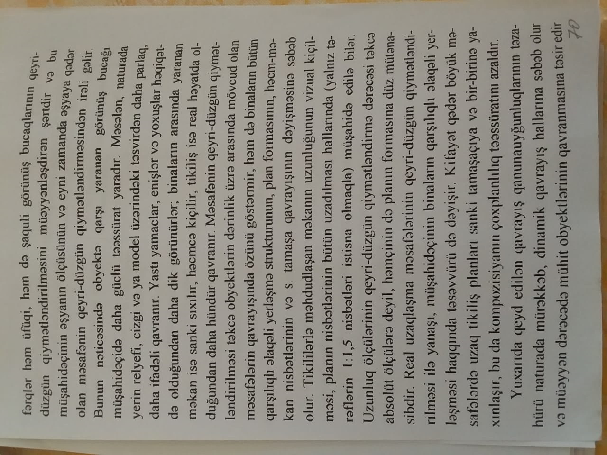

a 5... —. xnuncssüsdusununəssuəsən ə əda
QU.nŞ
ə. so oğ s Hs
Q6s62-.9886:2518 5. 6686232
.. səb göl o əmmoonesdcd xam -.. -
Q.q2.B68mğŞğəsdsəəosdyse£Eoö 23026 “ 8 "m
Ə3Əğ22831rŞ Boz?quşs5 3822-3462
” odı 88 -c-2£6 ” £ soEsyyıı 888
o iin...
gəz GB z .E dz union z u
SsŞEİs.d a 0 6300. 20)”, fe 2. 2582
xum s - z -
ha hün...
s x ö z £ 070 -.—.. öz) əx
gosüoüşğğasğldsüuvoaqaıx3x282 ux  52565
ğ gilğyəe 2020852. Xi 20 25 
00022 YŞyos ?sğşd2ğ)ğıxxaı4ığ) 60 S$Z209053 s
“ə gr Bo oz (BU m Ə) OZ Cc” (2 7 ŞS yüƏZŞr
QqaRERTuSşassSdEaz Fsdzi.i. ıı.
SəNEIdəƏə-0dsmgqudloçcyq3d42-ccsGxs-:55—
İn) yəy əsi İS QXeRğR4gMNŞŞesXNX232Zc022c- ee -  5
BElSZa49 8xX84927£6 € en mc z 8” S“ E- :524-
ez s şıaqız 34-55 gü s uş o 5” uu
EğcdC”$6ğuü09026,4ı zi s- 3. 8:6
oğoxm man... ğəz ümdə z mez —- mc
os SG zı  Q 6 69? 06:77 ZoOXxu- 657
(4) EFSSS39O2Q.-22Z28s83833£ o.£ m x x ə
“3” “SBSRSƏ2?XuŞĞQS3ÖY Ozol-6z27265 “o
XNESŞREŞSŞ433” bc uğu ssuszce
2” Qsöşia:3s63 2624 sı cı
sos : z x ş desz-.a ç ə nl
EŞ AŞ S 3222556 7
OQOR0--ES g2OORZDS ğ en ğı as ,.Zz
EcoaSosd4-”6xso 43661 0..6565
GEYƏR SYD 2222 a 2 o S 2 E
m ZTZ3r- tz - - oma. ış
ət ızı ır ısxöX7ıxXU7—X.—VX7
O Z mn .x. x 38 .- o — fr) —
Şaşfl 3 ”2 092 PX 3 2 2
ıı R D LÇQL, VU0 77 V V y y y y y y X X X V V V V V 0
“Bil .933ş 3360 ə ze 60 3 Ş zı 7s s 3
gEesibqs-Yö3 saodıo0ccs7:74:4:757—77-
2) osa üss3 onu x 6758s xağaın-ı—.ar
meşdğ3.xd4 Qa ozuouqmusdc-oxğ:7:777209606-
“55 rayısıdı2sı yomxmumusnnn.
SŞSEZS23268686x mvİiKEs5— ə ıdı
“os z 85 SE q44 8-6 2 ıı 00
müna xdsdmoğssss mr dx 026 s3
BSIİa3136 0 9226025 2Ğd 3296 £85 zs E
tfozon5irS9Q96£239£8236 63932 z6 o
Həə — U x o Zemo ğx m.
.xmmNMMBNMBNR R.

---

## Səhifə 70 (hdphoto70.png)

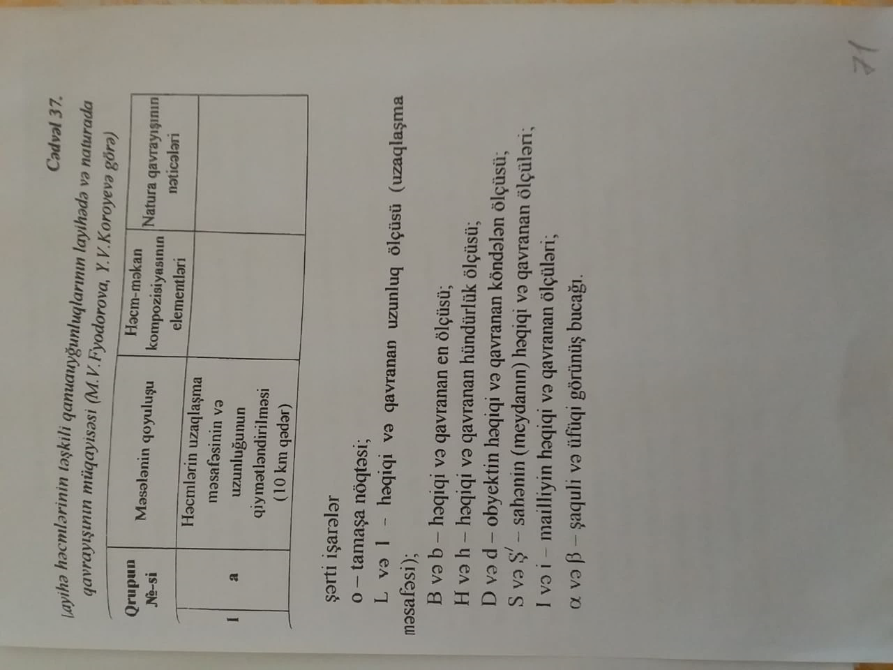

ununun ə ıı zz O oo,
obanın unanusnsuübunəassi nunun danuanusansununxususənduüusəxossas:
“s . E z:
m ii "ə
S 3ŞİB5 . Su
x 346 zo
O S s. Xu
Bolos S za
35” z r
Xo s Hi zu
“o — E — kanı
x "m od S
3.3 zi şi
x 5 z som.
5sİBİ1 - xəs oo
Yldıi s oxmussdaə
Y3Şl3i3 GSM
$ç R 55284
su — d ee Edi
Şx g zl Q Z oz
"iiz Z 5 usszo sx
şs zi m mn 5 dd 28 Ş
s z ö ssesz2-
x izi Zo o — s gs 2.
Sə 2 355 a 2563686
—. s işŞd 3530 - ssıırds
.. 23226 rs g9gos-£5
33): Ş352s İF sx3:8
Taa....::5:::
5. x s - m2: uzoouəsğk
Ki: n “ . un
5 Sam...
göğla rS9$IZ0o00807 o
...35. d Er” 5000

aa” Moudğmmuau.

---

## Səhifə 71 (hdphoto71.png)

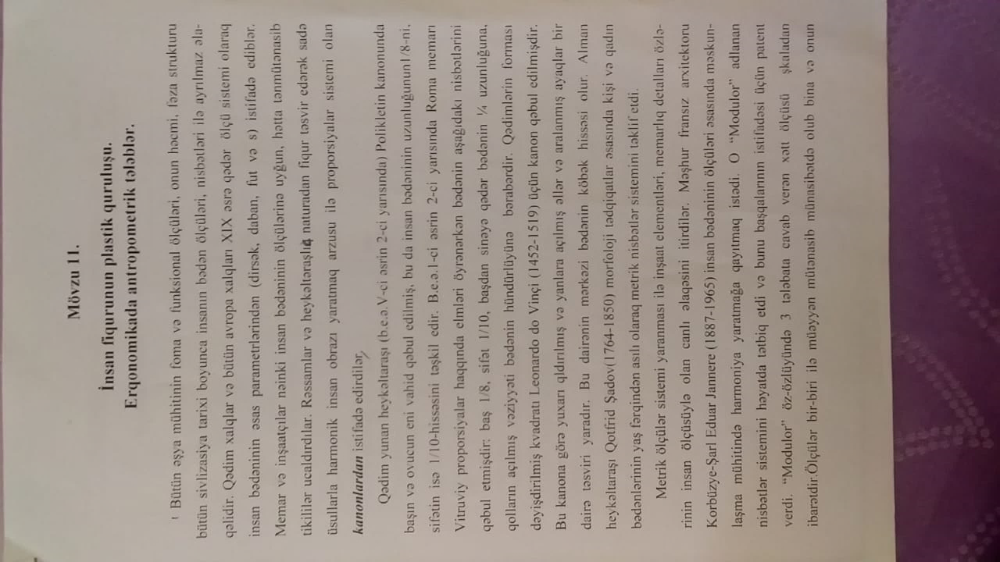

gözl d.2s8 şu md sə ır..umn 62:64 $3£3535
2Zəğmsağ2c 2? 3663 sis R-N ...
x 1... Sz£5Z£EZ Ex sSozZzxd36485
Fan 2 SsəlFkrY:si8 şs 56
Eyl 2 z212£ x £E£ 20. hən r 9 697 g
“o zg EE z ES 6” . A 2 HZ  ,ı,)8
“e  2 E $ 8 Bos S. öl z 5 5
şğ32 2204 3szola 39665 .....
ss sg xun s 00 0 E:
si scağq.32 80000) 6 7”
..— sz ssEĞŞEs3SsSƏO 28986
55... 2Xx342x.958:.52:36£ 6 028. 6
z Sedi ”ös6 zZşldlğlasz EşğezsEesx əmə
s. S sı ıbşğ?8bs 36 ....
zz SS 35986 es” qu. 8 5 2 7355522 -o.
— s 2 .... 225-265 gç .. c ə
2se 22X8-:898-g şıos5s0s.-.605.55555
E ged ss 6 m s “S puc 05
ə 5 . s ESo2Bs:£425228£ 55
zı $ 5 8 2 ə, Qa 3axyşs.x 4 z ə
5 2,5 o £ o 2844450366 6 30 2 5 6 8
us scsdam.” 5 Sı-2s9 zs x sə
-.. m x ə mö sad s-a— ƏXZ 9)5288 sə
xz evxxsəseng ə. nə m m3 5079267258
me. Əə  ... x A.E z zi
ız 31 )::4251İ5 eşıçdoy 232. ıı ıı 548
x P S55822:25“ z o ə. s ğr
ş546- ssil 2 Bz 5 "Ü0ÜH""..F:"C("("(""nhL
suv ad - oıcə ... lz zə
BE 3658 53 gz28.3X39069X5Bbüs202 şa:
Ə Saz “2212-8224 Teğ-ğ2 98864 ... m
- ss 3 s  2 S 8 5 86 xmsA 68 sesi s3s6 4328
: zo cz “dd 8şs “ƏusB zz”  ö 2? d4 .
A $T£Z2E86592. dauzoğsş.:72165-575:777
..— 35379: z 2 XI438b.6214 cos s
: z 4.2::1772 2-3 . EzTZəƏsS3“ 5 6$2
- 2 E 2 s £E£ 568 HB 0 a aa — ——Ç Ə
ş 5:422x:235 6622565 6ğxu50—568 o
şo alalftaəayşoşBoyxeyşağd4ancoaın......
2 £ xə 8 m Əş. və əsi z 2432329686
mUöcs 0 6882548907 E “ğə23 8 BE 0
HBəƏBLs39Ş9B232-2.X297a2a2989292:0:55055
z EZ2DEAXSE232121542 s Kl z s o 8 SESŞZH
m So u.Q.xs0ş? 48” 524 XYxEnəaLı asan
“mğsd aşa esl 4 MHüdŞs guxu q 4 906
d5702 şi yY?23£3422:28275 s
SsSYİÜzZ242.5:2257İ”4)-426488524 sou
.Əsk.os4 ə 5883607 80120. uxu 9008695
mo z S39 32932 6:672229ğ0720Q0535925£6 — £ 5255
mə. zzBYSqQ  2 ei o ftzşoxsu 5 2454
ga fğ?93 7-3“ ?)2ğ)8 s x ə üz zoə x
“55 S ExuZas:4asaş”?”a750o
s283)1ifİ4D Oş 5650 6:10 ıı 0
s m idi a 665 6 — 7 — (XU
sezdi HNHSuUŞOC2234-3828 s” Şağcı
Əöməsdnzm-iş3 suBp4, 27563 s$852225
HB 3x228 quğlusuuuu m şasşua
-ü-———. Buəğticdəməmnəs m x dua.

---

## Səhifə 72 (hdphoto72.png)

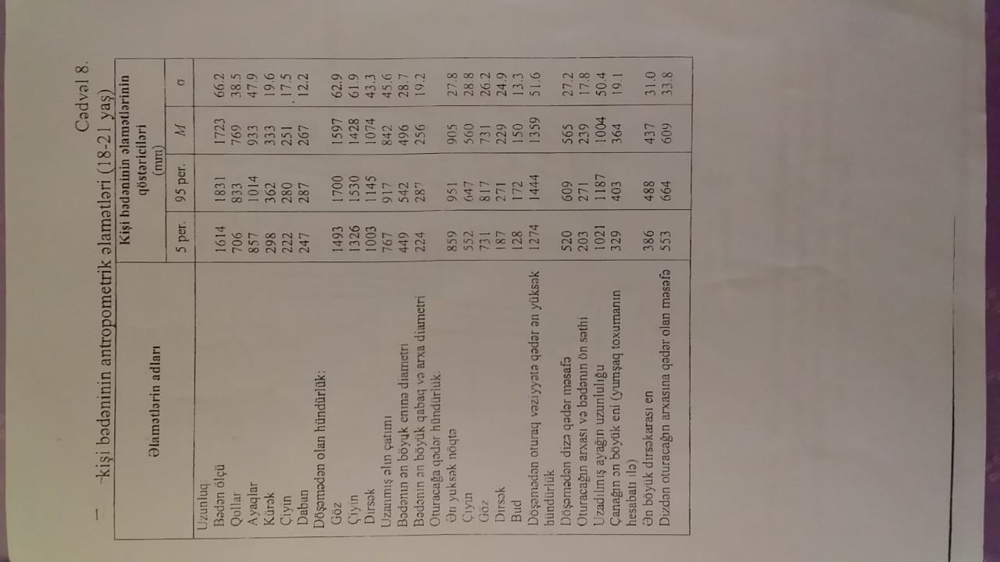

cə F ın
— İs eli üns nonunu monim nöx— ooo
s “ Genoms ci—mmdscz mueşoxu—o mmxos —o“
2: eseses dosşousd- nasını
mois - —————————————.-.
o Süz
2 R x 2
Galb: isi Bsasas 555: 6
class ZERARAR Sxa4A SARA 24268 6
colə s
lana
liz Z-x eeo zr ə
Eçgas eooc-aoaçcsşknp Enxeroçn ə b pox çısı v— om es
Bic n-3R RA2X3-Ş£ XŞERERX 8639 6ğ
giz 2505-———— — ——
ol£
El 5İ x es x mz
s.uüi— 6 ””.”.
ds ESSESA3X 332525 225538 Ş288 $£
s si sodada sacaşa oaşqsasunsasa ıso
Ki
z . 2
E 7 E
zi s E İ
- BE S z B
is o -
E ə Fİ ğ . Ee
BE 5 5
“s 56 3.7
c “ : E ş ğ3a ei
dçx 5 s
— s ... R 356?5
5 .- m 35 a
iz z m Bz S 23869 56
G m iz Hi $ 3284 25
- 2 zı “ə 2 5389 6
2 B . ə g ME da
s ə E das s:
zi B BOŞA 21:777:7
oil o SBAĞE GB Es
də gi B “saz BsS3s5342143
ğ gö s “ 45: per
HSEes3ü EZƏğSəƏ. “ ESsCğ3-umsoüE
ZE “S EDİSESB”S.2-23626 s
ƏSSŞoOSaya204695.252:2923548m54
1 mnuosuxuğos-AsudsudsauasŞanuğa8
saocduuoaxaooaıadovoonmasnac-ozoa

---

## Səhifə 73 (hdphoto73.png)

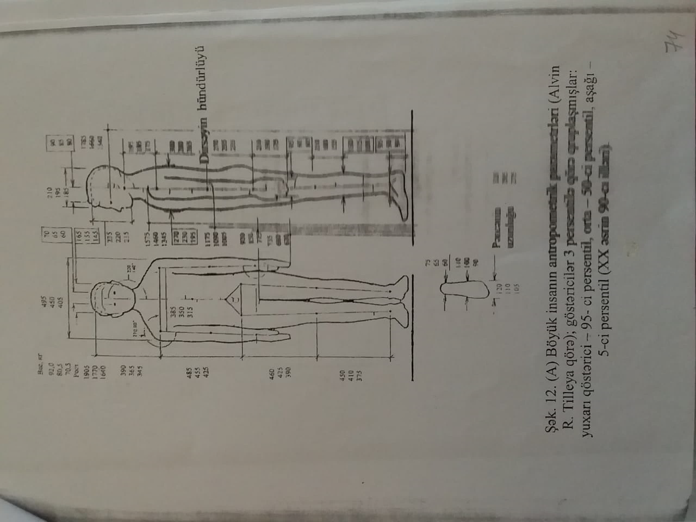

—————ıOÜxsuxuzUiu “ağlına vz —.........
si Ty
iz
5 EHə
İssəl FT bel aaa İnn in kur Tu il
ayru un yet qoy ilir h
“. iş “palaz ədl ai nı " b)
Gu TƏL DTELLİ udan H b
ə. uz m” t
1/7 GİL. İ 5 si
.. (5 - “İT -— 5 -
— .. z 2 2055
im ze aaz - ————m l süd
b ıl sə —.-.. m şə
13351383 833 g33 güz şın xö:ğ
sər 3
dəs

---

## Səhifə 74 (hdphoto74.png)

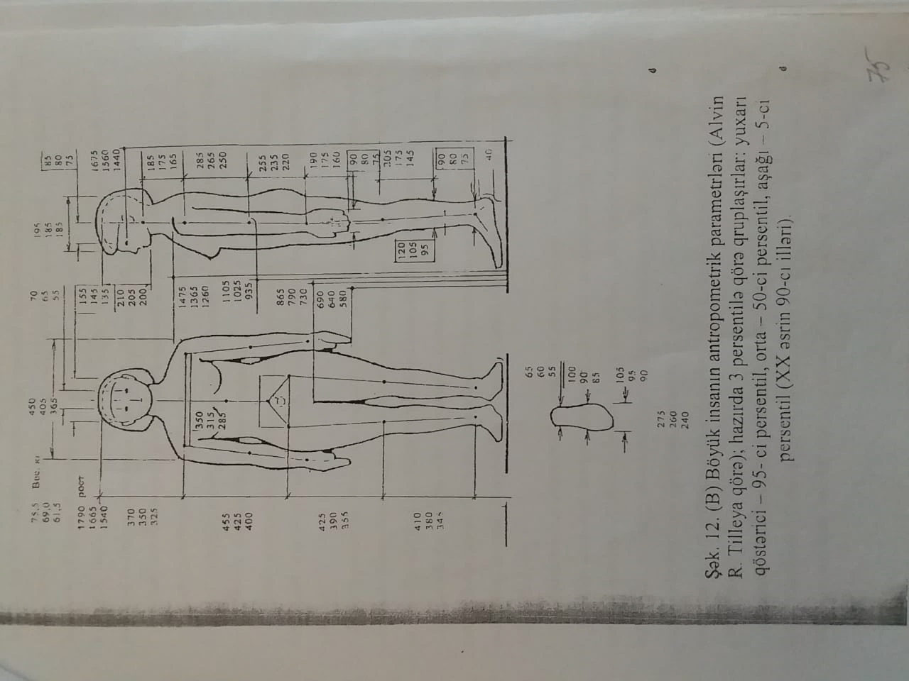

” - T.
sesi:
—— m: ən
g8ğ Pass 3725884893 İsal? 155
sas. Ş83) lssal B38 Pan 538648 - s
“7 b Buz
.. 3 əra məğ
ss 3 cu2c
Və E3s) ən
m : o ə
r ozun”
es Mİ cinə məə
sl EE a o 332 s
sə En 555 SAR g uk
sesİsos Ssş 25
EZ sü öm
1 —l ıl 555 Es
2 E marnbn — SAS
333— əz .——— su.
— m 53m
nı. ...
.. 22 əş sə
s 297 ea 258 32 525 - s
szə £33 28 7 EŞ
ol ə is
zə dz.
R ida surə

---

## Səhifə 75 (hdphoto75.png)

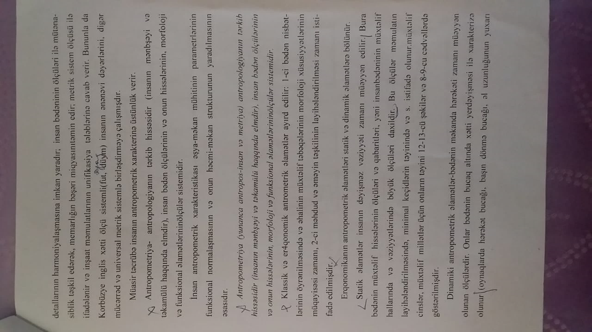

25 ou z oz xor “öyə me... BOR
606: 2 ə m cd çoz BE z “2 s uls 5 unun
£ .. xə Eu ə ozü sa xana kos
5 - so So Zooz m m0 ə ....
diz 5 - E s Bon mon E no mo
Esa3sc ə “ E ... ə 8 arusu.. E Bs
a da .. şs gn .. pusu gs
sg ə zz . E Es s zə msr £z ” 2
m E ... z şŞS8x85ş .. 2 z E
..... goz gs z 2:324. pon... Ben
BE xs85 E z ... S ə 3 zz S-es82ə Ee3
Ə . nz you kum Sd mm x Un -
suc b s Şsşq z “2585 dı sə
mus 0 s m sosduqukun Cc xo No S
ə” ə ə Bars z QƏSŞSunu m Gə ə
iz m os mm S m R ə. “Es
o x - 5 $ c Ss 5 ün s sd mo “
ə - 32 ün sos s hə sz özl Z
palan şŞğs4 .. Eu SEğl-zsz X...
..:-:.:46e 55 Saa zdaşk xe Zn ak: Bu
5::::: elə 5000 ER İz 5...
qz o zsxuc  z E- os E S sg EZ  -)e bo
5 Esdss . şə 68 89 06 2.
üms kəz ” suxdş. ans r a
- Bömşüdirlflisəş 5 sarısı 5.00 s $-2
“257 sə s oc şox mu m o x br
Besdi nüağ4ş Sos Şək məz s B394 2
düs: 6 $ 3 a s S 0 a ə o o Zoo
m a ası Eoz şs. 3394 m o uz ə E E
—. sos “s söz XSaxğd ss 422354c:6280 - 8 £
... m Səs . S 6 2 x 2262652 ms
os “88 z S 3 £ su ls m.
57 mədd. əsə e şyssass8 Bə ss EA -
Əmpcdaumu 826. 82 gıı9ze: ə x rarı
şıx 30 oşuəşd£ ms 5 x om “a 39 2 Əs ky
vm qon ns m BE 3 Sx37:72 E s k£ 8 5
— 05-ə -n-n-la xos gaz x EĞzc-$2c . .
ş- 8 EŞ BuT 8 Ssdğsab Tala s 0 2
SŞolmesd eyş ğazğze Ss zu sozu xos ə ə
mo r mm s o sşusc g 52:52: Eı
ESsSBğa.sc- 8 şu x oz “sSsnuaosz Bez
üə no ə m eoşs g s x el m m no — so zo
.. 557 575: s Q2322 pl dem o ona
Be221i226648 0:5 bi EsS2 22 ”
a —n. Sö. PŞo ss z şs. mo oz
xo xo H $SxX3c23424 dgğşaddzs 56
gşsi3oz: 8262 E PŞşs3s s b 2 “s 5 S si .
Hdsəcədf ğı dı öz 825 s x xc ə EZ qazlı z .
z Ə ğu “  2 ş43.shşıaıs- əh... EE s 1
S E 5 o 2 E Bö ğSaışd s z 8 E ...
i4 4 z Hz S R anə "BR a də
ASEBM925429684 z s şaya sans ö
s E qı oo EŞ şEsşrevs qocanı g R 9
dus uuqumcuranma... PSşı5s42:.46:. ŞE E Ezd
zi gi 2uədmn mus sos ss Ga x Bu “x...
Hs ZəaəZsi ia ii 6545 yaş youuguyunn EG ulu
saqın sa ŞIaX.S?SXğ5”Ş£$Şğ 63242
4.03::5:75: a .. SSoğvLZ6Ssuu.u 65722
“5 2 9 s c pe 200578 m s E Sü ələ
5277:17 2:0: -:5..:20 00 6 510277 6 “——.
BUSBBESYI4I2222520”2$iYsş2ğnso 6 Eı.)6za 375
dxuəbBi?3 Ham x bl m Bo 133323 mm
“xscus .. mod x ocmss mst s.
daşam xf g s Sos s Ed Huscsx “ə

---

## Səhifə 76 (hdphoto76.png)

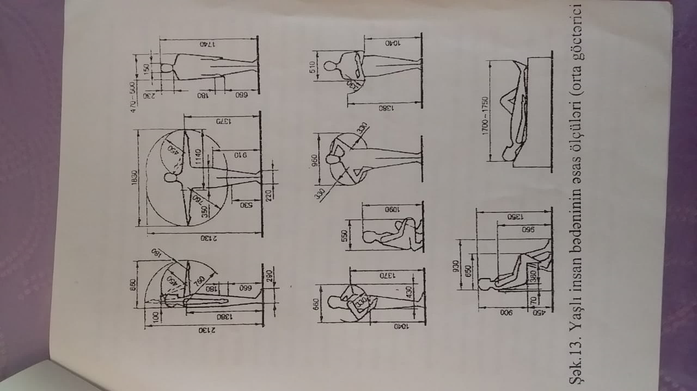

ba ROL ə

iz vü "099 - 5 ö
-— s ce ii -.—.
Sİ : iBEİ: 2
d/ Ebilzərrəyn. ə ez
m — 1 ə — 8 DI “x
7— ic— ə bi

cz bül,

si

---

## Səhifə 77 (hdphoto77.png)

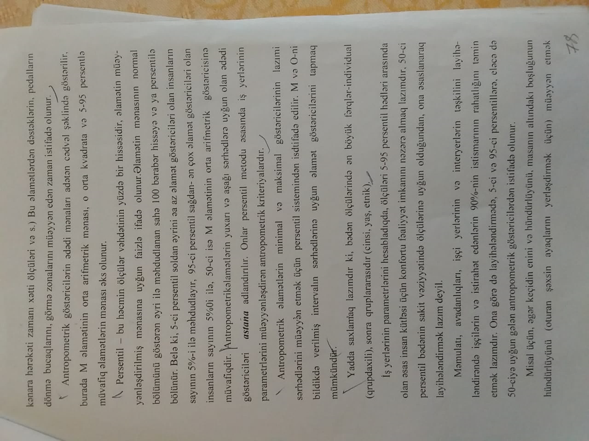.
s s" yr də gx ç
rn Bu uu s 6. em eş E nə nı Cİ s 2 x
z as cs cz EA Rİ Zoo s ə m
izi mo m o ə 0 SO x - Qu ə z sö zə
- soz XSusşusuu So3 z au ...ı
R. 2 oo ABS q 8868 2. s... Bə zo
se 8 Üz) x s s Ee 0” "b gi
” “55:57 ih SE s z ə
Zel  9 21 6 GS vr 5555. S ə Hö m z $
£52826 NmşBzs4ödvr..- oz ə m s m ə .
m esdtə mo ouzoudxz "əh oz mo iz ml sozun EE
0 qom sun ucu ə 98 o 5 eoz m
2232. ə əl mo so q mə m 8
pu geEyssusuğ z 5 s m kun s E 5 sU
gox” . as lann gx z x .. m oöru. ou
qacan - Əəə zz £tŞ ü uu - qusu BE 762925
dsv s munu nuqunm.a. SQ S m zə Ee Ha 0 çə
“Ə s s x zü sz ce on zə o £ Ko mə 30:g x
Z204 gızqcun.aı...a. 5502 2255--
“553 2010 Esas“ ə o Gö ə z 2 ço $ x
.. 5 Süsyşypoğsuğudaid4 iz s San a om ə GE m
anımı smosmsuso?” 53 zı nus Syan 255-.U.
“ dos Əz 9 m E Ş 2 0 o -i im əd oo
£33 6 ə 28 4 x zz "pod m x SG Bl o ı90 6 
55: masss:2- “80608 ExəsrssD 40
m 9 6 z “. B os ooo z $ S ə
ə 8 z 6 Sos NU o 8 H g s 8. 5. 3889265
ə s ə m mun Gondunuuan s s dessk
zi oz de gəş2ö s x us 00 ES 5s
ms3832 ez m o m EE 90 oxrs ğc 5 ə
- 5848 çaşar o - 5 xü ss E2 Su
” ə x 3 m x 9 dd e gü 2... ə xanını
əsmBod s şı.ğır2s 668664 Ə ə g.suş —u
.s.5 — Ə zo “4304228 Q 0 .S9 (Ə 7o Am /ğı mə ə
dizi 2084 8  929, 6 Q Ee 00 S oz : BƏsədəsx
gx Nsçşaəso0 mo Goz m - — S $
qə m sığar cı sn m Ee m. g un 0 cm bəs
smssumnn....a....a. usulu...
m a c- Exs3 dom dlədsssağ qın dü əş zs
Zəbi. 2339229208 6 86558 əşk s...
nu xu... sınağa gişcca SES 262
oğ o om muss o 4 dsndacueuxmn ez ə
BSstsa4 2866:5:5k:2052 NEBsuyxş4 ux
58285 “s“ö“öv($(öX0V9009V07:00-—.-:.
z 23 Qon xbnus. s 9 z g E da o ” do
mo s z sn E 5 monusunx s 8
- E z ə ə şok . ed ə” fel . g
s on 0 zo oo o s s Fİ s g mz
Ezdsnuəuqbsuruuuunuu.u..n.....n..
z Ön “a m 5 -
m megöedmuBnğ897 se muzuu “ə dım M 0 s gr
RSELBES38 pan ınqataıa. 4ESR3IlS.23.8c£
TS Bğu. şşaz £Ş Bz qoşa Səs ğa
sz düz yığəoəmxznp. du 283288 2 6686
x öğ os üzuəsmsc-umz bz ” 8 4  :H:5 00 E AR.
o 8 £ doz sə 28 88 Əd ms un mo ox
aaa 307”,
8 m İ z zə R ı m oz .. Ə
-.. vbsdassosşadağğıd4ılu0ğd4cscst69X328x2826268
Beş £P2S364360 0) 3 5 0
s dz du üs iz ön mn M də m
gö - ax sdee-:şadudn da” 65606 S o sun
mə s E ga na nu nu. ü mn

---

## Səhifə 78 (hdphoto78.png)

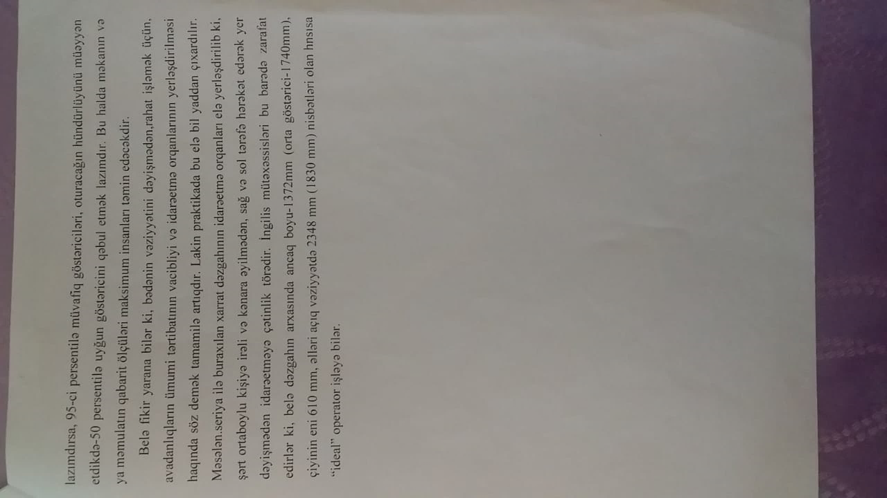

usd
5 BETR
7V77UCU:75::51--
s BELİ. 663
5 .5SB322£
sos məosss3 s
ss 57556:
s 65——..-
Ss 8ü 13:50
S835.86 6:
z glulu6
4255:5.52-5 tz
24511 :2 it
Eka zo bb oo
g 2Ş5::3$ 25
ou zs iz E
g ə -. mom 5
S02323:5215
U:55:754£
.. ,. Hg z zo
1717 v7v 53
E 2...
geds 777:
x... (s ə
i 16.55.32
E 3 E İ Əə os
z Şa 5265
"a “25

---

## Səhifə 79 (hdphoto79.png)

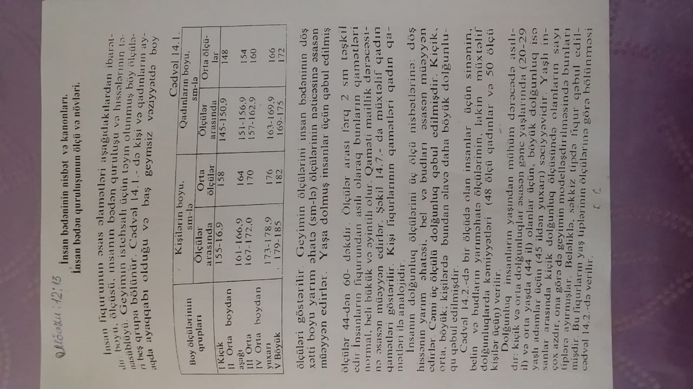

dn
20 cn quzışııa
məna 00054 le 23 dE
sz dus VOŞu cdo 56800:
i si do: 2 z sü
İB —. Sü33c Sü Cup 000
52 eb İz Sü 29 EL 27: s üə
(6660 x m. X2 98 süs o Ed tud”sa
En 3 .. iss də əm Ba EŞSc0 25: zf 25076.
2-5) İz Bs Eb MUR dom 538232. 8
0 Şiş iz gun xə. mi q GƏRƏ s293c63q
-2233 lz alo yğs sn EŞ — səs zə
süde gic Xə) 8 sz dsn. -— 2920
sls ğa ə S xass damo gszsunoumu
55 ƏSİ yo 32 -. gal 2253 5415.
L dözə E a 38 95 sə ez. biz 5 2052597
.. SzZUNŞ ə m zu vd de3 “dos 2-3 5 2500
33 2eEİŞ 5 2 ez 68 3:9 54696 --o8 ses 5255
sa 26298 PR ən 62 25575 d336 .. 5255
ic ə x - ə .. Goz 255
2 os 25 90 siri -u ssoossıı
35 32973 5525550065 5660000
s 2:32 İ 562 sOX6 oğ dəəə .. Ş3ixz
2655 eg 325 Ged qz ss 255
zə 555 z 38 S8 şə 00 0 240
55: —:::— s: 630 33- 33.35 6
25 2. ə. Pr üç 2605 o. ... y3d3a idı
BE ev: Es o2-70 qamu scu s19825X2
227082 9 dz mon d3o4 XE 53 “0
2: 23285 Fi 575 əs sözə üs
HB: 23715 ın QO zal gö 5 in 5 Ya.X5037-
zz S5z00 El. 27 Es .. co vğan 227 56
25 90229 z (ə $£ salı 9 "Südə Ş.333305.:7
zs s 5 A Ş- nı "Sl 62 . s3d5-3:0.233z 2333
2- 712 zı olı ə 2:5: ası "353333v:3.1:529
.. 5556 i zə 300 970 SEZSOĞULEusƏ
Kiz 2 7 mos damı FƏ55
m İ z iz 555
- z (zb-əə) z ş.z Gamnon zz Ə gə3 3562 x
2.12 3 3 m 5555 s
s “5 dc 133. 5350234 0200491 1702
520: R a 9 dz enə Geo sci
” 20.05 z 9 2 s. xay 0 naQxş-s Gö
əN ə ann ö9 5555 3:3279
5 səla 15 Gö SES. 2392 3:1:274İ
x ucan İz z $6:3 S-ə Bez Ev Xıl 204 322
xs 5. İZƏ s 1 səl sz0 də m d3cə 6
m: dom bət 0.00 56 sarazi 2000006?
ə — İ ” (00 z oxE 20321
İs —- si 555 e
ə - a MAz
i ə” 5 — —

---

## Səhifə 80 (hdphoto80.png)

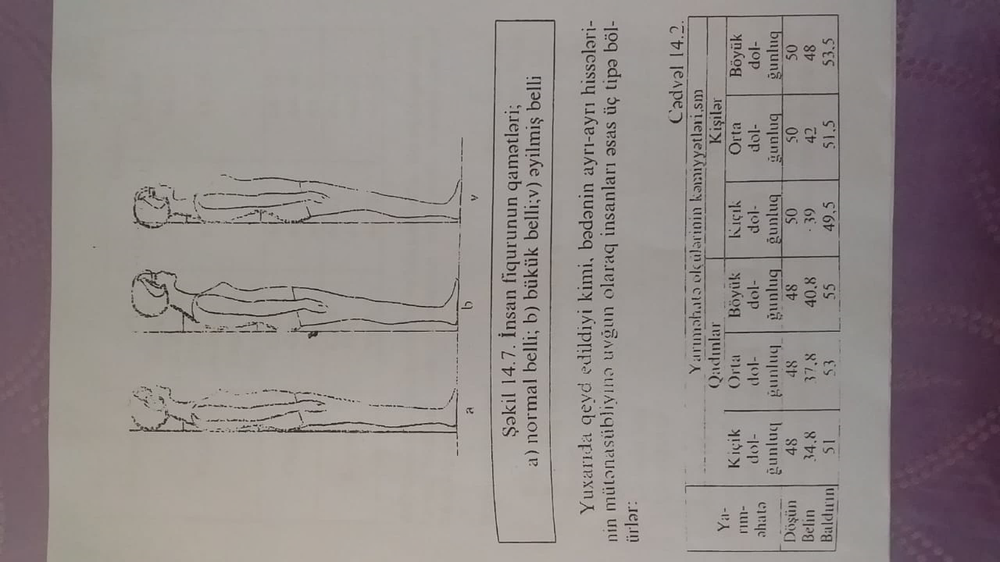

57 ci
zəli R g
s3 sf m zlə0
m s şsn
“İl 28 şs
sı. Əla
o “lz
“Ə S özi
dəl ii ma a
da qo ibar əvə
l - Es doə .
“3. oz 5 :
—.. s 55: iz
.. ..... / o” dz zi
gü — il m. s gə: zi
0 -— mk. doz zı 1.77 ui
(Z 0000 -— oz mi İseeiz esi
2. —— Hə yn. 5 Köz d m
k m -Ə 2 2
ı gox .. İ
gəz o Toz
əli: zə cı: g
/ əs ə HS el nç
5055 səl Xo iq 623733
i 7 - Kan xc İl 29579”)
..6.—0 a —
ıı 0 — —o məl dö EHu—
.— də m m i
—- x sil. 4 x
1 ğ a ına en,
i s. Bi 25“:
.. 555 n -. .. so
00 /ı.İSEİ 2” ——
75: mə ve ə
5 o .m İ x.aə32c.i
215- de
i dc üb
- Ex “ux
zz mühib---

---

## Səhifə 81 (hdphoto81.png)

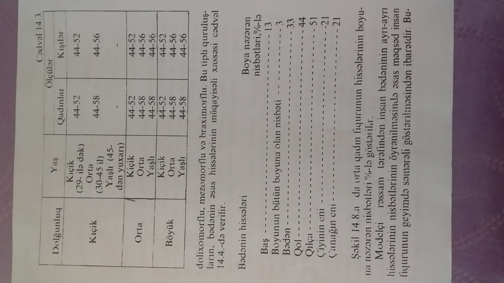

mi .-

məl sə o m felini xD
2 R - 3

— - elan six xs
“ıl Elis es ən Suneğuqa Ş şam
qucdısuı x eeolel 5ö gə Taala 0 , - .-.
x zi bada EM xa 2 Məzən çılau .ü ni məz
55:43 “57:77 geyə...” dalın
s. SİSSSİ -6 sn can. 2
“Ts 2 geri" ar "E ce ə.
zi dəyi məə dan ee “6
m zs ool , un "manc “Bö
2 İ əd öz) y . 0 G özi —

bs z üzü "" z ii
ə -— 7317" CV daş
zi ı İ zı 2075O: öz
nü ci so gölci oo səl Em uumusr e du
FR ü , Moolumul gg 1820005. 6 cz?
z b zı yes NL ü ce ....
sn 0 ən 2:22
BS 300 5
.. ə çe 1255 --.
x oz nə 15: zı342 8

İİ -— si, çə z dü Lİ zə
zi 2”xdsazmaz mu "ə 200 azn
x İn. s “30 zo — gə ü .. Sodom
ərə CRlE 262268 s34 da uu. . sGG -
İsaöİlSşi” xioc) 3“ 5——-.-.
Gezi Bo sü m. mx
107c”u S pan aydq so men 9
x İ s dı : gə
271555 . -—n..-
İ E m qü sSezcc
zi İ aa u012— 2 £
H i 525 :r
usde 2 - z? nk.
.. x ım x uğ 46 55:-.-...
il x k — Gə ə fes 5927)
7 x .. “o Bös cz BƏS SÜ 9028
ba m oa 0000005 -52-

Hə ə ? ..İ 2e- “cs
m: M Ziv $ azağolz 2.32
-—— İ İ “s. ğ əmi “mz
II usm mn - ğz

---

## Səhifə 82 (hdphoto82.png)

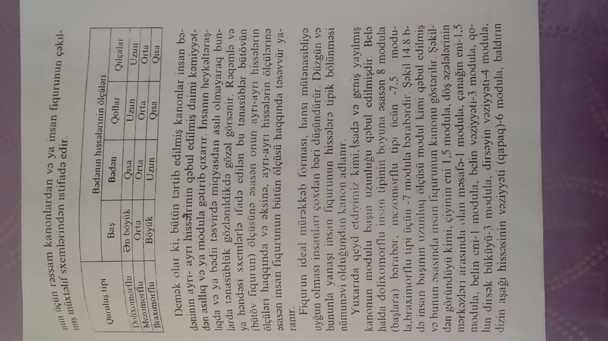

.. vumss
:5157 R ü oexz vomsisyasnssoss
- I ses9$3££:s S$752 usnaz ES a-os8
— İ İ o duos - isi E Qoc udz. m
xs İ s İzi Əb lğozsüE os 49 6
isi İ xelil sx3?l0.3: 236 X Oozsomdüsom
əl fzissisi şö vo8 ŞB”. ozonun.
s İİ İs)? quğsonıqıunnn b meŞ43
m İ ə AG os saö o ximsnmomsma
z əz xödonx o 8Q Xdğxğ2a”s alə
BE z sağşxdzağ 27. şEsooa222 Tİ
izi m HE-Ğs Esa 5-20:226 76
z mdqqEBsusss mü mı on ə o ə
ə zəl esuxunuuu 2. oocseE 0. m
az dgƏğolğsegc sus də oo nu sdsdosm
dz Öl SeZ2-98522x 52588 “ə-222232f1o
mz ii sH4£4368c so o ə xə səs”
s zi Hu Sa  0237s:2289026
z s qmu“musunsu ,.9ususşuqoud9unu
Su 3 Edds-odEL. Qod alsosao
şə 14 məeöşŞğso?2 Şu s2m
ə z “s Ya4X0oŞli2 5za20..2o42-$
z . bi z İr) m. nən... do
3 al S iza Boşuna oouqudusunum8 m
x z i xc m zım 0-0 sə idir
s 5I 3 felo5 mod329c sı
sö ki zi zay gol oOSGIZIARS2E 2-2
doz Cə dgqşasod6 mXsos372. 208226
ya Iİ Hüa343.22 239352.-637-52-027983
sd GELUĞZS)25 xofsı-?ş.2-52829
“5 İİ ms 8-..8022266720 6
sö ER Bus 5565 — —.
elssi 202 uzmu mssc- ...
s.e s us puAqudus356 BEBz3o.0s.ƏeS) namə
ss azo .mcümamoo 550
x. “ Məaz xi "ə o x uc .sElRS56
ih. 6”) “5. - -. Ousos-lsz ik”
z o b.4x8-u uzZxuukxce sö a
Bi SESANSLC SOZÇODLESESŞUquZ
ə i 1 00 025 2dası228 73235
Ge İ x lli 2Se”saz37s SEXOoOZUSXozzcoo-ss
Z.. mıza sngyo-339z22 İM XSixisco-E ZƏsc.os
mü x İlum GS. 2osuğ3022:322:27
sə 8) 82 1Zils mösucun mEss.5:352896955 23
.. -a ə. SARI. asası d351.7s532238029-
c-. £ mim “ssas” nen” Soxsescuza
mə ə PRƏRA zi .oşd3ğ izi ssaZ$Ssod9o222£
- ə za Slzsasaoa£8 552 XS32-c3:98626352

---

## Səhifə 83 (hdphoto83.png)

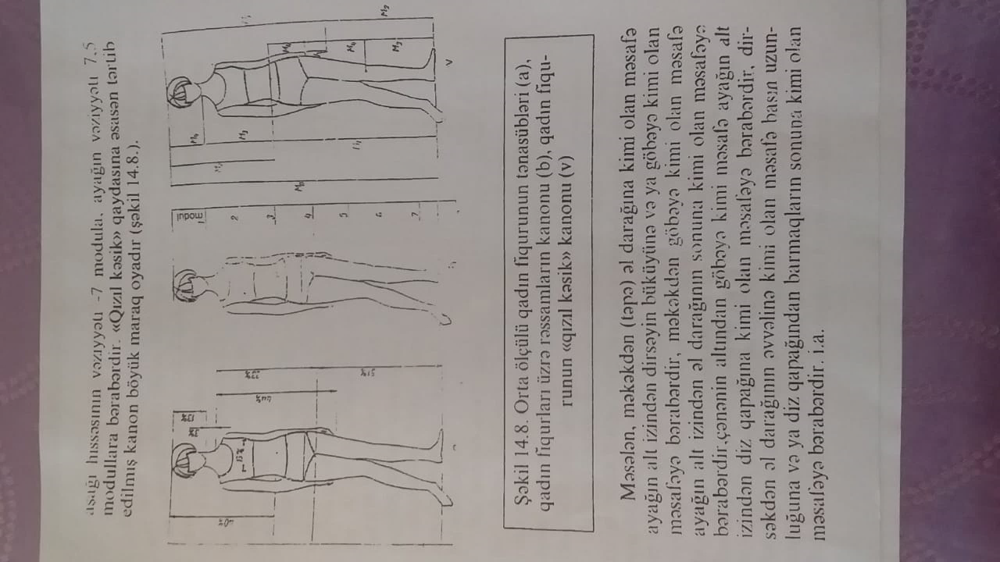

600000uy un 0071 ozmosdgmesxum
: duq

ce il salasan dsdusd34
m ə —— dgodğdus.382
- 9 ı “ou doz £ £ 60. i-
sə ı a HEzL-Ğd3-a
e t un E Sşesşdl4
os : — Em məesusozüu
s. : mə mess.sss
ss r Y Oo xc xu e
dr so I mm -—
sü 1 ə — — 2 mesossc
zə .. , d-— əc Gec G x
66000.. Bocan...--.
568917 —— q ıı ual ŞAçees7d2
m" m əl - x -—” x
“o —” 4?“ . 41 - “od cocda2das
25.”75 , ESSİ 22.
En 7557::: zs av 6 x Eu
245 50007 c601:46:5—
0 g- İ üu.—— -. em cm
Pq S 0 —— Kr Ezsmoe- s
evə .—.— .... go Gstezscec-s3ö
s: 5 :
ə meyi aqcunqu
Sus o Ğs con ə S R öz
Şax —m—“ —. sü xos...
mə İ zl d2-ısi35z39
“sö o... KE ss8S2 nsss
ER İ oses- dcuücru.asağ8
Eş "-— I x Ezsdiss98
zə İ İ oo s 55
2 zs 0 — ? oa) “3085 oz
252 —”T Ty — .i 5255255055
“7. ər İ n -z eee ğç
Qə. —— — sü Sa3a865382
2255 İ İ “3 ox xox 5s
-5-i i ə” şasşkadmua

gəl İ İ İ TELSBNusz

---

## Səhifə 84 (hdphoto84.png)

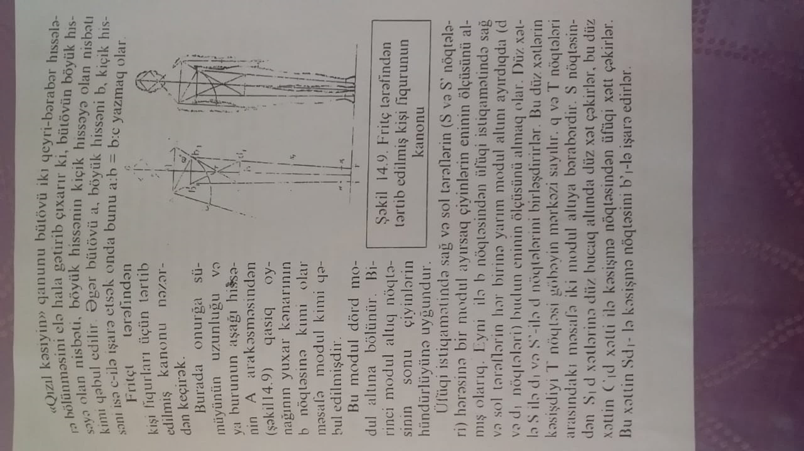

dozsd

gaz
d2sdcs AXYEULSZ438:

295 V.?ğmz USğ-gesz-
..co Arm gi gös
5834” ə xx — İİ sz gucusə 83
gös x 6 öz İŞ S22327“48
 O.S B “zz” 5 ez uosase0-8
G .. E “ m .— z səna ”ae
S9çeŞ — ə “25.5 6-8
- Soşgs a 0 doBşsu-mxnyu
27502: l sam RƏ “3:.3x563
27.-c sedllə23Ya 53 5
Şux ş İ "o Qul.
n Sər t s -Z4A-2c.-,ou5ş
Tülxzü Te v . məzs sus 80ğ5ğ8
000 Ye sn ———— en 58557
d-3zc üs —- — ış ücsdsnsuxnEssaə
mo “ - — s ZEZS3252:296
.... ıı —.—.-— mə
252:4 -—. ..... SƏ-328xus52025
dos -— səs SŞl88əS30 2
değsə os oXuş2ə24ı ia
FD x uz uSOZo-uzsğö
süm4 53
Ho. 20—”z
süxöeçdszo,L 150c:-- Eye z2s3 m4
dağşseĞğU əsğolsds "EEE —..
iz ənə əƏ“ğ3ciaz” es ə.
ənaodsUü suz 2-5: m0
282.088 hə Ze r 355.
Sədd 2eYE3222 20656 - A
soüğs”2c 65.25 525—— hu.
ƏOsə “əc “5228. -———. “5

ƏZ cc ORƏĞUS QEesəA3” “-RCUSEZT
5566... 346 B.3522.2:20550 0
-2c222-” 83 250—35E20mx20676£ “mc , sg 670
Mdsuno ıı ə
Bə332.3:1 3:2... 28::-72522 —
- Reno uzunu musurmnnssə
5656 “cc - xum mEs- ..c9z2
155 2795 Səs sqşonudun
1::::-5::02-c2 Ta“okz.22c-22
Z ossose2.27-
muzd m

---

## Səhifə 85 (hdphoto85.png)

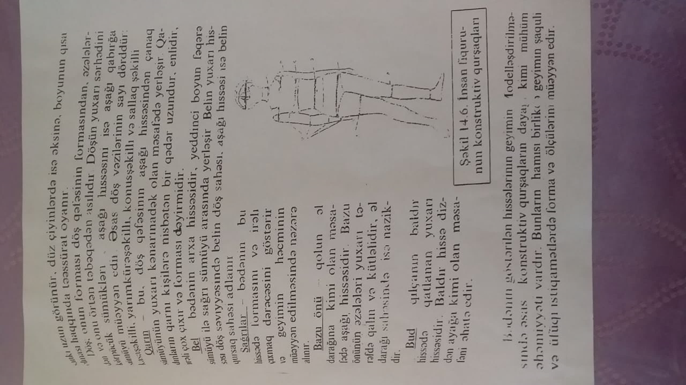

sl 0554
izi gö
m ii 454
vaz 8232 İSS 5272
Z (c082 132 525 zr: mz
2 55923 32 “. gi z dt
2 29-90-5956 Ço o Esl 6
£ 52255.-6 GEL, ..... d.. 25:
c Exss z 22 o 8 / doz gəlsə.
d  .":.3T— şad
205 Q ələyi da di “75 ...n.
2 4453312756 3si 0 İ Hil” x laki ssn
2 23f0-u65 gan “cc i.-—o xıl asuu
nə OĞUS od. 7 “x lı s Um
d 2.dı.684623 270 £. BİS 1
z 65007::4: zz —. göl sağ
z 5 38 mə əş sz
2 56-22a8X 983. ə ssüə
o 20 aE Xəz E Hn
s sOşdasav 4 DE”
öz. 2523s3.-.ci : “4:
c 32 ..05365 a əza
-oz2462s sazın saz 232582 2.8
selə vodusBu46 5 5 E.3q
22000 ZĞUĞI28v0 221 287.R 22 z Eu
? Su Azə oz 2 ...... soz Aİ
20.50-2032825- olsa Bü-s2 529 məm
doşdloquız “7 ordusunu öz 2um
oldusUduu.lusu . 952 6 28209 "His uz
SUR Güz 5i 23823 226532 .u24 2504
25- "asta 67 ER s. 22142
dduo Mos 89z6c “o ”s şın x ə
22 doc Hüss. iz 2272200. deŞ3
5 d.:2-2229522 . B22,23 23202 2:22
0052586: 304802 SQ oks oz “xxx ə
ssquşc2s oxunu usğuam mə”s”z Pa.
d3lla22581- sosizazn : 328 7: “ə v
cƏ--2Z22 vaudurldğulaao io) m3.-— di zo zux
Qauss. 00. 462350 45355 —. şö - m
üduz0lazx si ”2c edsuz s xey ziz soxan
səs -“xsBe:“5 12:35” mu .—..
52.4:.2::4553237 Sud46.:382.327-- fi.
QALŞLLƏŞASƏZUAnI si 5 “65

---

## Səhifə 86 (hdphoto86.png)

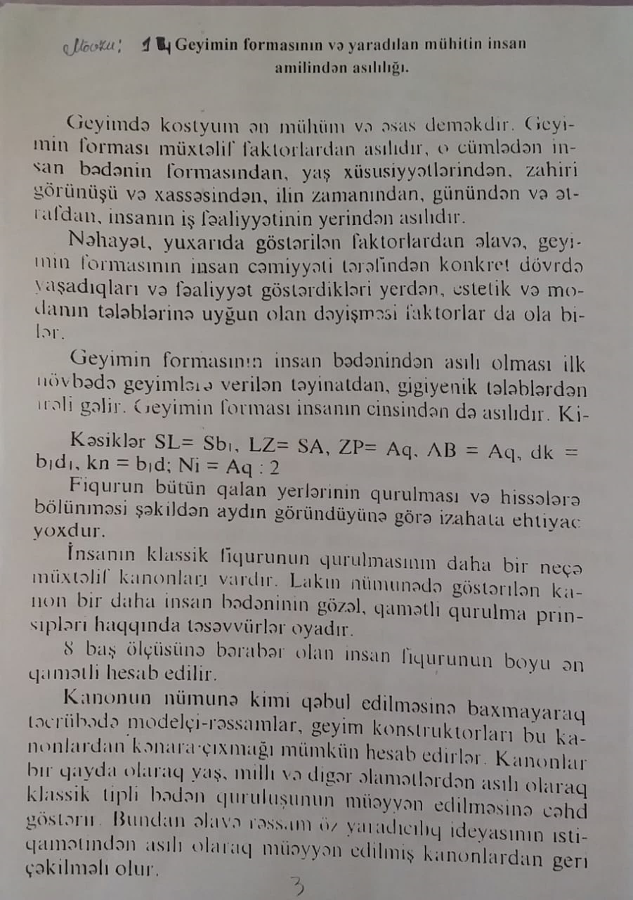

b mı—ııxxumnuuuuuuuuuuuuuuuuxununuuuunuuuuxuıunuzmıunıuounuuuuuı—ı—nsuxnı—xıxıumıxuxıııuuunu——ı
o//zota, 1 8) Geyimin formasının və yaradılan mühitin insan

i amilindən asılılığı.

Geyimdə kostyum ən mühüm və əsas deməkdir. Cieyi-
min forması müxtəlif faktorlardan asılıdır, o cümlədən in-
san bədənin formasından, yaş xüsusiyyətlərindən, zahiri
görünüşü və xassəsindən, ilin zamanından, günündən və ət-
Tafdan, insanın iş fəaliyyətinin yerindən asılıdır.

Nəhayət, yuxarıda göstərilən faktorlardan əlavə, Beyi-
iin formasının insan cəmiyyəti tərəfindən konkret dövrdə
Yaşadıqları və fəaliyyət göstərdikləri yerdən, estetik və mo-
danın tələblərinə uyğun olan dəyişməsi faktorlar da ola bi-
lər,

Geyimin formasının insan bədənindən asılı olması ilk
növbədə geyimlərə verilən təyinatdan, gigiyenik tələblərdən
vəli gəlir. Geyimin forması insanın cinsindən də asılıdır. Ki-

Kəsiklər SL— Sbı, LZ- SA, ZP£ Aq, AB Aq, dk 
bidi, kn  bid: Ni £ Aq:2

Fiqurun bütün qalan yerlərinin qurulması və hissələrə
bölünməsi şəkildən aydın göründüyünə görə izahata ehtiyac
yoxdur.

İnsanın klassik fiqurunun qurulmasının daha bir neçə
müxməlif kanonları vardır, Lakin nümunədə göstərilən ka-
non bir daha insan bədəninin gözəl, qamətli qurulma prin-
sipləri haqqında təsəvvürlər oyadır.

$ baş ölçüsünə bərabər olan insan İlqurunun boyu ən
qamətli hesab edilir. ı

Kanonun nümunə kimi qəbul edilməsinə baxmayaraq
təcrübədə mödelçi-rəssamlar, geyim konstruktorlar bu ka-
nonlardan kənara"çıxmağı mümkün hesab edirlər. Kanonlar
bir qayda olaraq yaş, milli və digər əlamətlərdən asılı olaraq
klassik tipli bədən quruluşunun müəyyən edilməsinə cəhd
göstərir. Bundan əlavə rəssam öz yuradıcılıq ideyasının isti-
qamətindən asılı olarıq müəyyən edilmiş kanonlardan geri
çəkilməli olur, 7

---

## Səhifə 87 (hdphoto87.png)

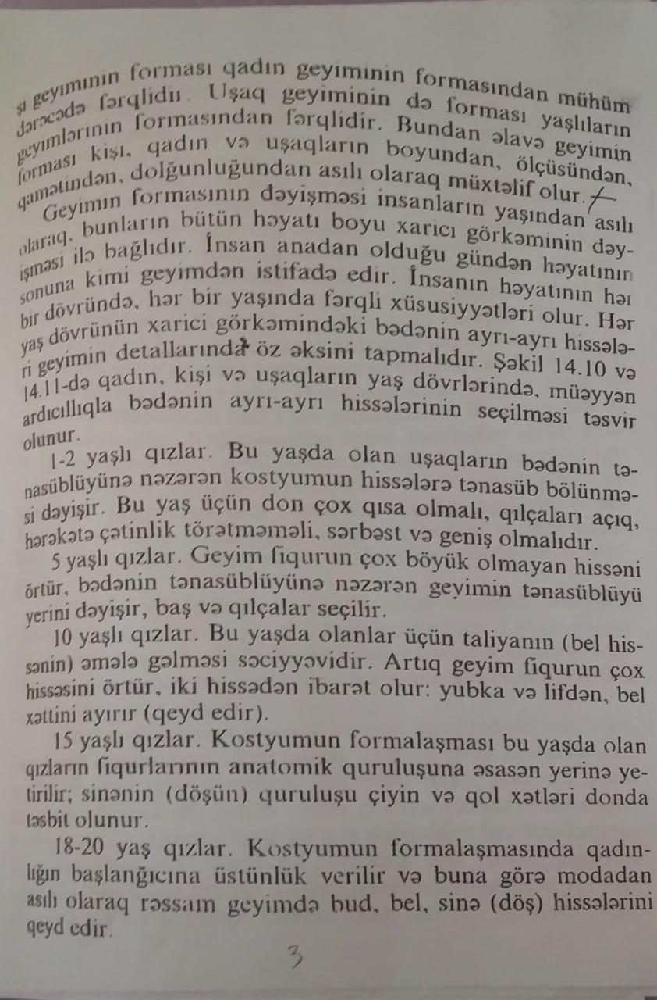

in forması qadın geyiminin fı.
genin qlidin Lişaq geyiminin də "masından müh
1 rədə "ormasından fərqlidi Ə Torması -
dər lərinin ir və Mr” Bundan əlay Yaşlıların
eyra kişi. 4 ə Uşaqların boyundan “ə .Beyimi
irisi dən. dolğunluğundan asılı olası ölçüsündən,
m aayımın formasının dəyişməsi insanları yşəlif olur. £ :

.” punların bütün həyatı boyu xaricı gər ından asılı
olrilriə bağlıdır. İnsan anadan olduğu dənin dəy-
iş ma kimi geyimdən istifadə edir. İnsanın h. n həyatının,
sö lövründə, hər bir yaşında fərqli xüsusi ərən hər
if Hövrünün xarici görkəmindəki badan əni ölür. Hər
yi imin detallarınd3 öz əksini tapmalıd ayrayrı hissələ-
Hz qadın, kişi və uşaqların yaş əəə 14.10 və
Vadıllıqla bədənin ayrı-ayrı hissələrinin seçilməsi təm
lunur .

0 1:2 yaşlı qızlar. Bu yaşda olan uşaqların bədəni
şasüblüyünə nəzərən 2 hissələrə tənasüb bölünmə.
zi aş üçün ü
z dəyir Ba —. olmalı, qılçaları açıq,
hərəkətə çətil ar. , SƏTDƏSİ və geniş olmalıdır.

5 yaşıdı .. .... iqurun çox böyük olmayan hissəni
örtür, bədənin tənasüblüyünə nəzərən geyimin tənasüblüyü
yerini dəyişir, baş və qılçalar seçilir.

10 yaşlıq. 5 Bu yaşda olanlar üçün taliyanın (bel his-
sənin) əmələ gəlməsi səciyyəvidir. Arüq geyim fiqurun çox
hissəsini .. dü. ibarət olur: yubka və lifdən, bel
xətlini ayırır (qeyd edir).

15 yaşlı qızlar. Kostyumun formalaşması bu yaşda olan
qızların fiqurlarının anatomik quruluşuna əsasən yerinə ye-
.. (döşün) quruluşu çiyin və qol xətləri donda
təsbit olunur.
18-20 yaş qızlar. Kostyumun formalaşmasında qadın-
lığın başlanğıcına üstünlük verilir və buna görə modadan
- olaraq rəssam geyimdə bud, bel, sinə (döş) hissələrini
qeyd edir.

---

## Səhifə 88 (hdphoto88.png)

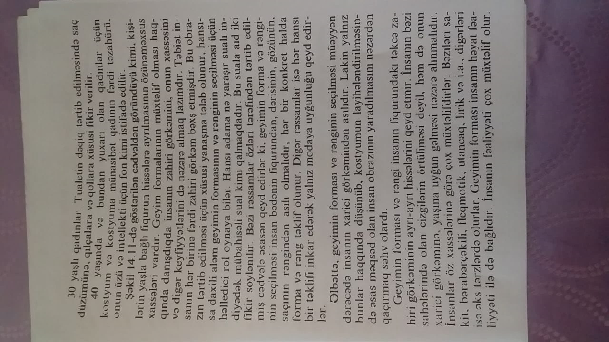

Fı..-
F . eu uz gsAeA6 S2483s6385
mecu Lasaca:936260a63345 5249 S932236292
2 oz xsauyusduqducusız Sa4o “Blu
go gn “ğul aZ) SER da ass
527 7:.:356X:712110 52.53 12.60 5 6
E 8 Basğonla0?4040 5BSEG sşqığ.as
2  xEESU sas sə” suda döüpədsud
Esse 23562 33.--8E
muss 5uXoOğs386.0.5 H..s3 Yu”İSssç.
şuşa BEosones sı xe SE-SSEe”85
SzəsiğuŞdsd ass 2343223 552026
S o ə bı Hüs lc0-o
zuscş s" 1.8 ə zu—ğ x əz
suosduEhuğəsəuüü..5 42.5 GU“ee—ac
2:2“26-.2388268. 030 ZS-ağ cöz lə zl
gəsəonəbuuDuşsdosuq-k möəş- Zozusdcə
ŞağuBuSEUĞuZS$UBü.5.58 5034 5Ss48SE2
s3xoB9.6 gğs34N322502 üns 2” daa
exunusRnRAZASU. 38AZ sd23 2553288
əs z dadığq-z7 ə m x” Qu E2OG“Ez
S5...315415412:4100 3 210. 9290255
olasead . HBəsd3z ə e.ə ə cı
2325452304 ..3359:5 94: 526 ĞdO2
E2s00485-3-82:2X6-232 3223 32.22”
.o6ğ933828duN. 2 EzzZ0Ox “Ə əəə 5
s EPuğsbduu 6402 ğam dek mu. çıomsıas.
daa 320308 xx90: sü sslcəz..s3 zz
dr o s ss GXUuŞLuo05s-iz
S uq “qola Bosoğ362 100 0 o
d4-0920-c0 dqorağo4ss zi 5 s
H60000 0 0 06 620”: XMau-OscCSŞuUğ26o034
sls ünuBUƏsd-25 cz OSSGUUS.OS322x23935
Uz. ŞS 80240-qş4 uş-ğz-cozlğgğxoü
z zo” s3?”S8Yd9s2oğ-6c .QUuqq sz S yoo
mas Xa olodalasq-ı gqaşğıllo2sönu
gusnunuudməesoStloEltgzs 2 Stog£o08c28
Su zəşxqaaau 00.” ğ)o oxa
oEc?7053 xuduuğyus.u mə s
mc xc sƏ-37 "0923 sğsaşı02096.5gv.—
“şs S. 563 OŞIğ-OnLou2c
9875: 5042:2:3cX213 75. S 3S”S coZ-e2728£
202 oğ damaönusozn orloxs nH3.2c
gx SxXUXSUNOHUZEUSSSA SAS 2252226
i sənə

---

## Səhifə 89 (hdphoto89.png)

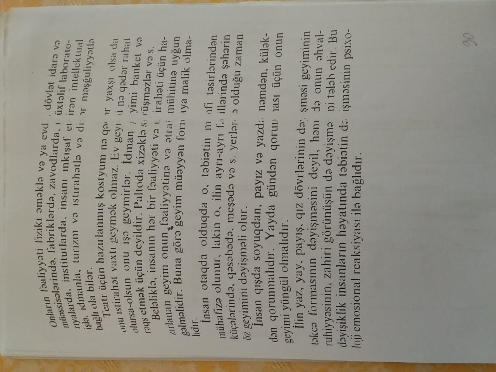

.—.. əuyuuünuduusu usb
iss sea 4234 5)? 3 şsk is
S: O2”X279 o s o 2. zə ı
“26 X5.“Zuh se sozunu
ge Z3cz30o0 Els s (Bə m
..s - xə.” ZOR -—- -
23-25 oğuz 3727225 7212
“mün ,şdoize Han So zcdc
AZS? ?Şo5xNs38 21853 Gus zım
5:4: ::7.02:55“F02 E Zgom2
d Soxz -.- izi x E- anı
Ss? 2540 3? 8? Eozgz
BE ounmu az r sx xu ə
4 sz zoo zE6$ q3” olsu
Şeğ” Oğceg,foə 2-3 Ş£ əosEl0
gög göösğxMZ9” ssn Sözə)  ç£
şız?” f-642şŞ yy” sa
xx caoaqaquınn nu ca
gə 2. 2 sa” ”  BU A
sou Da e.ə x o Gö ə)
xo xsssaeg Se Nu “cc o” ə
oş-S S235080x342323 mə. saz 0
sə Nm dalda ci m m “ eol: c msln
x m. ÖL o. Sözə ez ss
Gaz? vorunsan in (en UÜ.Bc
nude 2.oB6E6SS8 uz
süz ZSuL-c-- ə os Naz C
ə. SgŞ..so 2oOŞmzd i--
go m -- 3 - ə iz
ə” “EE 05 iə mas x Sz-c
əə əl Bx əə 4ƏH.odndsaudqd4s2
sesca ..c- “O EEZc ə s
sss tğuc çuxc ui nım
-SsƏS “- ozaşx, ŞS xın
x mücir sö x
ca üzalsç “AŞQEŞQZZC Ex
Şe £“1436e420a QOZ 0 ax
muun.usgsonZES Gzı.sso0760Ic57
Xsassss.-2.6.a s5998v90s-Ğğ.85c
şlam oZzrUcvseguu”u
dü ə ısə oo o” . s s
Eda xə . ödə 0x go
Quu 2 .247o 5 DI o ƏeN 
Hü ee s “qazc?e3 ca o
susqıuğuqiqak dış 402
qx a a a o pn Ya mo - “ə “— ox —-
BeŞsSƏ siös“3£6.S 306 2 x
vAUsAa Ən ao mesh şinin
nun S uş S İS m: —
ix is ə a ...

---

## Səhifə 90 (hdphoto90.png)

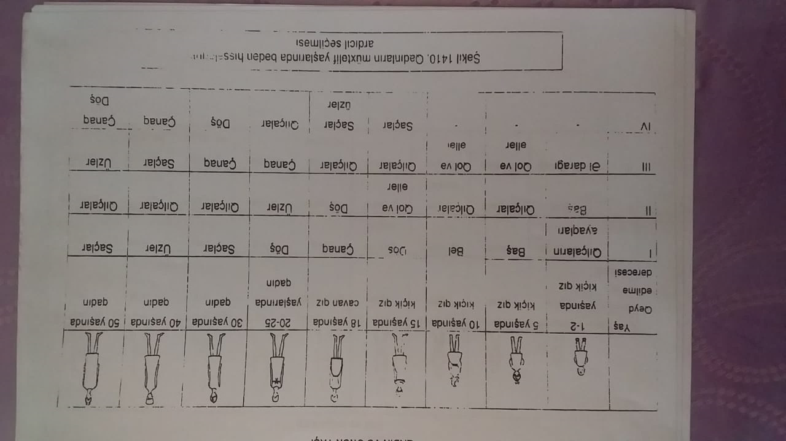

“dıl NEED i
val: -ysSSlu üepeq epulirl$e/ ilelxnul ulleyulpao “01bl İhes
2 “.“.———..— : ————.— ——————
soq i İ delzn İ

 beus . bsueö  “$9d 1ereölio ) 1sbe 1 isöes - 1 ı ı AŞ
I : 1 isile deye p
1 lelZf) , 4Ees beue beueğ 1 seye İ seyeölio eqo İ eloo i5EsEDİe) ıl
b sən 1 mes İ i İ —-..,.-
i defe İ i :
İEİzəİlə) İ HEələ) I İZ ƏŞİLə) 1elzn) 1 $oq BEB Hələ) l 4ereölio “eg İL:
İ i İ İ i İ üsbəfə / İ

1 15158 İELAİ İ ee 1 5oq beupğ z. söçi I ləq 1 9eg -İ uleye3iio İ il
i İ İ i İ İ issəsiep
i İ upeb ) İ 1 Zib yöly — eünpə :
, üpeb ) ünpeb / ülpeb , Epuliel$e/ ) zib üpaeə İ zib yö) İ zba zib yö pure p/əp

i EpulE/ og İ Epulse4 (LA Epul$e/ 0£ gz:02 BPUlS8/ gi, Epulğe/ çı İ Epul$e/ oy epul$e/ gi zü EA
rı YEL 1v00
l l İ " . İ i ül
(Ul - ii İ İ
l İ ei al İ : i
9. — 55 . x. - i — —L—.— x ...........

---

## Səhifə 91 (hdphoto91.png)

— ..——o———— nn —
m... iselili33$ ı : : İ sy
ii2uL s ül tokesSlu Uepeq apulel5e/ iietxnul uneniy “1VPl İes x...
257: — xn
ununun — 2 ili
I İ dellob A i 1EİOb 6A ) : 1Eİob 64 İ
dE00 İ. selul(i5 İ ləhu/iğ 1 səölio İ: seyuidiĞ 1 sereğlio İ debes 1 aereölio. ) iğelep te l III
——— —— do b 7
kes : i iŞesinb I . :
— 1uin/isoy İ iereölio i sepölio İ: dellioo 1) EHbələ) TELİLTƏ) ul/1Ö Yeyeəilo Seg ) ı
ii İ l i i qeğes İ I elbeZe )
$eg İ $eg İ $eg .seg il - $eg ea $eg eyeəlio 1 seğes eA BölƏ 1 li
i İ Iseoesep
i İ : : euilipə
59, i$pİ 151) İ BRİ , Uelğo oueb ublğo 1 ubiğo uslğo 1 uplğo : planı
il
apul$e/ ge 1 epuibe/ gp. 23 sz epulğe/ oz / epul$e/ gi i epul$e/ ol İ epul$e/ ç İ epul$ek 1 5eA İ
a : ı i : . . pə
M İ İ :
ma ı ga
Ul: i İ il ü.
vo oö 3 I 3 .
0 0 0. 1... aa i i
İSA NDNO EN SİM ı Baba 0000”

---

## Səhifə 92 (hdphoto92.png)

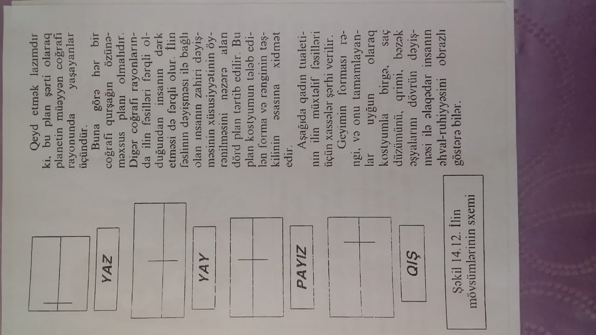

“güz
şun m Okex8noez
Esas s::01505558Ş 56 4
15055 550 ESRIS2q0c2ns
i ? -—— 5 . : Er.
ss” 50 saz ürə 5.25:
00 m 5655:
s gö doz s sĞ 2301 ”
Ha g5..5142.872 3035: 55524 —
: 53 5 “ssn Bsli 2izs
süs Kşsn”azaz nn “dd o m
— ə bd sla S57$ Şaha 56284
-. “uuS Ssuda. 23 s L “3.2
ŞsB345s35 şgöşeısz £ 25625 .
QAB “25566 Az oHoğsa“s6 5
EH z 1557613255
S oğ sE-.84 0 - 15
dazr 535 77 :2—
: Süas23401533307 ə 25.
asamssq üz d.3s555z
o muz "sl d44
Sezldu
TT “E
. ı di
N S Nİ -.
əə Hs zi ı ı -.
Ç Uy xs
S ik -
mq gl İl Hə dc
s us
I EH ı ”
i uu. hi. -
Hi ı

---

## Səhifə 93 (hdphoto93.png)

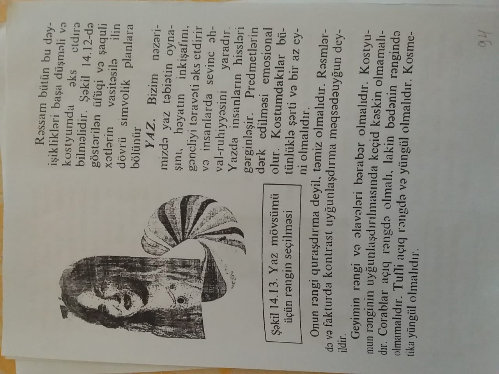

1 ud. — 0 S lur run bl P .
gozum cCsducıoısdır GSL 02062 ə
“daş” şaölıəsukaBo 23 232: s

Bo: z o qoz məz N so Eş
sz . Ux ni ox oQağsnu. 2 ön 2
o v” o m guzgu öv do Ö x bo
zə -odlan üeHMƏZmkR E — ə oz MEÇOX

a ə -Cc2 isə id üə) çim Gö
mud. Bas "Y545 .. 2028
mo “odunu “s ə Suz oo 53 - ə
Dd 2299 mass” 82 2 dşss
Ə əz “Gsl 2336.3696 2340x

.. “ə so ın xu
ım araq aqa 077)”:
SU zi Şad xaz09o0 o Zoo
əossudc BAX23 GomxomocE Om c

xüsasıağa £2523czZ uENuN.::26:9£E
gəRQçgƏOtmə” .0EELU , 1 x g 0  öp
MSƏOALHUuUZQĞSz- N-£ "Ns xz-azz Ozum
XXBAXS8 2İS:3S65232252 37982

I iz ƏxUS Humul3-2004:45223 Bü
AZ £289

3 -” ş iə .s “a
q zı

sa IŞ ra BİS 270

30 "Əə ə GoöP2327--X5

: əəə gubıs ncco

Çə IB, iz “cc Lara
oq. 15 —.
uu uv ib. qını Sa
” m ən zə dın . — S - s .. o)
Ey səmə b : .. oysx
ə aa F in məs. ıı
- dk 007 qu iz a
ƏŞ ə. xəli 32822
ə ə dbES EasSsSs
Səxsar aa ə hoca
sü Es52

.l.lhs.mmədmanu.auuıusnau-Z-.Z-AZz

---

## Səhifə 94 (hdphoto94.png)

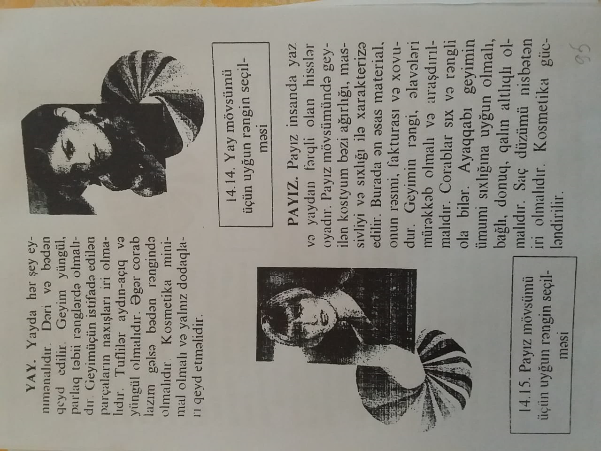

"om 28335 x... cö- .......1cusddüudtlü
——. (HÜ). 50-ə, 5) “za
dir 135,854
dk 0.20 0055330502”
k “ə mə 52 ESCSOŞU BA” m ƏD
207 o seo S582-22820980
şsr ün... Ho oo x
“ ş ) .. is db go £ g 50 dı
( s İ oz sezz2s- m —
ƏN” ə a (o ÖD aoduudnnz z .—
: “ao ca “s2uuğusuzaosud 08
: EŞ-I “ou 32 0 E
“ Ş xü sd.2Şə xo
- “ ? m ö Alo som. o “sn
Mə s soz soz mssş
c ə z ..E Bi 5 “ül da- :
gə fu 0
əə 500 squd.ss
“ .. oa a r —- 5“
ş sus Ca 000
- : ə 7ynsaıuısodz35?0.585722.-
öz yu-m9 2236 -.
s-s- GSOXeZ- EH
gə alana Xadısas.2270 5
saqa s8us 56-65-6246 -
cos E a XLZMƏZOGCSGEEc ıı
oğla əz o EZEcSSZS zı 
də xsoogoucmcs —
m ıı 8 .
5 un gös .. əh :
Basa ğ .. ”— 6 m m m
55 7. in
somu nsoudcc "rdrəraı bil ə
Aoz mə əə Bə h 5 Gə inn m
cə gx. 026” ə z K.z
ii gazssooe ə) “ unun ib
2..2:63 a “sana am ...
(8940 E-a 54 -- “arı — oaxaşa.. P 4. .ZS2
..9:56.043:-0-6: : : “əşi ələr
2.00.5u5. un. —— ezs-
sox R q ə əla EL ob
2£5-2722:--: ərəidilə ə sə
zu.--us3ssz kd isinə A e
dr DA -—
dn ? -

---

## Səhifə 95 (hdphoto95.png)

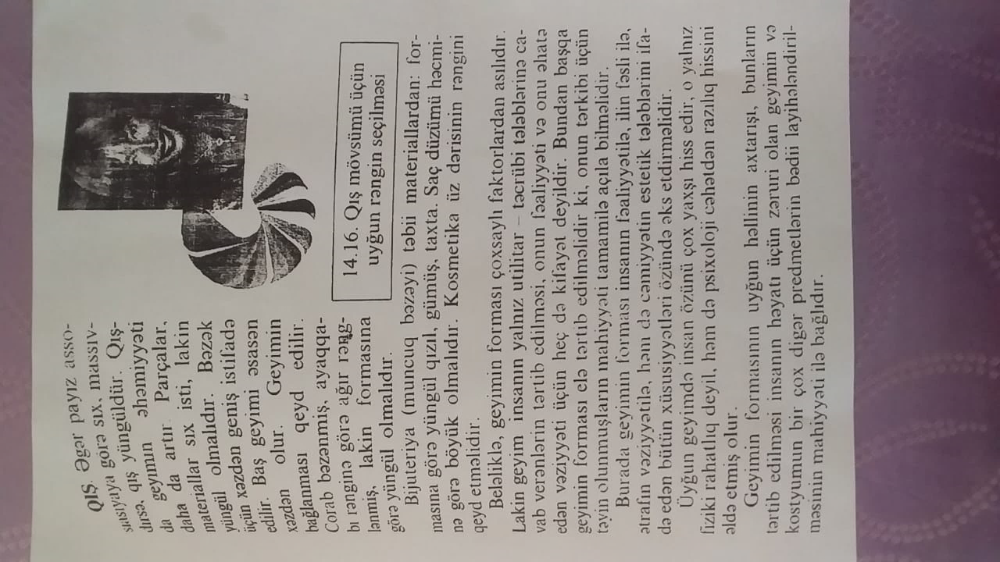

(əəə an naun daz ız  s.
dz -Sz üz) Es z.c e,-
- İSS gösğş sü ££ kos
zı Zaşsşsö.x- m. S.Ə
ım...

mo mülsa zz ö ə ...

x” və ə mElES So008. nu əz
Sİ əə Bs 23:55£“Su mu

b m) S məhsəmdü Nd? Gas
5” . 2slş9s dead. 326

x m im İ.9 os9n dəzüs im

zə R” ə Bəlişə Cubsoonusoı ou
 əəibəs aşa. “onuunuumun zə

də — gız Sğsdxunqs ... ez

ə s cal. 2:8504855566 4
ğ “216 x Abuedüsdəeo- 5“

2/a oo ld Ş-3 gEsdloxs? 2:8

"5 əLS30 dSözə42:39282628 Eİ-—

59) 155/..: 22:25:20: 9.

o ə cz dı s gg2osBs249028 335
."zö 0.c28269082 2 0 x
SE SLS. sun
: 48N6-.08z7 “58 2.
77: :c79 746 .u: On. Eanosooo0 0700 sua
çılrososğ832 sz sdc .. EzEez3s3ıc0 o
Z20X3328s222 752 732 Buş: ”Qs
s 2 sı aş CGAROdz?22 ə
2. - x udlaq zı eSOSOo£Z ms E
5552707: Su.22723972 sus ct
55322 2 Mərsbisa dGasq3azoe— 22766
gəzsə m su Bo Bstuozudayə EZSÇ
əə ə o. gec qazı ım no mə
E cx ouovBü ə a ə zılı ə 2 — ə
“xX2.22X2288 Bezoşoms” usavgonu usm
Balaş vl la23s 65 05:.05.228255
x ĞasSOüs8 “N.ususğex 083860
ədə Me məə m z öD üm İsi Hec əz ıı
məə ıı HM —
əzə Busta s oa305.3002.
O Su daz duşa sdoozo”.
SanuluuXo-sa də8 S34382 63 32 342
1 - SƏ zl Sü

---

## Səhifə 96 (hdphoto96.png)

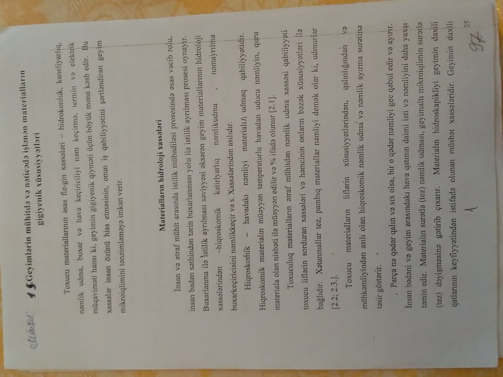

uz a
28556 BSS x
müs. z o . vəl
2 ... anı - i
.. .— aa əə səi 2 .
ı uu. EŞ m4 .—. :
-. o — ə kəz 5 cə .. cı. 2858-56 Fİ İ
Mğs8 5 -.- əz Hm 2.04.-0
Boz gu Boz gü s z m Ema
2:7 2.1 pə 2: - Sağ
z .... 3 2 c 2 sms
z £ z ə ..—. $ Bur
E 2557 7:5: 2:507- zo —. I
... dE 32:5- 2 2556”:
— ... z Lə a sə cə om.
£ 1214245 E 1255: 213 8502:542
5 das 12557-...: məmnunam.
c məsə 2akəazi mon 7 0...
250 13265 2 60267vv7 —. 255.
e.ə zə soz sə in Buz x au
cs 368 m 2 İrsisosüla Bo ğu
acan Teş228 8 x Şa ğidi x “ m ?
27 Qe dz- B..S2uBu le z- m 125
-— s E mə zə dz 25.: Ex E E Ə 8 den
2 555 65: U  . esdi 242277
Xz. zo .. - mi z 5 z mr ze. xox
FE 57: 245574 1: 5 7:5:55-
ası: ..—.
.. 253228 $8315:£214385 777? —
32 2ş.242 2445201240 5 UU.
doz QBS74 gs 4 E 2 zı Ba r mom um
sləli. 5 25075: EE ı -i- z 23 gü
5 255215 (35121.14 5 500000
r E 22348 H s x T ğ E ms . 2 nl m
5 $ 5533 ora Hu 45-: :
R BƏ ö-ğ ga z x s 25 0 :
iz bu428- 2: 277 Qu ğğs
z 4512142 2 SEZHİSeƏS24 dü
: s 2835812 ğ e  d i
5 DO-:--h 57
“ 22357 E
bəl E£”- sSmmuxkxsb mu ih:
22242 lə.
zə dəl
yə ra i
S B 5.
x ə ii

---

## Səhifə 97 (hdphoto97.png)

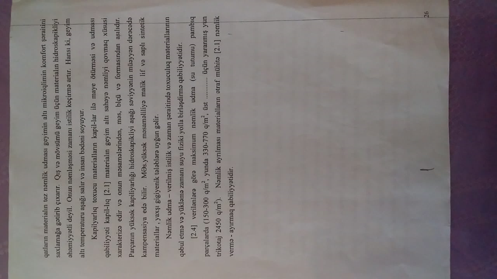

200—. — dindi ail
:5.-—.- s şgqs 8 ——— uu
mə uu uu x ii sz
558 68 5-5 .-.. L
Bü dSxaubs x s
Xos ş?Bq3z 555
Bu - Hu arın s
daqınlıluırısaqs
"m dH Bl 5 Şü.cE
mus... .5ö 2.
dı 1 ııı 5
us ŞB. ŞS ğa .
sa dın 250:
5 B HQaşın şs.
əda r sEğə Bü”
Bö smüaəsüakn munu
2Z545:34132:1228557” uu
mo Bü üsu
şğğs- S2849 :
şŞEREBTİşdas əhsika
SSRIsaƏLŞeş,şsEGü I
sü 5412707775
if. 334 2854 5
aaa... .:5: “ə
207916 a
EL HB. Hz
qisğu..  5:80.856 x
Bur
2852232223 :Ş$3852987
Ssaıo46526: Rusun öm
Esııb483:58 11343
BEŞESPŞ3 2548 2 232
BES .. Ro E 5
ss gü sddəxğş g z o
.x. m r) s çe doz

---

## Səhifə 98 (hdphoto98.png)

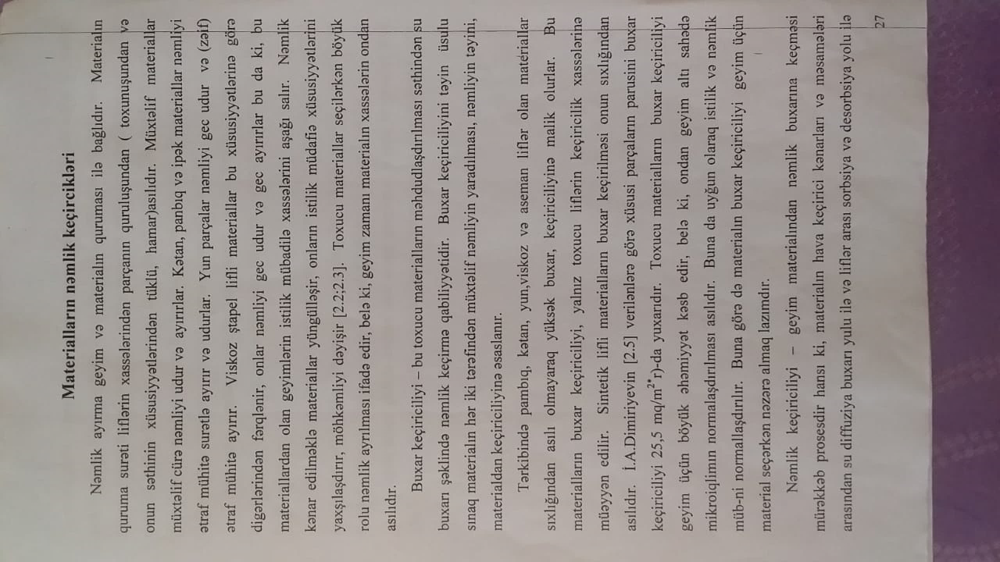

mu 3
R s g—ü —————İ
R. 5—...5:.
ən ə “muz o xo x x o Hu
ki “x. o oxum ZƏ öüx sSEnsuosa - ou
“Şuxc 3231 Ş35 $ 13532: 53
.—..umnsu,ma mn nunun 52..—-
.z.“aı 27.5: 5:0. “ 557 ...
54:... 255: şs Huzur.
qınını Xos möusuusu 5 5
zəl .“. s H3n hz 2 XA 2 Eri
- ... s “a s dz mom nə m ə
55 olun 0
Şub. sk Elə olı an Bo x Bö
E ..3 Zoo z m iz sous bə m s
- SER3lfərRi: £ g s m
əlli 23: £652 2.156166 552
25 0 bı “55 8 55:57 zoə
52577: m 8 Gi BUsu mo
s 5 1 5: Sağsoğlaqş 0
25:2::22.5554 1 B34120:33 ş05
25557 :V(((1:U
BEİSTlSS.242 Bas fFafi.aş3: 23.
sır minə 275... Şoos
dz zə "dm s z (Sİ gəouo  ğ Bo s ıds
z 5. sususc HB Şufdal 52.24 ı iz
25.1::1156101 3510-3153 s.
z əki . dn - s du /d 4
“arı ı Bds...a şa şü
mai 33 5-£ sus 2.21284.53: 0
S35:8“-4852-.58 233 56:15.
1557525631500 Q1.13:133 3011
E 56 8 8 z : z zə
E E yş.es32- . A ə m.
B53.:51313115532 (3111364143.
-.. ƏBUSnİ 4342286
işla c4 355506 8600070 -
mız üz m təl BƏeDpsdğ” mo -c-s5. EE ns
E 3565057 ii Bö . s g
Bl ld 4 bus 3566160 51
.. BaeŞösöBszx4 sduqu 13565 rb.
şuşğbdıı:ğıluss sdsunad 4:55147:-06
..əx “s Bz $.455:55:22:077551 g ə
Bsadcaıü su fas?3iq3442 s 82383
£ 255 Höşuunc s z E
z s B 258 BE 5 0 Ş38
m dXəosdsuasiıs834 m x” 5:25 7 pon
5 “ü ...:::.. ban: iH
49(VvV(V0:7555-: 8526vv7v 7”
2371007007” — m
dB s -...
sbssə

---

## Səhifə 99 (hdphoto99.png)

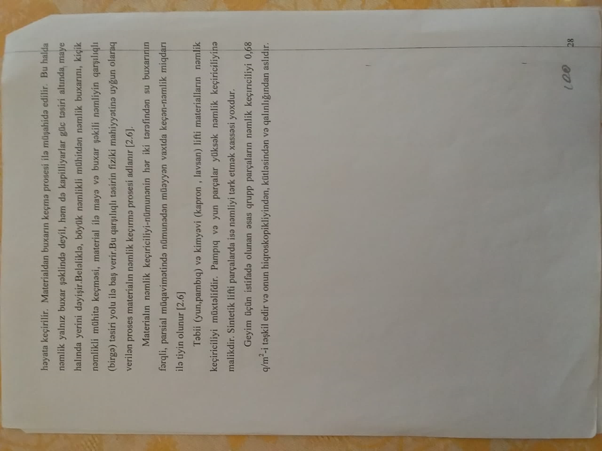

a x oz ıı “o. səni .

z y “m so ns
də ... E
ııazi şi o k -
anun. $ 5: “ə
Es 5 - m
ddiəs ss 3.
Basa .. Si.
şs. 5: 2.313
12:86 soz ə o.
şiziş 2 242332
şŞaııaszs 5 BEZU8
5045:1-5.0$ ER- s

Sa5-3.73 E Pi
: 1333654 eşi 7:

b şıiba.d - azıq 8
Es 8 sö.
rı... goasxod
2233825 s ELS
şŞusoms Ş Ba
s... ..5c
şgi23” 366 "un
—” 338 Şa
şs3Bi6635 £ E4
“ pəl Ee s mi
B3BS-5 ş 25
ğ BES Po is .i
25x382:3:42 2352
R .sRElX  53
2Ss3s ET? “26 s
gƏSaüşŞ58 Baş
Bs - g
ti Pr3 43
3341331 liəkb
3350653 Saz. 1
s s b X s
3532.3131 S34.2
122.:: 5 Q sı
oa s. 2. 6.84
s . 3. 3
320536 EŞzs58
dı: nı s
$ Yşaışarıcu.u.
s 3 aa
BüUsESEĞSSSd4 .
Ssuz2İş33 1395188
.. xm— c 20 şs xi
sşsə33265 zo bs 3 )
ehBhə bii ə şs E
s as io -
smuenasnşğ ı

---

## Səhifə 100 (hdphoto100.png)

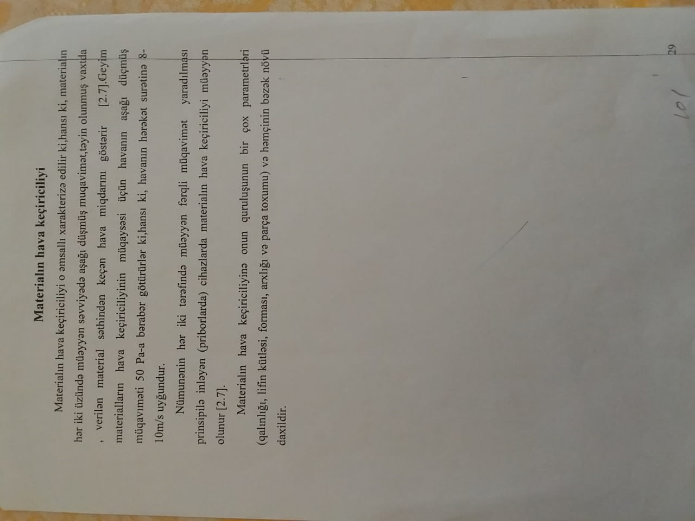

ı l ı —
mom :
mo sik ,
Exs -— zs :
ZE xz 5.
unun Eş "b
3628 ə 3 N
pn 3.
2.05 B 3
EE 8 50
Esə” z.
sm 2 z.
ə zl şi “ 5
r Ha Ex -
Bala üz 50 2
505
4 z Sos s
252254 də ə
404 5 alüri
üzə . . E
sın sz ms /
şq33113 $3 15:
Şaraızçş ... zi
2 z m Kə
Es m E 50 :
- Ezal .
ğa 34 .. 5.
.55:5: çi -
Qı . Bə
gaz 5 .
fs d6o sz :
corucu də .
... xo Bs .
P35.33 54 .
:77y7y:-
m z 54 d
Si13: . 5
:57:- dd s...
xə . BEB 51
mu zon 52 52
sus 2512-1268
pal 51302.51..
547: HE
--—-. . E
-.. zz 22
Kil. :5— E
manı

---
